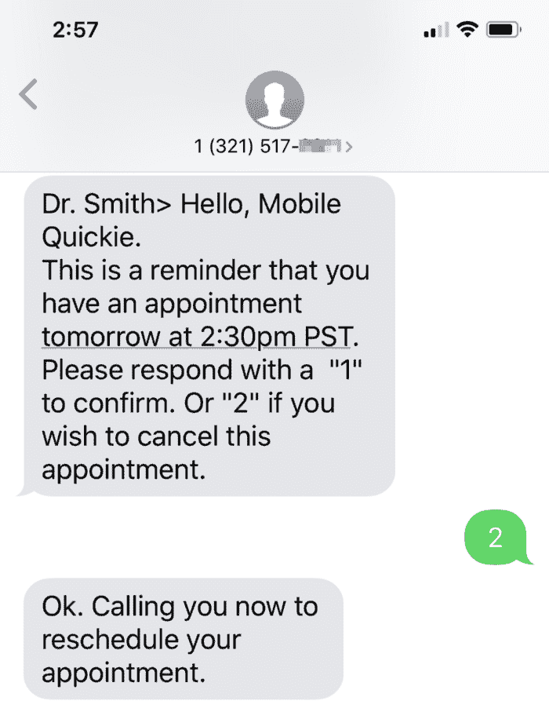
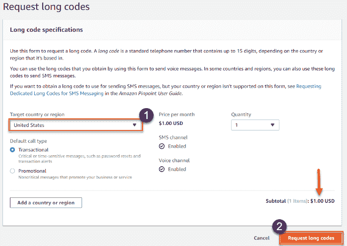
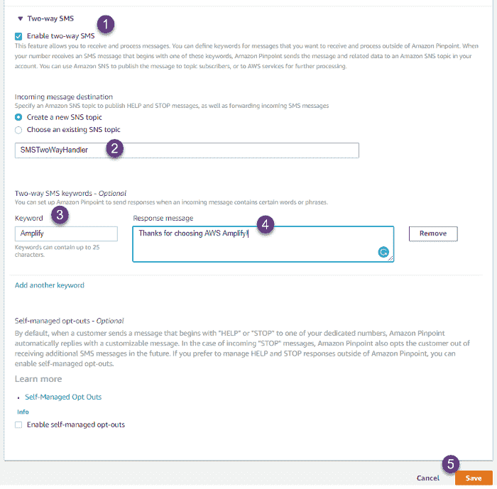
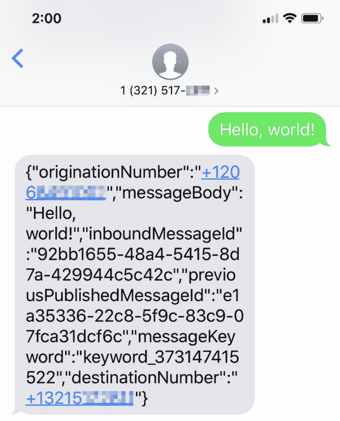
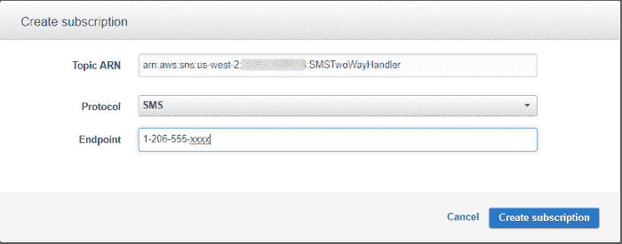

# Amazon Pinpoint:接触用户并提高参与度

> 原文：<https://acloudguru.com/blog/engineering/two-way-sms-with-amazon-pinpoint>

SMS，即文本消息，是在普通面向客户的 web 或移动应用程序之外联系用户的最简单方式。与电子邮件和推送通知等其他沟通渠道相比，短信能带来更高的参与度。

短信非常方便，用户无需认证、下载你的应用或访问你的网站。他们只是在他们的设备上接收你的信息。说到获得和留住客户，没有比这更容易的了。

在本文中，我将解释什么是双向短信，以及如何使用 Amazon Pinpoint 快速轻松地向客户发送个性化、及时且相关的短信。然后，我们将实现一个实用的解决方案，设置一个 SMS [长码](https://docs.aws.amazon.com/pinpoint/latest/userguide/channels-sms-awssupport-long-code.html)，这样您就可以开始发送和接收文本消息。

## 什么是双向短信？

SMS 消息(更好地称为“文本消息”)通常发送给人，但它们也发送给企业。企业通常以编程方式发送文本消息，否则他们将需要大量的物理电话和专门的员工手动向每个客户发送文本消息，这根本不现实或不可扩展。

当企业向客户发送文本消息时，它往往是单向 SMS。在单向通信中，企业将以公告或一次性通知的形式发送消息，通常不需要任何进一步的交互。例如，当顾客预订的桌子准备好时，餐馆可以给顾客发短信。或者，医生办公室可能会给病人发短信，提醒他们即将到来的预约。

企业还可以向客户发送双向信息，以便他们能够收到为他们提供可操作的后续步骤的响应。例如，回到医生预约用例，给患者的出站消息可以包括一个选项来响应“1 表示‘确认’或 2 表示‘取消预约’”。患者的文本回复会返回到医生的办公室管理应用程序，然后他们可以根据回复采取行动。有了双向短信，可能性是无穷的。

Dr Appointment reminder two-way SMS example

## 短码对长码

为了与你的客户进行程序化的双向短信对话，你首先需要从 Twilio、Nexmo 或 Amazon Pinpoint 等信息提供商那里获得一个[长码](https://docs.aws.amazon.com/pinpoint/latest/userguide/channels-sms-awssupport-long-code.html)或[短码](https://docs.aws.amazon.com/pinpoint/latest/userguide/channels-sms-awssupport-short-code.html)。

每个提供商都将提供一个 API，用于发送和接收来自客户的文本消息到您的长代码或短代码。这些号码与移动设备无关，只是作为应用程序的虚拟地址。

一个**长码**实质上是一个 10 位数的电话号码，用于发送和接收短信，每秒钟限于 1 条短信。一个**短代码**是一个五位数或六位数的号码，用于大容量短信。

短代码通常用于应用程序到个人(A2P)的消息传递、双因素身份验证(2FA)和营销消息，并且您必须为您支持的每个国家/地区申请一个单独的短代码。

底线，你需要认真对待短信，拥有一个短码，因为它们比长码更昂贵。在美国，你可以以每月 1000 美元的价格租赁它们。短代码还涉及到与无线运营商的严格注册过程。

如果您的业务以短信为主要沟通方式，如银行提醒/交易、紧急通知等。，那么短代码是一种可行的方法，因为它提供高容量的消息传递，并且可以同时到达许多不同的用户。你可以通过 Amazon Pinpoint [点击](https://docs.aws.amazon.com/pinpoint/latest/userguide/channels-sms-awssupport-short-code.html)了解更多关于申请短信专用短代码的信息。

## AWS 精确定位接收双向短信

Amazon Pinpoint 使 AWS 客户能够通过长代码或短代码发送单向和双向交易或促销文本消息。通过双向短信，Amazon Pinpoint 为事件驱动的用例开辟了可能性，在这些用例中，客户从人对人或人对企业的交互现在是最重要的。

下面，我将通过 Amazon Pinpoint 提供一个长代码，注册一个关键字和固定消息，并创建一个 SNS 主题。别担心，一旦我们设置好了，我会解释它是如何工作的。

## 如何开始使用亚马逊 Pinpoint

设置大约需要 5-7 分钟。请注意，**这项服务不是免费的**。有关价格信息，请查看[当前价格](https://aws.amazon.com/pinpoint/pricing/?nc=sn&loc=3#SMS_Text_Messages)。

1.  登录[亚马逊 Pinpoint 控制台](https://us-west-2.console.aws.amazon.com/pinpoint/home/?region=us-west-2#/apps)
2.  命名一个项目，然后选择**创建一个项目。**

3.**选择项目功能下的短信和语音**

4.在常规设置中，选择(a) **为该项目启用短信频道**和(b) **选择事务性。**

5.展开**高级配置—可选**和**选择请求长码**

6.选择您的**目标国家或地区**，数量为 1。**选择请求长码**橙色按钮。如果您没有看到特定县的长代码，您可以随时申请一个。

7.选择新提供的电话号码

8.向下滚动**忽略所需关键字**和**选择启用双向短信**

启用双向短信时，系统会提示您创建或选择现有的 SNS 主题。选择“创建一个新的 SNS 主题”并为主题提供一个名称，如 *SMSTwoWayHandler* 。

9.**选择添加另一个关键字**

对于关键字，添加“放大”。在“响应消息”下，添加一条消息，当用户向您的长代码发送“放大”时，该消息是对用户的自动响应。**选择保存**。

Enable two-way SMS, create a topic, and add keyword page

**搞定！**你现在有一个专用的长码发送&接收短信。您的客户不再需要下载应用程序或在线提交表格来与您的企业互动；您可以简单地设置一个电话号码(长代码)并要求客户发送投票、注册活动、确认约会或任何其他需要即时反馈和交互的事情。

## 社交网站主题、订阅和关键词

您刚刚提供了一个长代码，创建了一个 SNS 主题，添加了一个关键字，并为给定的关键字提供了一个默认的预设响应消息。现在，让我们来谈谈它是如何工作的。

**关键词和预设信息** 对于发送到您新的长码的短信，Amazon Pinpoint 会解析信息并查找特定的关键词，如果找到，会立即通过短信回复客户，并附上您为相应关键词提供的预设信息。整个周期完全自动化，由 Pinpoint 管理。

**处理带有 SNS 主题的传入消息** 除了处理关键字和预设响应之外，原始消息总是会被转发到您的亚马逊简单通知服务(SNS)主题进行进一步处理。无论客户是否提供关键字，SNS 主题都会收到来自 Pinpoint 的 JSON 消息。

早些时候，我们创建了一个 SNS 主题，但没有添加订阅。我们需要在 SNS 主题中添加一个监听器(订阅),以便捕获所有的入站消息，否则，这种双向短信功能就没什么用了。

Amazon Pinpoint 向您的 SNS 主题发送一条 JSON 消息，用于发送到您的长代码的所有入站消息。作为开发人员，您可以为 SNS 主题订阅一个或多个协议(端点)来处理入站 JSON 消息。

对于订阅，您可以订阅任何 HTTP/s 服务端点、电子邮件地址、亚马逊简单队列服务(SQS)队列、 [AWS Lambda 函数](https://acloudguru.com/blog/engineering/building-more-cost-effective-lambda-functions-with-1-ms-billing)、推送通知端点，甚至是 SMS 电话号码。您可以为同一个主题订阅一个或多个端点。

## 来自 Amazon Pinpoint 的传入 JSON 负载

当您的长码号码收到短信时，Amazon Pinpoint 会向您指定的 Amazon SNS 主题发送一个 JSON 有效负载。JSON 有效负载包含消息体和相关数据，如下例所示:

*originationNumber* 的值是发送消息的号码(即您客户的手机号码)。 *destinationNumber* 的值是消息被发送到的号码(您的长码)。*消息正文*就是你的客户在手机上输入的文本消息。

## 为您的 SNS 主题订阅一个端点

作为一个例子，我将带你通过订阅一个 SMS 电话号码到 SNS 主题。在这种情况下，流程是这样的:客户+12064555xxxx 发送“你好，世界！”到您的长码+1321517 XXX。

> 12064555xxxx >你好，世界！
> 
> Pinpoint:检查关键字，没有找到匹配的关键字，将“JSON 消息”转发到 SNS 主题。
> 
> SNS:向订阅的端点发布 JSON 消息。在这种情况下，完整的 JSON 消息将作为用户发送到您的 SMS 号码:+12064555xxxx。请注意，该消息是从社交网络发送到您的电话号码，但传入的电话号码是您的亚马逊 Pinpoint 双向短信长码。

Developer phone receiving text message as a subscriber to topic

## 订阅您的手机短信号码(测试)

1.  启动 [SNS 管理控制台](https://us-west-2.console.aws.amazon.com/sns/v2/home?region=us-west-2#/topics)
2.  选择你的主题(我们将其命名为 SMS *TwoWayHandler*
3.  选择**创建订阅**
4.  选择 SMS 作为协议，并输入您的电话号码。确保格式正确，如图所示。

Amazon SNS Create subscription dialog

5.**选择创建订阅**

**搞定！**现在，通过从任何移动设备向您的 Amazon Pinpoint long code 发送文本消息来测试订阅，您应该会看到 JSON 消息到达您刚刚订阅该主题的 SMS 电话号码。短信订阅只是一个快速测试。一种常见的做法是订阅一个 AWS Lambda 函数，该函数处理传入的消息，解析它，执行其他业务逻辑，甚至响应客户。

## 短信限制

在 Amazon Pinpoint 上使用双向短信时，需要考虑一些限制。首先，每个账户只有 1 美元的默认消费限额，你可以在发送几十条短信后达到这个限额。最好立即[增加这个限制](https://docs.aws.amazon.com/pinpoint/latest/userguide/channels-sms-awssupport-spend-threshold.html),这样你的短信就不会突然停止。

其次，对于长码，短信交易有发送速率限制，如[亚马逊 Pinpoint docs](https://docs.aws.amazon.com/pinpoint/latest/userguide/channels-sms-awssupport-long-code.html) 中所述。另请注意，不同的国家和司法管辖区对短信的许可使用有不同的限制，请确保您遵守当地的法规，否则您将面临罚款并被暂停发送短信。

## 亚马逊精确使用案例

大约五年前，我创建了一个应用程序来监控 AWS 状态仪表板的问题。当一个新的帖子发布到 RSS 提要时，我在 AWS Lambda 函数中解析数据，并通过 SMS 通知大约 15 个订阅的手机号码。

在大型活动期间，该应用程序每小时可以向这 15 个用户发送多达 12 条消息。这大约是每小时发送 180 条短信，自从近两年前从亚马逊简单通知服务(SNS)转换以来，我没有发现任何问题，并且相信亚马逊 Pinpoint 能够成功及时地发送这些消息。

## 客户参与的强大工具

短信是与客户互动的强大工具。在您的企业中使用双向短信渠道可以推动采用，并以比电子邮件或推送通知更多的方式帮助留住这些用户。文本消息将你的应用从画面中移除，并提供即时交互和客户反馈。给亚马逊 Pinpoint 一个尝试，开始发送/接收短信！

我正在考虑一些更高级的 SMS 消息主题，如电话验证，构建一个健壮的 Lambda 函数处理程序来处理所有双向场景，和/或深入研究交付和故障 CloudWatch 日志。请在评论中告诉我你的偏好。

* * *

## 提升您的云计算职业生涯

无论您是云新手还是经验丰富的专家，云专家都能让您轻松(而且非常棒)地获得认证并掌握现代技术技能。查看 ACG 目前的免费课程或立即开始免费试用。

* * *