# 使用 Azure、PostgreSQL 和 Kafka |云专家改变数据捕获

> 原文：<https://acloudguru.com/blog/engineering/use-kafka-connect-to-build-a-data-pipeline-from-postgresql-to-azure-data-explorer>

这篇博文展示了如何使用变更数据捕获，通过使用 [Apache Kafka](https://kafka.apache.org/) ，将数据库修改从 PostgreSQL 流式传输到 [Azure Data Explorer](https://docs.microsoft.com/en-us/azure/data-explorer/) (Kusto)。

变更数据捕获(CDC)用于跟踪数据库表中响应创建、更新和删除操作的行级更改。这是一种强大的技术，但是只有当有办法利用这些事件并使它们对其他服务可用时才有用。

*想了解更多关于 Azure 认证的信息吗？*
*查看我们的 [Azure 认证和学习路径。](https://acloudguru.com/azure-cloud-training)*

#### 介绍

使用 Apache Kafka，可以将传统的批处理 ETL 过程转换为实时的流模式。你可以[自己动手](https://en.wikipedia.org/wiki/Do_it_yourself)使用你选择的客户端 SDK 编写优秀的老 Kafka 生产者/消费者应用。但是，当有 Kafka Connect 及其即用型连接器套件时，您为什么要这样做呢？

一旦你选择了 Kafka Connect，有几个选项。一个是 JDBC 源连接器，它主要通过轮询目标数据库表来提取信息。基于变更数据捕获，有一种更好的(尽管有点复杂)方法！进入 [Debezium](https://debezium.io/) ，这是一个分布式平台，构建在不同数据库中可用的变更数据捕获特性之上。它提供了一组 [Kafka Connect 连接器](https://debezium.io/documentation/reference/1.2/connectors/index.html)，这些连接器接入数据库表中的行级更改，并将它们转换成发送给 Apache Kafka 的事件流。一旦变更日志事件在 Kafka 中，它们将对所有下游应用程序可用。

与这篇博文相关的代码和配置可以在这个 [GitHub 资源库](https://github.com/abhirockzz/kafka-adx-postgres-cdc-demo)中找到

这是这篇文章中呈现的用例的高级概述。

与订单相关的数据存储在 PostgreSQL 数据库中，包含订单 ID、客户 ID、城市、交易金额等信息。时间等。这些数据被 PostgreSQL 的 Debezium 连接器拾取并发送给 Kafka 主题。一旦数据在 Kafka 中，另一个(sink)连接器将它们发送到 Azure Data Explorer，允许进一步的查询和分析。

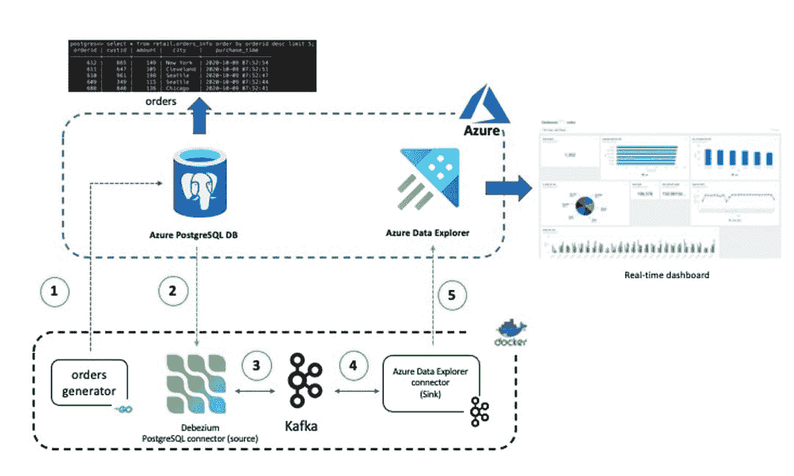

端到端解决方案中使用的各个组件如下:

数据管道可能相当复杂！这篇博文提供了一个简单的例子，其中 PostgreSQL 数据库将被用作数据源，大数据分析引擎充当最终目的地(接收器)。这两个组件都运行在 Azure 中:[Azure Database](https://acloudguru.com/course/using-microsoft-azure-database-services)for PostgreSQL([*Source*](https://docs.microsoft.com/en-us/azure/postgresql/?WT.mc_id=acloudguru-blog-abhishgu))是一个基于开源 [Postgres](https://www.postgresql.org/) 数据库引擎的关系数据库服务，而[Azure Data Explorer](https://docs.microsoft.com/azure/data-explorer/?WT.mc_id=acloudguru-blog-abhishgu)(*Sink*)是一个快速且可扩展的数据探索服务，它允许您收集、存储和分析来自任何不同来源的大量数据，如网站、应用程序、物联网设备等。

虽然本博客中使用了 Azure PostgreSQL 数据库，但这些说明应该适用于任何 Postgres 数据库。如果你愿意，请随意使用其他选项！

Apache Kafka 和 Kafka Connect 一起充当流数据管道的可扩展平台——这里的关键组件是源和接收器连接器。

用于 PostgreSQL 的 Debezium 连接器捕获插入、更新和删除数据库内容的行级更改，并提交给 PostgreSQL 数据库，生成数据更改事件记录，并将它们传输到 Kafka 主题。在幕后，它使用 Postgres 输出插件的组合(例如 wal2json、pgoutput 等。)并且(Java)连接器本身使用 [PostgreSQL 的流复制协议](https://www.postgresql.org/docs/current/static/logicaldecoding-walsender.html)和 [JDBC 驱动程序](https://github.com/pgjdbc/pgjdbc)读取由输出插件产生的变化。

[Azure Data Explorer 接收器连接器](https://github.com/Azure/kafka-sink-azure-kusto)从配置的 Kafka 主题中提取数据，批处理并将其发送到 Azure Data Explorer，在 Azure Data Explorer 中它们被排队接收并最终写入 Azure Data Explorer 中的表。连接器利用了用于 Azure Data Explorer 的[Java SDK](https://github.com/Azure/azure-kusto-java)。

大多数组件(除了 Azure Data Explorer 和 Azure PostgreSQL DB)都作为 Docker 容器(使用 Docker Compose)运行——Kafka(和 Zookeeper)、Kafka Connect workers 和数据生成器应用程序。话虽如此，只要所有组件都配置为根据需要相互访问和通信，这些指令将适用于任何 Kafka 集群和 Kafka Connect workers。例如，你可以在 Azure HD Insight 上拥有 Kafka 集群，在 Azure Marketplace 上拥有 T2 融合云。

如果您对这些场景感兴趣，您可以查看这些[动手实验](https://github.com/Azure/azure-kusto-labs/tree/master/kafka-integration)。

下面是组件及其服务定义的分类——你可以参考 GitHub repo 中完整的 docker-compose 文件[。](https://github.com/abhirockzz/kafka-adx-postgres-cdc-demo/blob/master/docker-compose.yaml)

```
  zookeeper:
    image: debezium/zookeeper:1.2
    ports:
      - 2181:2181
  kafka:
    image: debezium/kafka:1.2
    ports:
      - 9092:9092
    links:
      - zookeeper
    depends_on:
      - zookeeper
    environment:
      - ZOOKEEPER_CONNECT=zookeeper:2181
      - KAFKA_ADVERTISED_LISTENERS=PLAINTEXT://localhost:9092
```

Kafka 和 Zookeeper 使用 [debezium](https://hub.docker.com/r/debezium/kafka/) 图像运行——它们工作正常，非常适合快速反馈循环、演示等迭代开发。

```
dataexplorer-connector:
    build:
      context: ./connector
      args:
        KUSTO_KAFKA_SINK_VERSION: 1.0.1
    ports:
      - 8080:8083
    links:
      - kafka
    depends_on:
      - kafka
    environment:
      - BOOTSTRAP_SERVERS=kafka:9092
      - GROUP_ID=adx
      - CONFIG_STORAGE_TOPIC=adx_connect_configs
      - OFFSET_STORAGE_TOPIC=adx_connect_offsets
      - STATUS_STORAGE_TOPIC=adx_connect_statuses
  postgres-connector:
    image: debezium/connect:1.2
    ports:
      - 9090:8083
    links:
      - kafka
    depends_on:
      - kafka
    environment:
      - BOOTSTRAP_SERVERS=kafka:9092
      - GROUP_ID=pg
      - CONFIG_STORAGE_TOPIC=pg_connect_configs
      - OFFSET_STORAGE_TOPIC=pg_connect_offsets
      - STATUS_STORAGE_TOPIC=pg_connect_statuses
```

Kafka Connect 源和接收器连接器作为单独的容器运行，只是为了让您更容易理解和推理它们——也可以在单个容器中运行这两个连接器。

注意，虽然 PostgreSQL 连接器内置在 [debezium/connect](https://hub.docker.com/r/debezium/connect) 映像中，但是 Azure Data Explorer 连接器是使用自定义映像设置的。[号 Dockerfile](https://github.com/abhirockzz/kafka-adx-postgres-cdc-demo/blob/master/connector/Dockerfile) 相当紧凑:

```
FROM debezium/connect:1.2
WORKDIR $KAFKA_HOME/connect
ARG KUSTO_KAFKA_SINK_VERSION
RUN curl -L -O https://github.com/Azure/kafka-sink-azure-kusto/releases/download/v$KUSTO_KAFKA_SINK_VERSION/kafka-sink-azure-kusto-$KUSTO_KAFKA_SINK_VERSION-jar-with-dependencies.jar
```

最后，orders-gen 服务只是通过 [Go](https://golang.org/) 应用程序将随机订单数据植入 PostgreSQL。可以参考[GitHub repo](https://github.com/abhirockzz/kafka-adx-postgres-cdc-demo/blob/master/orders-generator/Dockerfile)中的 Dockerfile

```
  orders-gen:
    build:
      context: ./orders-generator
    environment:
      - PG_HOST=<postgres host>
      - PG_USER=<postgres username>
      - PG_PASSWORD=<postgres password>
      - PG_DB=<postgres db name>
```

希望到现在为止，您已经对架构和相关组件有了合理的理解。在深入实际问题之前，你需要注意几件事情。

最后，克隆这个 GitHub repo:

```
git clone https://github.com/abhirockzz/kafka-adx-postgres-cdc-demo
cd kafka-adx-postgres-cdc-demo
```

首先，让我们确保您已经设置并配置了 Azure Data Explorer 和 PostgreSQL 数据库。

**1。创建一个 Azure Data Explorer 集群和一个数据库— [这个快速入门](https://docs.microsoft.com/azure/data-explorer/create-cluster-database-portal?WT.mc_id=acloudguru-blog-abhishgu)将指导你完成这个过程。**

**2。使用下面的 [KQL](https://docs.microsoft.com/azure/data-explorer/kql-quick-reference?WT.mc_id=acloudguru-blog-abhishgu) 查询创建一个表(Orders)和映射(OrdersEventMapping)**

```
.create table Orders (orderid: string, custid: string, city: string, amount: int, purchase_time: datetime)

.create table Orders ingestion json mapping 'OrdersEventMapping' '[{"column":"orderid","Properties":{"path":"$.orderid"}},{"column":"custid","Properties":{"path":"$.custid"}},{"column":"city","Properties":{"path":"$.city"}},{"column":"amount","Properties":{"path":"$.amount"}},{"column":"purchase_time","Properties":{"path":"$.purchase_time"}}]'
```

在摄取过程中，Azure Data Explorer 试图通过在小的入口数据块等待摄取时将它们批处理在一起来优化吞吐量，可以使用[摄取批处理策略](https://docs.microsoft.com/azure/data-explorer/kusto/management/batchingpolicy?WT.mc_id=acloudguru-blog-abhishgu)来微调这一过程。或者，出于本演示的目的，您可以按如下方式更新策略:

```
.alter table Orders policy ingestionbatching @'{"MaximumBatchingTimeSpan":"00:00:30", "MaximumNumberOfItems": 500, "MaximumRawDataSizeMB": 1024}'

.show table <enter database name>.Orders policy ingestionbatching
```

*详见* [*摄取批处理策略命令参考*](https://docs.microsoft.com/azure/data-explorer/kusto/management/batching-policy?WT.mc_id=acloudguru-blog-abhishgu)

***3。为连接器创建服务主体，以进行身份验证并连接到 Azure Data Explorer 服务**。如果你想使用 Azure 门户来做这件事，请参考 [How to:使用门户创建一个 Azure 广告应用和服务主体，可以访问资源](https://docs.microsoft.com/azure/active-directory/develop/howto-create-service-principal-portal?WT.mc_id=acloudguru-blog-abhishgu)。以下示例使用了 Azure CLI[az ad sp create-for-RBAC](https://docs.microsoft.com/cli/azure/ad/sp?view=azure-cli-latest&WT.mc_id=acloudguru-blog-abhishgu#az_ad_sp_create_for_rbac)命令。例如，要创建名为 adx-sp 的服务主体:*

```
*az ad sp create-for-rbac -n "adx-sp"*
```

*您将得到一个 JSON 响应:*

```
*{
  "appId": "fe7280c7-5705-4789-b17f-71a472340429",
  "displayName": "kusto-sp",
  "name": "http://kusto-sp",
  "password": "29c719dd-f2b3-46de-b71c-4004fb6116ee",
  "tenant": "42f988bf-86f1-42af-91ab-2d7cd011db42"
}*
```

*请记下 appId、密码和租户，因为您将在后续步骤中使用它们。*

***4。向您的数据库添加权限***

*为您刚刚创建的服务主体提供适当的角色。要分配管理员角色，[按照本指南](https://docs.microsoft.com/azure/data-explorer/manage-database-permissions?WT.mc_id=acloudguru-blog-abhishgu#manage-permissions-in-the-azure-portal)使用 Azure 门户或在您的数据浏览器集群中使用以下命令*

*。添加数据库<enter database="" name="">管理员(' aad app =<enter service="" principal="" appid="">；<enter service="" principal="" tenant="">’)‘AAD App’</enter></enter></enter>*

*你可以使用各种选项在 Azure 上设置 PostgreSQL，包括 [Azure 门户](https://docs.microsoft.com/azure/postgresql/quickstart-create-server-database-portal?WT.mc_id=acloudguru-blog-abhishgu)、 [Azure CLI](https://docs.microsoft.com/azure/postgresql/quickstart-create-server-database-azure-cli?WT.mc_id=acloudguru-blog-abhishgu) 、 [Azure PowerShell](https://docs.microsoft.com/azure/postgresql/quickstart-create-postgresql-server-database-using-azure-powershell?WT.mc_id=acloudguru-blog-abhishgu) 和 [ARM 模板](https://docs.microsoft.com/azure/postgresql/quickstart-create-postgresql-server-database-using-arm-template?tabs=azure-portal&WT.mc_id=acloudguru-blog-abhishgu)。一旦你这样做了，你就可以使用你最喜欢的编程语言，比如 [Java](https://docs.microsoft.com/azure/postgresql/connect-java?WT.mc_id=acloudguru-blog-abhishgu) ，[轻松地连接到数据库。NET](https://docs.microsoft.com/azure/postgresql/connect-csharp?WT.mc_id=acloudguru-blog-abhishgu) 、 [Node.js](https://docs.microsoft.com/azure/postgresql/connect-nodejs?WT.mc_id=acloudguru-blog-abhishgu) 、 [Python](https://docs.microsoft.com/azure/postgresql/connect-python?WT.mc_id=acloudguru-blog-abhishgu) 、 [Go](https://docs.microsoft.com/azure/postgresql/connect-go?WT.mc_id=acloudguru-blog-abhishgu) 等。*

**尽管上述参考资料针对单服务器部署模式，但请注意，* [*超大规模(Citus)是另一种部署模式，您可以使用*](https://docs.microsoft.com/azure/postgresql/overview?WT.mc_id=acloudguru-blog-abhishgu#azure-database-for-postgresql---hyperscale-citus) *来处理“接近或已经超过 100 GB 数据的工作负载”**

*请确保准备好以下 PostgreSQL 相关信息，因为您将需要它们来配置后续部分中的 Debezium 连接器——数据库主机名(和端口)、用户名、密码*

*为了让端到端解决方案按预期工作，我们需要:*

*   *确保可以从本地 Kafka Connect workers(容器)访问 Azure 中的 PostgreSQL 实例*
*   *确保适当的 PostrgeSQL 复制设置(“逻辑”)*
*   *创建 Orders 表，您将使用该表来测试变更数据捕获功能*

*如果您使用 Azure DB for PostgreSQL，使用[az postgres server firewall-rule create](https://docs.microsoft.com/azure/postgresql/howto-manage-firewall-using-cli?WT.mc_id=acloudguru-blog-abhishgu#create-firewall-rule)命令创建一个防火墙规则，将您的主机列入白名单。由于我们在 Docker 中本地运行 Kafka Connect，只需导航到 Azure 门户(我的 PostrgreSQL 实例的**连接安全**部分)并选择**添加当前客户端 IP 地址**以确保您的本地 IP 被添加到防火墙规则中:*

*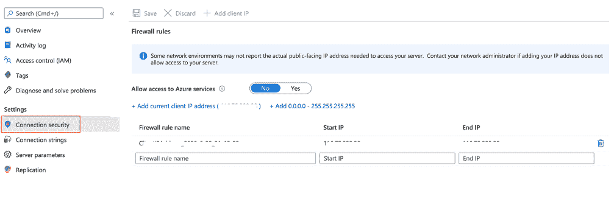*

*要更改 Azure DB for PostgreSQL 的复制模式，可以使用 [az postgres 服务器配置](https://docs.microsoft.com/cli/azure/postgres/server/configuration?view=azure-cli-latest&WT.mc_id=acloudguru-blog-abhishgu#az-postgres-server-configuration-set)命令:*

```
*az postgres server configuration set --resource-group <name of resource group> --server-name <name of server> --name azure.replication_support --value logical*
```

*..或者使用 Azure 门户中 PostgreSQL 实例的**复制**菜单:*

*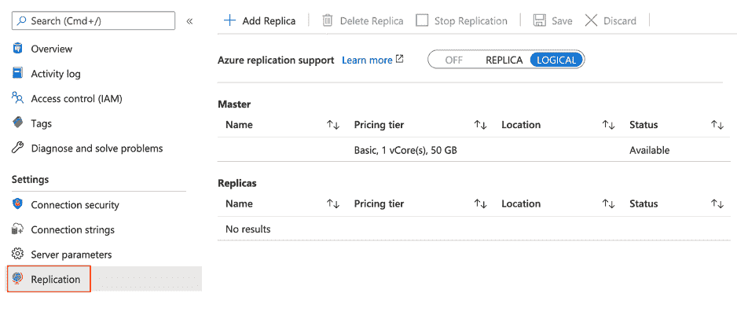*

*更新配置后，您需要使用 CLI([az postgres server restart](https://docs.microsoft.com/cli/azure/postgres/server?view=azure-cli-latest&WT.mc_id=acloudguru-blog-abhishgu#az-postgres-server-restart))或门户重新启动服务器。*

*一旦数据库启动并运行，就创建表。我在这个例子中使用了 psql CLI，但是也可以随意使用其他工具。例如，通过 SSL 连接到 Azure 上的 PostgreSQL 数据库(系统会提示您输入密码):*

```
*psql -h <POSTGRESQL_INSTANCE_NAME>.postgres.database.azure.com -p 5432 -U <POSTGRES_USER_NAME> -W -d <POSTGRES_DB_NAME> --set=sslmode=require

//example
psql -h my-pgsql.postgres.database.azure.com -p 5432 -U foo@my-pgsql -W -d postgres --set=sslmode=require*
```

*使用下面的 SQL 创建表:*

```
*CREATE SCHEMA retail;

CREATE TABLE retail.orders_info (
    orderid SERIAL NOT NULL PRIMARY KEY,
    custid INTEGER NOT NULL,
    amount INTEGER NOT NULL,
    city VARCHAR(255) NOT NULL,
    purchase_time VARCHAR(20) NOT NULL
);*
```

*purchase_time 捕获执行购买的时间，但是它使用 VARCHAR 而不是 TIMESTAMP 类型(理想情况下)来降低整体复杂性。这是因为 [Debezium Postgres 连接器处理时间戳数据类型](https://debezium.io/documentation/reference/1.2/connectors/postgresql.html#postgresql-timestamp-type)的方式(这是正确的！)*

*在接下来的几节中，您将设置源(PostgreSQL)、接收器(Azure Data Explorer)连接器，并验证端到端管道。*

*多亏了 Docker Compose，启动我们的本地环境非常容易。我们只需要一个命令:*

```
*docker-compose --project-name adx-kafka-cdc up --build*
```

*这将与 Kafka、Zookeeper 和 Kafka Connect workers 一起构建(并启动)订单生成器应用程序容器。*

*下载和启动容器可能需要一段时间:这只是一次性的过程。*

*要确认是否所有容器都已启动:*

```
*docker-compose -p adx-kafka-cdc ps* 
```

*订单生成器应用程序将开始向 PostgreSQL 中的 orders_info 表插入随机订单事件。此时，您还可以进行快速的健全性检查，以确认订单信息是否被持久化——在下面的示例中，我使用了 [psql](https://www.postgresql.org/docs/13/app-psql.html) :*

```
*psql -h <POSTGRESQL_INSTANCE_NAME>.postgres.database.azure.com -p 5432 -U <POSTGRES_USER_NAME> -W -d <POSTGRES_DB_NAME> --set=sslmode=require

select * from retail.orders_info order by orderid desc limit 5;*
```

*这将为您提供最近的五个订单:*

```
* orderid | custid | amount |   city    |    purchase_time   
---------+--------+--------+-----------+---------------------
      10 |     77 |    140 | Seattle   | 2020-10-09 07:10:49
      9  |    541 |    186 | Cleveland | 2020-10-09 07:10:46
      8  |    533 |    116 | Cleveland | 2020-10-09 07:10:42
      7  |    225 |    147 | Chicago   | 2020-10-09 07:10:39
      6  |    819 |    184 | Austin    | 2020-10-09 07:10:36
(5 rows)*
```

*为了将订单数据传输到 Kafka，我们需要配置并启动 Debezium PostgreSQL 源连接器的一个实例。*

*将下面的 JSON 内容复制到一个文件中(可以命名为 pg-source-config.json)。请确保使用与您的 PostgreSQL 实例对应的值更新以下属性:database.hostname、database.user、database.password。*

```
*{
    "name": "pg-orders-source",
    "config": {
        "connector.class": "io.debezium.connector.postgresql.PostgresConnector",
        "database.hostname": "<enter database name>.postgres.database.azure.com",
        "database.port": "5432",
        "database.user": "<enter admin username>@<enter database name>",
        "database.password": "<enter admin password>",
        "database.dbname": "postgres",
        "database.server.name": "myserver",
        "plugin.name": "wal2json",
        "table.whitelist": "retail.orders_info",
        "value.converter": "org.apache.kafka.connect.json.JsonConverter"
    }
}*
```

*在编写时，Debezium 支持以下插件:decoderbufs、wal2json、wal2json_rds、wal2json_streaming、wal2json_rds_streaming 和 pgoutput。我在这个例子中使用了 wal2json，Azure 也支持它。*

*要启动连接器，只需使用 [Kafka Connect REST 代理](https://acloudguru.com/hands-on-labs/consuming-kafka-messages-with-confluent-rest-proxy)端点来提交配置。*

```
*curl -X POST -H "Content-Type: application/json" --data @pg-source-config.json http://localhost:9090/connectors

# to confirm
curl http://localhost:9090/connectors/pg-orders-source*
```

**注意，REST 端点的端口是 9090。这是在 docker-compose.yaml* 中定义的每个服务端口映射*

*让我们来看看 Kafka 主题，看看由源连接器产生的变更数据捕获事件。*

```
*docker exec -it adx-kafka-cdc_kafka_1 bash*
```

*你将被丢进一个壳里(在容器里)。执行以下命令以使用 Kafka 中的变更数据事件:*

```
*cd bin && ./kafka-console-consumer.sh –topic myserver.retail.orders_info –bootstrap-server kafka:9092 –from-beginning*
```

**注意，主题名**my server . retail . orders _ info**是 Debezium 连接器*使用的约定的结果*

*主题中的每个事件都对应一个特定的顺序。它是 JSON 格式的，如下图所示。请注意，有效负载还包含整个模式，为了简洁起见，该模式已被删除。*

```
*{
    "schema": {....},
    "payload": {
        "before": null,
        "after": {
            "orderid": 51,
            "custid": 306,
            "amount": 183,
            "city": "Austin",
            "purchase_time":"2020-10-09 07:23:10"
        },
        "source": {
            "version": "1.2.1.Final",
            "connector": "postgresql",
            "name": "myserver",
            "ts_ms": 1602057392691,
            "snapshot": "false",
            "db": "postgres",
            "schema": "retail",
            "table": "orders_info",
            "txId": 653,
            "lsn": 34220200,
            "xmin": null
        },
        "op": "c",
        "ts_ms": 1602057392818,
        "transaction": null
    }
}*
```

*到目前为止，我们已经有了前半部分的管道。让我们开始第二部分吧！*

*将下面的 JSON 内容复制到一个文件中(可以将其命名为 adx-sink-config.json)。根据您的 Azure Data Explorer 设置替换以下属性的值-aad . auth . authority、aad.auth.appid、aad.auth.appkey、kusto.tables.topics.mapping(数据库名称)和 kusto.url*

```
*{
    "name": "adx-orders-sink",
    "config": {
        "connector.class": "com.microsoft.azure.kusto.kafka.connect.sink.KustoSinkConnector",
        "flush.size.bytes": 10000,
        "flush.interval.ms": 30000,
        "tasks.max": 2,
        "topics": "myserver.retail.orders_info",
        "kusto.tables.topics.mapping": "[{'topic': 'myserver.retail.orders_info','db': '<enter database name>', 'table': 'Orders','format': 'json', 'mapping':'OrdersEventMapping'}]",
        "aad.auth.authority": "<enter tenant ID from service principal info>",
        "kusto.url": "https://ingest-<enter cluster name>.<enter region>.kusto.windows.net",
        "aad.auth.appid": "<enter app ID from service principal info>",
        "aad.auth.appkey": "<enter password from service principal info>",
        "key.converter": "org.apache.kafka.connect.storage.StringConverter",
        "transforms": "unwrap",
        "transforms.unwrap.type": "io.debezium.transforms.ExtractNewRecordState"
    }
}*
```

*注意，这里使用了 Kafka Connect [单消息转换](https://kafka.apache.org/documentation/#connect_transforms)(SMT)——这是 Debezium 提供的 ExtractNewRecordState 转换。你可以在文档中详细阅读*

```
*"transforms": "unwrap",
"transforms.unwrap.type": "io.debezium.transforms.ExtractNewRecordState"*
```

*它从 JSON 有效负载中删除了模式和其他部分，只保留所需的内容。在这种情况下，我们从 after 属性(在有效负载中)中寻找订单信息。例如*

```
*{
    "orderid": 51,
    "custid": 306,
    "amount": 183,
    "city": "Austin",
    "purchase_time":"2020-10-09 07:23:10"
}*
```

*当然，您可以对此进行不同的建模(在源连接器本身中应用转换)，但是这种方法有几个好处:*

1.  *仅将相关数据发送到 Azure Data Explorer*
2.  *Kafka 主题包含*整个*变更数据事件(以及模式),任何下游服务都可以利用该事件*

*要安装连接器，只需像以前一样使用 Kafka Connect REST 端点:*

```
*curl -X POST -H "Content-Type: application/json" --data @adx-sink-config.json http://localhost:8080/connectors

# check status
curl http://localhost:8080/connectors/adx-orders-sink/status*
```

**注意，REST 端点的端口是 8080。这是在 docker-compose.yaml* 中定义的每个服务端口映射*

*连接器应该投入运行，向 Azure Data Explorer 进行身份验证，并开始批处理接收过程。*

**注意，flush.size.bytes 和 flush.interval.ms 用于调节批处理过程。请参考* [*连接器文档*](https://github.com/Azure/kafka-sink-azure-kusto/blob/master/README.md#5-sink-properties) *了解各个属性的详细信息。**

*由于连接器的刷新配置和 Azure Data Explorer 中 Orders 表的批处理策略相当激进(出于演示目的)，您应该会看到数据快速流入 Data Explorer。*

*您可以在数据资源管理器中查询 Orders 表来分割数据。下面是一些简单的查询。*

*获取纽约市订单的详细信息:*

```
*Orders
| where city == 'New York'*
```

*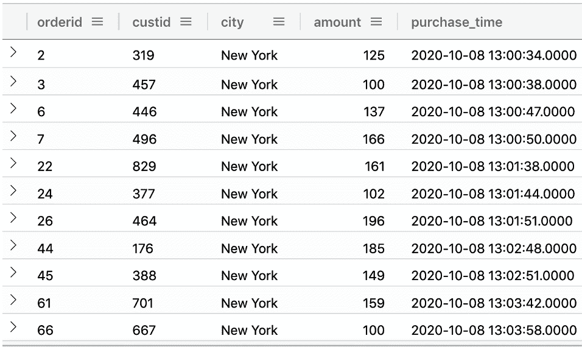*

*仅获取来自纽约市的订单的购买金额和时间，并按金额排序:*

```
*Orders
| where city == 'New York'
| project amount, purchase_time
| sort by amount*
```

*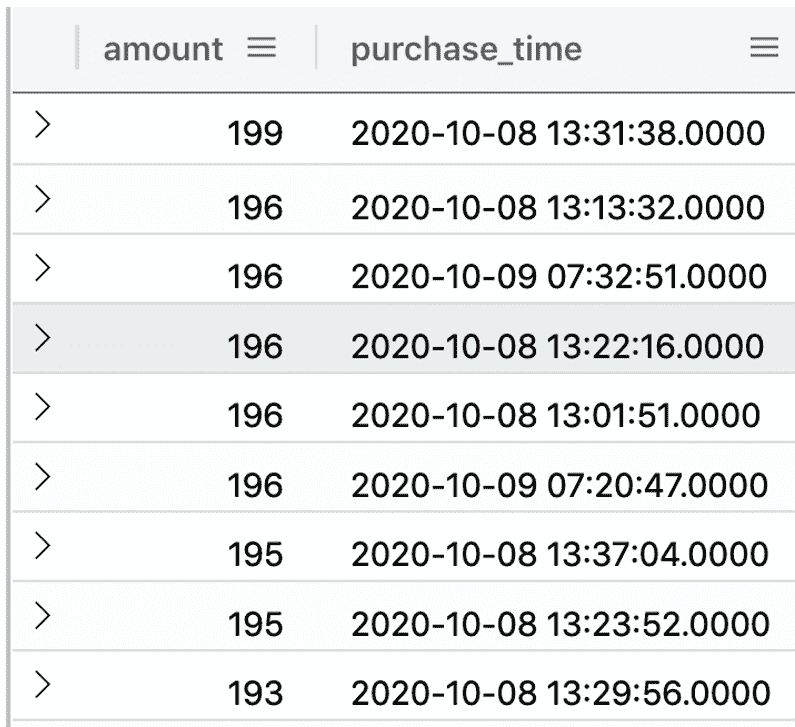*

*找出每个城市的平均销售额，并用柱形图表示出来:*

```
*Orders
| summarize avg_sales = avg(amount) by city
| render columnchart*
```

*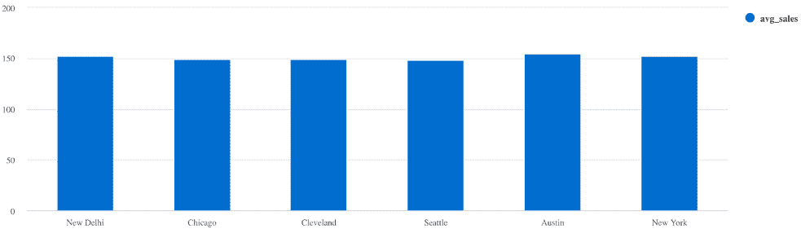*

*每个城市的总购买量，以饼图表示:*

```
*Orders
| summarize total = sum(amount) by city
| sort by total
| render piechart*
```

*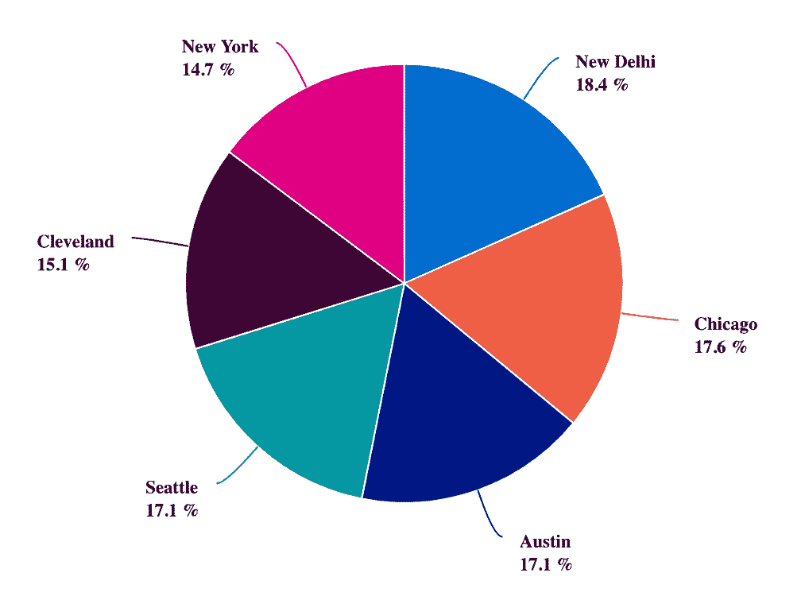*

*每个城市的订单数量，以折线图表示:*

```
*Orders
| summarize orders = count() by city
| sort by orders
| render linechart  *
```

*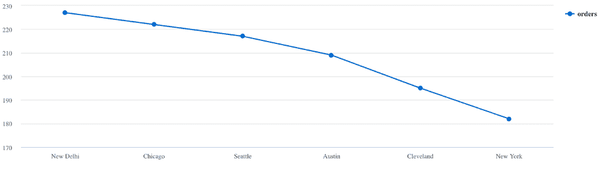*

*购买量在一天内如何变化？*

```
*Orders
| extend hour = floor(purchase_time % 1d , 10m)
| summarize event_count=count() by hour
| sort by hour asc
| render timechart*
```

*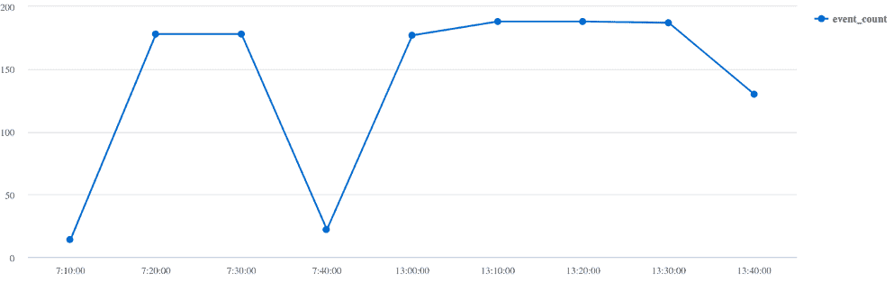*

*在不同的城市，一天之内它是如何变化的？*

```
*Orders
| extend hour= floor( purchase_time % 1d , 10m)
| where city in ("New Delhi", "Seattle", "New York", "Austin", "Chicago", "Cleveland")
| summarize event_count=count() by hour, city
| render columnchart*
```

*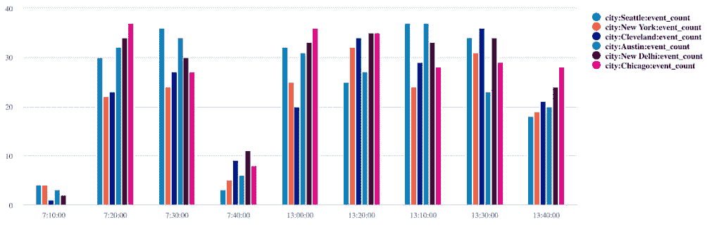*

### *Azure 数据浏览器仪表板*

*您可以组合一个或多个这样的查询，并创建实时仪表板。例如:*

*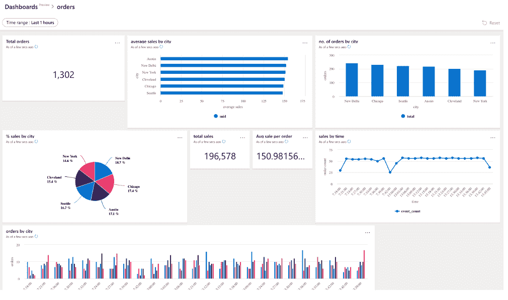*

*要了解更多信息，请查看如何[使用 Azure Data Explorer 仪表盘可视化数据](https://docs.microsoft.com/en-us/azure/data-explorer/azure-data-explorer-dashboards)*

*要停止容器，您可以:*

```
*docker-compose -p adx-kafka-cdc down -v*
```

*要删除 Azure Data Explorer 集群/数据库，请使用 [az 集群删除](https://docs.microsoft.com/cli/azure/kusto/cluster?view=azure-cli-latest&WT.mc_id=acloudguru-blog-abhishgu#az-kusto-cluster-delete)或 [az kusto 数据库删除](https://docs.microsoft.com/cli/azure/kusto/database?view=azure-cli-latest&WT.mc_id=acloudguru-blog-abhishgu#az-kusto-database-delete)。对于 PostgreSQL，只需使用 [az postgres 服务器删除](https://docs.microsoft.com/cli/azure/postgres/server?view=azure-cli-latest&WT.mc_id=acloudguru-blog-abhishgu#az_postgres_server_delete)*

```
*az postgres server delete -g <resource group name> -n <server name>
az kusto cluster delete -n <cluster name> -g <resource group name>
az kusto database delete -n <database name> --cluster-name <cluster name> -g <resource group name>*
```

### *结论*

*Kafka Connect 帮助您构建可扩展的数据管道，而无需编写定制的管道代码。您主要需要设置、配置，当然还有操作连接器。*

*请记住，Kafka Connect worker 实例只是 JVM 进程，根据您的规模和需求，您可以选择使用 Docker 容器的形式来操作它们，使用一流的编排服务，如 [Azure Kubernetes 服务](https://docs.microsoft.com/azure/aks/?WT.mc_id=acloudguru-blog-abhishgu)。因为 Kafka Connect 实例是无状态的实体，所以您在集群工作负载的拓扑和规模方面有很大的自由度！*

*如果您想进一步探索，我建议您深入以下主题:*

**想了解更多关于 Azure 认证的信息吗？*
*查看我们的 [Azure 认证和学习路径。](https://acloudguru.com/azure-cloud-training)**

### *关于作者*

*Abhishek Gupta 是微软的高级开发人员。你可以在 [Twitter](https://twitter.com/abhi_tweeter) 上关注他，在 [LinkedIn](https://in.linkedin.com/in/abhirockzz) 上联系他，或者关注他的[博客](https://medium.com/@abhishek1987)。*