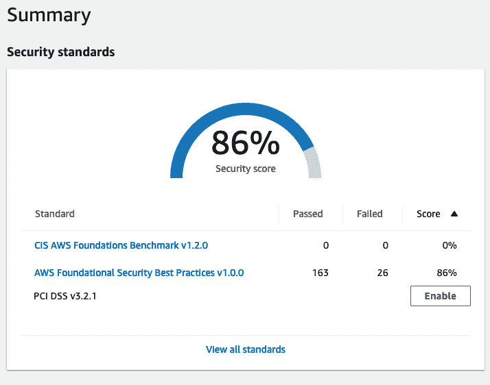
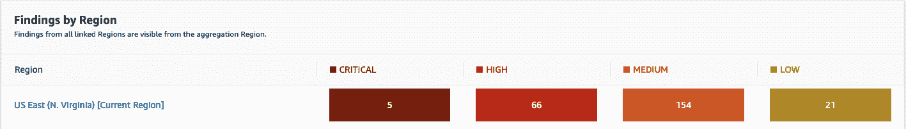
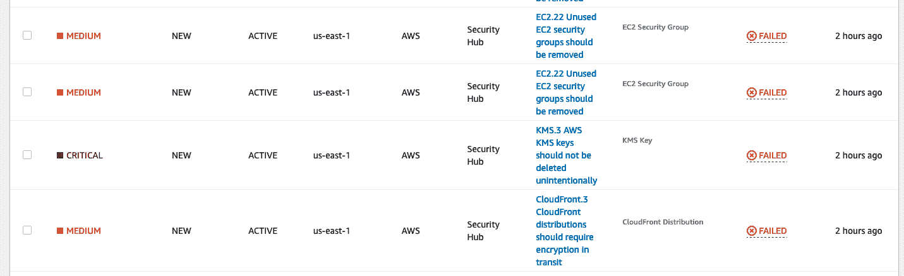
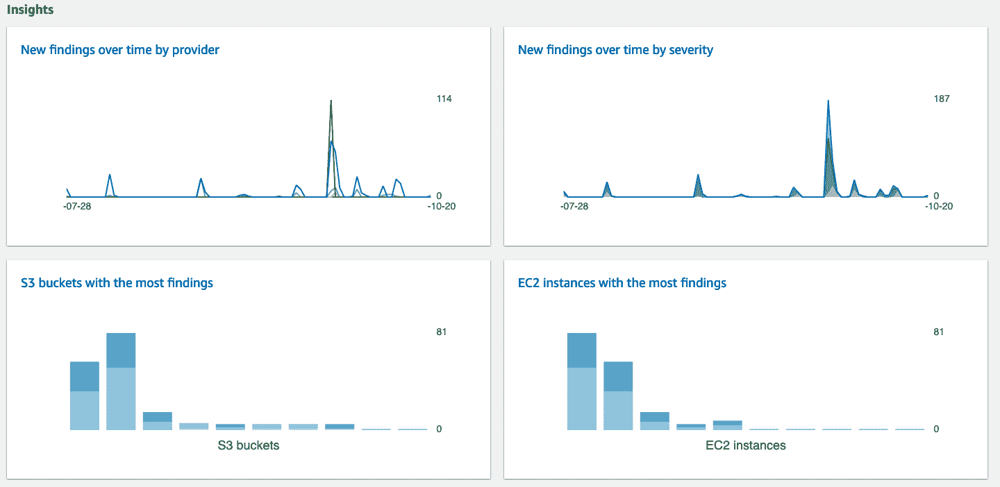
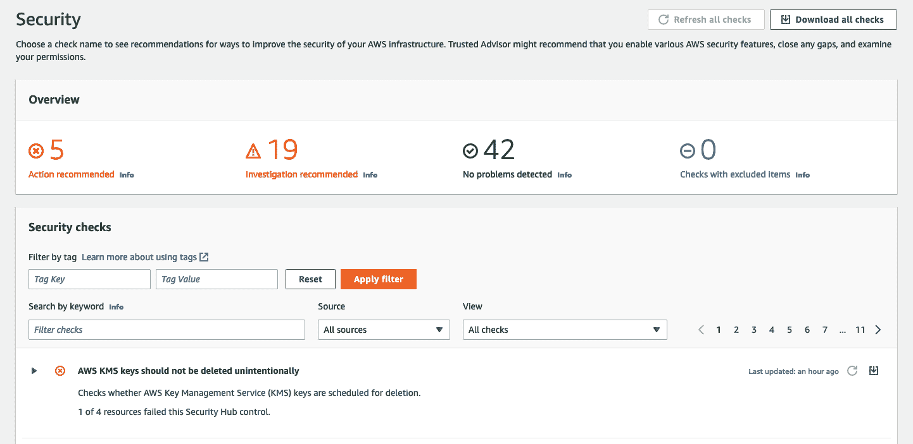

# 如何借助 AWS 安全中心，掌控安全

> 原文：<https://acloudguru.com/blog/engineering/using-aws-security-hub>

说到保护您的 AWS 环境，您可以使用许多服务来检测、保护、监控和修复威胁。这么多，其实要不断地全部管理，可能有点吃不消！谢天谢地，AWS 已经想到了这一点，并为我们提供了 AWS 安全中心。

在本文中，我们将讨论 AWS 安全中心；它是什么，它能做什么，以及如何将它与 Trusted Advisor 等其他产品结合使用，以提供您的 AWS 环境的鹰眼视图。

* * *

## 加速您的职业发展

[从 ACG 开始](https://acloudguru.com/pricing)通过 AWS、Microsoft Azure、Google Cloud 等领域的课程和实际动手实验室改变你的职业生涯。

什么是 AWS 安全中心？

* * *

## AWS Security Hub 就像它听起来的那样:一个可以全面了解 AWS 安全状态的地方。Security Hub 从服务、AWS 帐户甚至第三方合作伙伴产品中收集数据。它帮助您掌握标准和最佳实践。

当您第一次进入安全中心时，您将看到您的安全分数，如下所示。

向安全中心发送调查结果或数据的一些不同服务包括:

AWS 配置

*   AWS 防火墙管理器
*   亚马逊守卫
*   AWS 健康
*   AWS IAM 访问分析器
*   亚马逊检查员
*   亚马逊 Macie
*   AWS 系统管理器补丁管理器
*   请记住，像 AWS Firewall Manager 这样的服务也从 AWS WAF 和 AWS Network Firewall 这样的地方收集数据，因此发送到 Security Hub 的数据也将包括他们的发现。

这些数据可以跨 AWS 帐户发送，这需要花费大量的时间来跟踪什么发现来自哪里。

安全中心的严重级别

## 安全中心的调查结果按严重级别提供。有四个严重级别:严重、高、中和低。

这些级别有助于您确定需要多快找到特定项目的解决方案。例如，如果您有一个需要删除的 KMS 键，它将显示为防止任何意外删除的关键发现。相比之下，如果 S3 存储桶没有配置生命周期策略，这将显示为低严重性。

安全中心还允许您设置工作流状态和对某些调查结果的自定义操作。这有助于维护安全性，而不需要有人有目的地进入并采取行动(这节省了时间、金钱并防止了错误)。

深入了解安全中心

## 安全中心还提供了见解。这些见解涵盖了各种主题的趋势，从 S3 到 EC2，再到未达到的标准或最佳实践。洞察可以用来帮助可视化整个 AWS 的安全状态。

我提到了最佳实践，这就是可信顾问发挥作用的地方！

什么是 AWS 可信顾问？

## AWS Trusted Advisor 会检查您的环境，并提出有助于增强安全性、提高成本优化和性能的建议。然后，您可以遵循这些来帮助优化您的服务和资源。

AWS Security Hub 如何与 Trusted Advisor 配合使用

## AWS 安全中心将其调查结果发送给可信赖的顾问。这意味着当您查看建议时，您可以查看与这些建议一致的调查结果。举个例子，

让我们回到我们需要删除的 KMS 键。它作为一个关键发现出现在安全中心，我们知道安全中心将该发现发送给了可信顾问，因为 AWS KMS 密钥不应被意外删除。

你进入可信赖的顾问，看看是否有任何行动或调查建议，并看到熟悉的发现。

因为我们已经在安全中心看到了它，我们知道我们在那里都很好。如果我们不知道它，我们可以调查谁在 CloudTrail 中设置了删除键，并弄清楚删除它是否会在我们的环境中引起任何问题。

结论

## 在威胁不断演变的同时，我们的安全状况也必须不断变化。维护您环境中的安全性是一个持续的过程，您可以使用越多的技巧和窍门来更轻松地管理它，效果越好。利用 AWS Security Hub 等服务并将其与 Trusted Advisor 等产品相集成，可以为您维护强大的安全状态提供所需的支持。

有了这一新的认识，我强烈建议您继续使用 AWS Security Hub，并在 Trusted Advisor 中涉水前行。弄脏你的手，看看你的环境可以做些什么改进！

如果您想深入了解其他 AWS 安全主题，但您刚刚开始涉足该领域，请深入了解 AWS 安全课程的[介绍。它将为您的云安全之旅打下坚实的基础。](https://acloudguru.com/course/introduction-to-aws-security)

If you want to dive into other AWS Security topics, but you are just starting out in the arena, dive into the [Introduction to AWS Security course](https://acloudguru.com/course/introduction-to-aws-security). It will help provide you with a solid starting foundation into your cloud security journey.