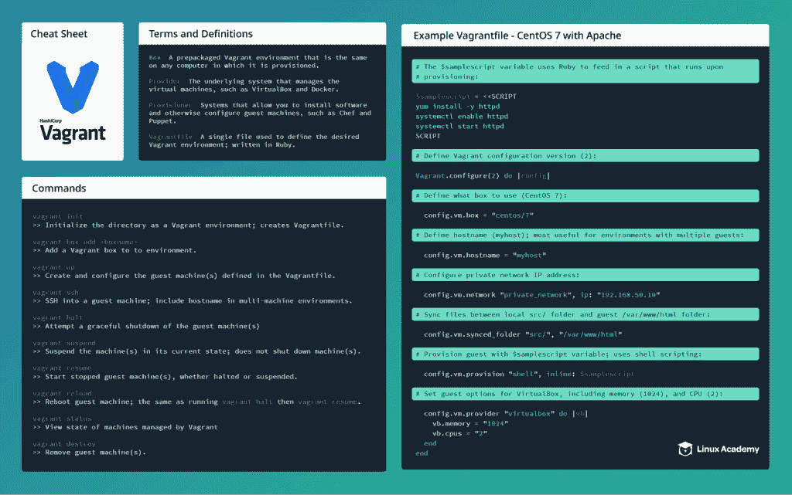

# 流浪记小抄+流浪记入门|一个云宗师

> 原文：<https://acloudguru.com/blog/engineering/vagrant-cheat-sheet-get-started-with-vagrant>

我们带着另一张小抄回来了——这次是给流浪者的！我们定义了一些常用术语，为您提供了最常用命令的概要，甚至包括一个样例 vagger 文件，该文件提供了一个基本的 CentOS 7 web 服务器进行实验。查看小抄，获取里面的基本流浪教程！

## 小抄

[](https://linuxacademy.com/site-content/uploads/2017/12/vagrant-cheatsheet-Linux-Academy.pdf)

## 流浪汉入门

### 先决条件

*   [流浪汉](https://www.vagrantup.com/downloads.html)！流浪汉很容易安装，过程应该只需要几分钟。
*   [虚拟盒](https://www.virtualbox.org/)
*   Linux，Mac，或者 Windows！流浪汉可以在任何操作系统上使用，命令都是一样的。
*   操作系统的基本命令行知识。由于本指南与操作系统无关，我们将使用通用术语，如“进入`src`目录”,而不是使用任何特定的命令；您应该知道如何在您的系统上执行以下命令:
    *   更改目录
    *   打开文本文件
    *   添加文本文件
*   Windows 用户也应该安装了 PuTTY。

### 创建你的流浪项目

1.  创建一个我们可以工作的目录。在本指南中，我们将使用通用名称`vagrantdir`来引用该文件夹。
2.  从命令行，移动到`vagrantdir`文件夹。
3.  我们计划创建一个 CentOS 7 客户机。为此，我们需要找到合适的盒子来使用。公共包厢可以在这里找到[。在这种情况下，我们使用 centos 提供的](https://app.vagrantup.com/boxes/search) [centos/7](https://app.vagrantup.com/centos/boxes/7) 盒子。除了 VirtualBox，这个盒子还兼容 VMWare 和 libvirt 提供程序。添加框:

    ```
     vagrant box add centos/7
    ```

4.  我们现在可以创建一个基本的流浪者文件:

    ```
     vagrant init --minimal 
    ```

    > 如果我们在没有`--minimal`标志的情况下运行`vagrant init`，我们的流浪者文件将生成指导性注释。出于本指南的考虑，我们选择不包含额外的注释，以便为我们提供一个更清晰的流浪文件。

### 通过浮动文件配置客户机

#### 基本设置

1.  Open the newly-created Vagrantfile in your chosen text editor. Currently, it should resemble the following:

    ```
     Vagrant.configure(2) do |config|   config.vm.box = "base" end
    ```

    就目前的情况而言，这个浮动文件所做的只是将浮动配置版本定义为`2` ( `Vagrant.configure(2) do |config|`)，并将客户机设置为从“基础”框(`config.vm.box = "base"`)开始工作。注意，盒子配置开头的`config`直接引用回版本行中的`|config|`值。我们所有的配置设置都会从`config`开始。

2.  更新框以使用我们刚刚添加的 CentOS 7:

    ```
     Vagrant.configure(2) do |config|   config.vm.box = "centos/7" end
    ```

3.  我们还想为这个机器定义主机名 *myhost* 。我们可以通过简单地将`config.vm.hostname = "myhost"`添加到我们的代码:

    ```
     Vagrant.configure(2) do |config|   config.vm.box = "centos/7"   config.vm.hostname = "myhost" end
    ```

    中来做到这一点
4.  我们也可以在流浪者中配置网络设置。在这个例子中，我们将在一个私有网络范围内设置一个 IP 地址:

    ```
     Vagrant.configure(2) do |config|   config.vm.box = "centos/7"   config.vm.hostname = "myhost"   config.vm.network "private_network", ip: "192.168.50.10" end
    ```

    > 如果您已经使用了私有 IP 192.168.50.10，请相应地更新游民文件以使用不同的地址。

#### Sync Folders

在 vagger 中，我们可以将一个文件夹同步到我们的来宾机器中的一个文件夹。因为我们正在创建一个示例 web 服务器，所以我们希望本地目录保存我们网站的文件。

1.  在您的环境目录下创建一个名为 *src* 的目录。
2.  要配置`src`目录同步到`/var/www/html`目录，使用`synced_folder`选项:

    ```
     Vagrant.configure(2) do |config|   config.vm.box = "centos/7"   config.vm.hostname = "myhost"   config.vm.network "private_network", ip: "192.168.50.10"   config.vm.synced_folder "src/", "/var/www/html" end
    ```

3.  如果需要，将一个`index.html`文件添加到您的`src`目录中，其中包含您想要的任何内容。

#### 设置供应

在创建服务器时，vagger 能够与许多配置工具配对来配置您的服务器。最基本的使用简单的 shell 脚本。这是我们将要使用的。具体来说，我们将使用 Ruby 语法将一系列命令输入到一个变量中，然后在配置我们的供应的行中调用该变量。

1.  创建一个安装、启用和启动 Apache 的`$samplescript`变量。将此*放在*之前，浮动配置节:

    ```
     $samplescript = <<SCRIPT yum install -y httpd systemctl enable httpd systemctl start httpd SCRIPT Vagrant.configure(2) do |config| [snip]
    ```

2.  将 provisioner 配置行添加到主代码块:

    ```
     Vagrant.configure(2) do |config|   config.vm.box = "centos/7"   config.vm.hostname = "myhost"   config.vm.network "private_network", ip: "192.168.50.10"   config.vm.synced_folder "src/", "/var/www/html"   config.vm.provision "shell", inline: $samplescript end
    ```

#### 配置 VirtualBox

最后，我们可以使用我们的流浪文件来配置 VirtualBox。这是通过在我们的流浪者文件的主要部分中添加一个特定于 VirtualBox 的代码块来实现的:

```
config.vm.provider "virtualbox" do |vb|  vb.memory = "1024"  vb.cpus = "2"end
```

注意它的格式是如何类似于浮动配置行的设置的，只是我们没有定义然后将`config`添加到配置中，而是使用了`vb`(对于 VirtualBox 请注意，该值不必相同)。

### 最后的流浪档案

您的最终流浪文件应该如下所示:

```
$samplescript = <<SCRIPTyum install -y httpdsystemctl enable httpdsystemctl start httpdSCRIPTVagrant.configure(2) do |config|  config.vm.box = "centos/7"  config.vm.hostname = "myhost"  config.vm.network "private_network", ip: "192.168.50.10"  config.vm.synced_folder "src/", "/var/www/html"  config.vm.provision "shell", inline: $samplescript  config.vm.provider "virtualbox" do |vb|    vb.memory = "1024"    vb.cpus = "2"  endend
```

保存并退出文件。

### 流浪起来！

完成我们的流浪文件后，返回命令行并确保您在`vagrantdir`目录中。从这里，我们可以启动我们的虚拟机。在流浪者中启动一个虚拟机是容易的。只需运行:

```
vagrant up
```

等待设置过程完成。完成后，您可以通过在浏览器中访问`192.168.50.10:80`来查看 web 服务器是否工作。我们也可以 SSH 到我们的服务器。这个过程取决于您的工作站计算机。

#### 来自 Linux 和 Mac 的 SSH

要从 Linux 或 Mac 工作站 SSH 到您的新虚拟机，只需使用:

```
vagrant ssh
```

请随意花点时间参观 CentOS 环境。完成后回到你的工作站。

#### Windows 中的 SSH

由于您不能从 Windows 中的命令行 SSH 到您的虚拟机，我们需要使用 SSH 客户端，比如 PuTTY。首先，从命令行运行`vagrant ssh-config`来检索虚拟机的 IP 地址和端口:

```
vagrant ssh-config
```

接下来，将这些信息输入到 PuTTY 中；经过迁移调配的虚拟机的默认用户名和密码都是*迁移*。从这里，我们应该能够连接到您的服务器。借此机会探索来宾机。完成后关闭连接。

### 停止、启动和销毁

恭喜你！你刚刚旋转了你的第一个流浪者盒子并且登录了！通常，无论你在做什么项目，你都会继续使用你的流浪环境。但是当你结束一天的工作后呢？您可以通过两种方式关闭机器，`vagrant halt`和`vagrant suspend`。

#### 停止

要停止计算机，即尝试正常关机，此时计算机会像物理机一样关闭，请运行以下命令:

```
vagrant halt
```

#### 暂停

挂起的机器是关闭但没有关闭的机器；本质上，它保存在运行`suspend`时的确切状态。要暂停机器，请运行:

```
vagrant suspend
```

#### 简历

要启动之前暂停或挂起的机器，请运行:

```
vagrant resume
```

#### 重新开始

您可能还需要重新启动您的机器，以确保您的系统设置通过重新启动或其他方式保持不变。使用以下命令重新启动机器:

```
vagrant restart
```

重启与运行`vagrant halt`相同，随后是`vagrant resume`。

#### 破坏

如果您永久地结束了您的流浪环境，并希望将其从您的系统中完全删除，请使用:

```
vagrant destroy
```

出现提示时，确认您希望销毁机器。

### 结论

vagger 是一个强大且非常有用的工具，它可以确保你的开发系统无论在什么计算机上运行都是一样的。您可以随意修改和扩展这个示例，如果遇到困难，一定要下载备忘单作为快速参考！坚持练习，你很快就会成为流浪专家。