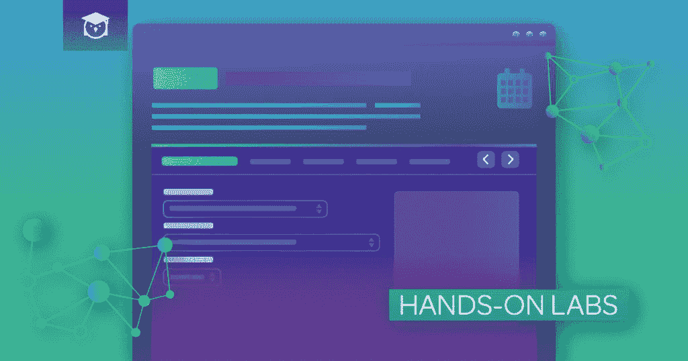

# 如果我没有通过 AWS 认证考试怎么办？|云专家

> 原文：<https://acloudguru.com/blog/engineering/what-if-i-fail-my-aws-certification-exam>

所以你决定要获得 AWS 认证。恭喜你。做出这个决定是伟大的第一步。很多人花了几周或几个月的时间反复思考，害怕做出承诺。获得认证会给你的职业生涯带来巨大的变化，但当你决定去争取时，压力并没有结束。人们最大的疑问之一是:

> 如果我没有通过 AWS 认证考试怎么办？

我要在这里分享一些我不喜欢谈论的事情:我在大学考试中失败了。我会学习好几天！我想我已经完全掌握了材料！但是，当我在考试那天翻到第一页时，整本书看起来就像希腊语。很多时候这些都是物理考试，所以公平地说，有*有*很多希腊字母，但这并没有让失败变得更容易接受。

## 不要害怕失败

恐惧会让你瘫痪。不要让对你能否通过考试的焦虑阻止你有效地学习。我知道，说起来容易做起来难，对吧？现实是很多人没有通过 AWS 认证考试。毕竟，他们并不容易。如果是的话，每个人都会有一个。证书的价值来自于它们难以获得的事实。他们向雇主展示你有一套别人没有的技能。它们是用来区分掌握 AWS 的人和没有掌握 AWS 的人的。很多人没有通过考试，也有很多人通过了考试。区别在于你是否真的了解 AWS。如果你只是简单地记住了一系列考试问题和答案，你可能会有一段困难的时间。如果你已经深入研究了每个概念，并且实际使用了这些服务，你就有更大的机会通过。如果你准备充分，没什么好害怕的。

## "不做准备，就是在为失败做准备。"

这就像本杰明·富兰克林 200 多年前说的一样正确。如果你不准备，你就是在为失败做准备。但是知道如何准备本身就是一个挑战。AWS 认证的在线学习材料似乎多如牛毛，而且并非所有的考试准备课程都是平等的。以下是考试前几周你可以做的几件事:

*   **看样题**——考试形式可以让你知道要找什么，不仅仅是内容，还有提问的方式。可以直接从 AWS 获取[样题](https://aws.amazon.com/certification/certified-solutions-architect-associate/)。
*   找一个学习伙伴——有人对你负责会迫使你认真复习资料，即使你不想做。AWS 可能很复杂，所以你可以确定你们每个人都知道一些其他人不知道的东西。
*   做点什么——你有个人博客吗？你把一个 web 应用作为一个附带项目来构建？将其迁移到 AWS。您会惊讶地发现，只要使用该平台并调试您遇到的任何实际问题，您就可以学到很多东西。

每天做一点很重要。即使你只有 15 分钟，你也可以利用这段时间看视频教程或阅读白皮书。当谈到学习像 AWS 认证这样困难的东西时，你简直不能过度准备。

## 管理你的压力

我知道，我知道。这违背了我刚才说的利用每一分空余时间学习，但是你还是需要找到一个平衡点。工作与生活的平衡很重要，每个人都需要休息。当你在学习 AWS 认证时，一定要休息一下。制定一个时间表并坚持下去是很重要的。这也适用于你的日程结束。如果你计划学习两个小时，不要熬夜死记硬背。当你的两个小时到了，去做一些你喜欢的事情。如果你压力太大，你就无法有效地学习，所以不要让压力消耗你。

## 我怎么知道我是否准备好了？

如果你错过了什么呢？如果考试问的是你没有学过的东西怎么办？我准备好成为认证解决方案架构师了吗？首先，深呼吸(见上图)。这些是每个人都担心的事情。越接近考试，越容易开始怀疑自己。考试将涵盖各种各样的主题，你可能不确定你是否涵盖了所有你需要知道的内容。幸运的是，这正是我们的专长。Linux Academy 根据您的学习需求提供个性化培训。它是这样工作的:

1.  你参加动手实验
2.  我们的学习引擎为您提供实时反馈
3.  当你拿到成绩时，你可以根据你的表现打开更多的动手实验室

如果您没有通过动手实验，您将获得基于您需要工作的领域的定制培训。你可以在一个真实的环境中测试你的技能，让你确切地知道你需要复习什么，而不是参加考试，然后艰难地发现你忘记了学习什么。不过，你不必相信我的话。你可以免费亲自尝试一下。

## …但是如果我还是失败了呢？

我们都同意失败是一种可怕的感觉。但这发生在每个人身上。正如我所说的，AWS 认证考试注定会很难，不是每个人都会通过第一次或第二次考试。成功不是来自于避免失败。当你*从失败中学习*并利用它在下一次做得更好时，它就来了。即使你遵循了每一个提示，研究了每一道样题，你仍然可能通不过考试。这没关系。如果您没有通过 AWS 认证考试，请再试一次。AWS 确实要求你在重考前等待 14 天，但是你可以利用这段时间(如果你需要的话，甚至更长)来充实你的知识，填补你的薄弱环节。重要的是振作起来，继续学习，尽你所能成为最好的解决方案架构师。还有一件事…如果你想知道的话。试了两次，但我最终还是通过了物理课。🙂