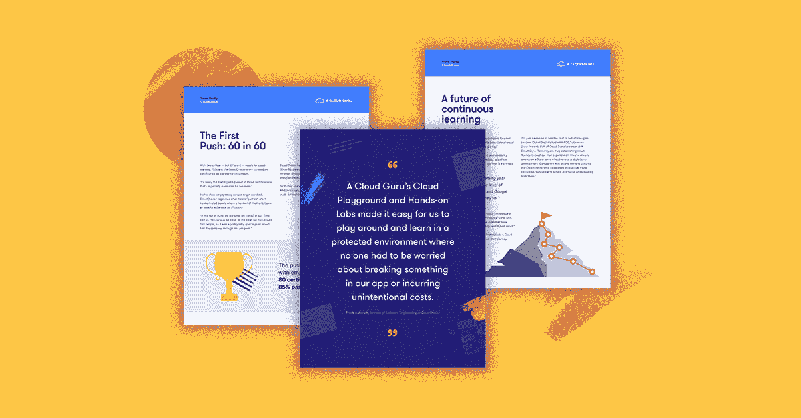

# 什么是云转型&为什么您应该拥抱它？|云专家

> 原文：<https://acloudguru.com/blog/engineering/what-is-cloud-transformation-why-embrace-it>

如今很难不听说云。似乎无论你走到哪里，企业都在讨论云转型战略，或者已经开始了他们的旅程。但是它仅仅是嗡嗡声(词语)，还是你需要知道的更多的东西？

* * *

**通往更好职业的钥匙**

[立即开始 ACG](https://acloudguru.com/pricing) 通过 AWS、Microsoft Azure、Google Cloud 等领域的课程和实际动手实验室来改变你的职业生涯。

* * *

如果你是一个商业领袖，技术决策者，或者对技术带来的商业成果感兴趣，那就留下来吧。我们将从更高的层面了解云转型实际上是什么，以及当它被完全接受时会是什么样的。

## 什么是云转型？

简单地说，云转型是每个人的事！这不仅仅是技术爱好者的时尚。事实上，如果你的技术团队*告诉业务*云将如何在技术上提供帮助，那么你可能需要重新考虑如何扭转这种对话。这里有一些你可以问自己的问题。

### 云如何帮助您的企业？

要实现云转型的最大价值，这是首先要问的问题之一。通常，表达谈话的最佳方式是以业务为中心。

云不仅仅是为了技术而技术。也不仅仅是将您的数字资产从内部转移到云中。事实上，它甚至不一定是全在云端，甚至不一定只是一个云提供商。它可以是对业务有意义*的任何类型的云部署，以最好地实现*业务成果*。*

**云转型是实现更大商业价值的机会。**

* * *

**[阅读:7 个常见的云采用错误](https://go.acloudguru.com/cloud-adoption-mistakes-ebook)** 三分之二的公司报告没有获得预期的云优势。 [*7 种常见的云采用错误*电子书](https://go.acloudguru.com/cloud-adoption-mistakes-ebook)详细介绍了企业可能会犯的错误，这些错误可以让他们的云努力保持稳定。

* * *

### 企业通过云转型可以实现什么价值？

云从根本上改变了技术的采购和管理方式。这一技术革命以前所未有的方式实现了更多、更简单、按需的技术访问。

企业现在可以在全球范围内快速打开或关闭各种各样的技术服务和产品。只需点击一个按钮。

这可以为所有行业的企业带来各种可衡量的结果。我们谈论的是更快的开店时间、减少制造故障、提高客户满意度、增加市场收益、数字颠覆等等！

## 那么，云转型之旅是什么样的呢？

每个[云转型战略](https://learn.acloud.guru/series/cloud-adoption-essentials)都是不同的，但是有一些你想要考虑的共同因素。实现商业价值需要商业方向和赞助。企业应围绕驱动因素和预期结果引导讨论。这不仅仅是技术问题。

由于转型是由业务成果定义的，因此确保业务本身围绕这些目标保持一致非常重要。转型包括更高的云采用率、*和*更高的组织云成熟度。单靠其中一项很难取得成功。你应该注意以一种可控的方式有意识地将这些进展结合在一起。

* * *

CloudCheckr 使用 ACG 在短短 90 天内提升了他们在 AWS 上的所有销售人员。[看看他们是怎么做到的](https://go.acloudguru.com/cloudcheckr-case-study?cpn=7013u000000VDht)。

* * *

### 您的企业如何利用云？

随着时间的推移，企业可能需要对技术的使用以及人员和流程进行现代化。因此，这可能包括:

*   组织调整，例如从职能小仓库转移到跨职能团队
*   项目管理和文化的改变，比如引入敏捷实践
*   简化的流程提供对云的自助式访问(在业务定义的防护栏内。您需要考虑法规和业务需求)
*   提高整个企业的云素养，以允许想法和创新，然后可以广泛地展示和快速地进行试验
*   支持现在和未来业务的技术开发和保留。

当然，这些只是企业为了更好地利用云的力量而可能做出的一些改变的例子。所有这些都是为了支持业务成果。

如果您同意云转型不仅仅是一个流行词，也不仅仅是为了技术而技术，那么您可能有兴趣进一步探索这一旅程！

要了解有关好处、挑战和云转型之旅的更多信息，请查看我的课程[云转型:大趋势](https://acloudguru.com/course/cloud-transformation-the-big-picture)。或者挖掘一些[云转型常见问题:文化、团队和大规模云流畅度](https://acloudguru.com/blog/business/cloud-transformation-faqs-culture-teams-and-cloud-fluency-at-scale)以获得更多博客文章。