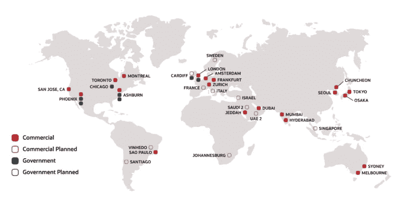

# 什么是 Oracle 云，为什么要使用它？|云专家

> 原文：<https://acloudguru.com/blog/engineering/what-is-oracle-cloud-and-why-should-you-use-it>

甲骨文云(OCI)是较新的云服务提供商之一，但什么是甲骨文云，什么时候应该考虑使用甲骨文云，应该学习甲骨文云？

这篇文章将为您提供这个云计算平台的高层次概述。我们将讨论 Oracle 云是什么，OCI 如何与其他云参与者相适应，以及您为什么应该关注它。我们将解释其基础架构如何帮助支持 OLTP 应用程序和数据传输密集型工作负载，并了解如何利用 Oracle 云进一步学习。

我们将关注两种不同的观点:

1.  您是 Oracle 云业务的潜在用户。
2.  作为一名学生，您正在考虑获得 Oracle 云认证。

我们开始吧！

## Oracle 云与其他云平台

从 2016 年底开始，Oracle 云成为该领域的新参与者之一。现在基本上有两种不同的云:行业领导者和利基参与者。Gartner 有一个非常好的图表，解释了细节，并为您提供了一个粗略的轮廓。图表，喂！

如你所见，亚马逊网络服务(AWS)、微软 Azure 和谷歌云(GCP)是这一领域的领导者。而阿里巴巴、甲骨文、IBM 和腾讯则处于“小众玩家”的位置。

虽然甲骨文目前被列为利基参与者，但他们拥有客户群，并渴望成长为像三大巨头一样的行业领导者。

看这张图时，重要的是要理解利基并不一定意味着第二层。事实上，根据您的具体需求，这些平台可能为您提供最佳选择。

考虑到这一点，我们将穿上防水靴，前往更深的水域。我现在将向您介绍 Oracle 云提供的服务以及最有可能的使用情形。

## Oracle 基础架构、服务和数据区域

首先，我们来看看可靠性和数据区域。

### Oracle 云有多少个数据区域？

Oracle 将其数据区域称为“[云区域](https://www.oracle.com/cloud/architecture-and-regions/)”甲骨文目前有 30 多个，包括政府。基本上，无论您需要去哪里，Oracle 都会在那里。

甲骨文与微软的合作进一步加强了这一点。目前有多个地区共享 Oracle 云和 Microsoft Azure 之间的互连。这允许客户在云中的应用程序之间轻松移动。

*Source: Oracle Cloud*

### 甲骨文云有多可靠？

就可靠性而言，Oracle 有一个可靠的基础架构，它由非常全面的端到端 SLA[提供支持，涵盖服务的性能、可用性和可管理性。](https://www.oracle.com/cloud/iaas/sla.html)

* * *

[**成年人的 NoSQL:DynamoDB 单表建模与里克·霍利汉**](https://get.acloudguru.com/nosql-for-grownups-dynamodb-webinar) 在[这个免费的点播网络研讨会](https://get.acloudguru.com/nosql-for-grownups-dynamodb-webinar)中，里克·霍利汉，AWS 的高级实践经理和单表 DynamoDB 设计的发明者，展示了他在 dynamo db 中建模复杂数据访问模式的技巧。

* * *

## 甲骨文云的优势和劣势是什么？

虽然在 Oracle 云中我们可以谈论大量的服务。我将重点介绍 Oracle 的一些优势。

Oracle 裸机云是一组云服务，让您能够构建所需的环境。

裸机服务意味着没有虚拟机管理程序，只有物理计算节点。这在以下情况下非常有用:

*   您想要高性能(这通常意味着与数据库有关)。
*   你想要更大的控制权。
*   你想要更好的成本管理。

基本上你有更多的自由去做你想做的事情。这样做的代价是需要更多的技能和时间来配置您喜欢的系统。

如果您发现自己不熟悉裸机服务器、虚拟机管理程序等概念，您可能会发现 Oracle 云比三大云提供商中的一些更不适合，因为 Oracle 通常需要更多的云知识。

### Oracle 云数据库

说到数据库，我们来谈谈 Oracle 云数据库选项。这些绝对是 Oracle 云的最大优势，这不足为奇，因为 Oracle 最大的客户群是数据库驱动的。

[例如，Oracle 数据库云服务器](https://www.oracle.com/au/engineered-systems/exadata/)是一个针对运行 Oracle 数据库而优化的计算平台。它擅长于同时运行的在线事务处理(OLTP)应用程序。

当然，如果不讨论 Oracle Cloud 著名的自治数据库，任何关于 Oracle Cloud 的评论都是不完整的，这些数据库非常适合 OLTP。自治数据库是传统数据库与机器学习的结合，提供了许多优势——它提供自动修补、优化备份、*和*自我修复

### Oracle 内部和混合环境

最后，我们来谈谈内部部署。Oracle 云尤其擅长迁移和支持混合环境。

Oracle 设计其云环境的主要目标之一是现有用户群。该用户群几乎完全是本地的。有了这些知识，Oracle 为用户迁移到云中设计了许多有用的特性。他们还有一个非常强大的混合环境支持模型。

### Oracle 云的弱点

虽然 Oracle 显然正在以巨大的速度增长，但他们在这个阶段最大的弱点是，一旦你超越核心用例，进入低端产品或更边缘的情况，这些功能就不能很好地与 Microsoft Azure 或 AWS 等更大的竞争对手相匹配。

## 有哪些 Oracle 云使用案例？

让我们通过两个使用案例来了解一下我认为什么是 Oracle 云的理想客户。

1.  Zoom 是一个非常流行的在线会议平台。Zoom 选择甲骨文而不是其他云提供商的主要原因之一是价格。Zoom 每月有数十万 TB 的流量流经云，而 Oracle Cloud 对数据传输定价的收费要低得多。如果您需要大量的数据传输或存储，Oracle 云可能会成为优于其他云提供商的绝佳选择，因为它们的产品价格极具竞争力。

2.  **Oracle 数据库用户** —如果您是 Oracle 数据库用户，您会发现 Oracle 在构建他们的云时考虑到了这种使用情形。从定价到支持数据库选项，再到混合和本地，现有 Oracle 用户喜欢 Oracle 云的地方数不胜数。

Oracle 明确将具有高流量和存储需求的大规模数据库用户及其当前客户作为 Oracle 云的理想目标。

这并不是说没有其他用例。甲骨文的产品绝对在突飞猛进地增长，而且，基于他们与微软的合作关系及其在 2020 年云区域几乎翻了一番，这是一个预计将持续的趋势。

Oracle 云提供免费试用，并且有一个非常强大的云成本估算工具。我绝对建议你去查一查，四处看看。

* * *

[**获得痛苦的云词典**](https://get.acloudguru.com/cloud-dictionary-of-pain)
说云不一定要努力。我们分析了数以百万计的回复，找出了最容易让人犯错的概念。抓住这个[云指南](https://get.acloudguru.com/cloud-dictionary-of-pain)获取一些最痛苦的云术语的简洁定义。

* * *

## 学习 Oracle 云

你可能会发现自己在想，“获得甲骨文认证会对我的职业生涯有帮助吗？”答案是响亮的是！

了解竞争平台有巨大的价值。它让你成为更受欢迎的候选人，让你更好地了解潜在客户可能来自哪里，并拓宽你对云概念的理解。

我强烈建议任何从事云计算的人花些时间学习几个不同的平台。我要特别指出 [Oracle 云基础认证](https://www.oracle.com/cloud/iaas/training/foundations.html)或 [Oracle 云架构师助理认证](https://www.oracle.com/cloud/iaas/training/architect-associate.html)，它们是帮助您打下 Oracle 云基础的绝佳目标。

* * *

## 获得更好职业所需的技能。

掌握现代技术技能，获得认证，提升您的职业生涯。无论您是新手还是经验丰富的专业人士，您都可以通过实践来学习，并在 ACG 的帮助下推进您的云计算职业生涯。