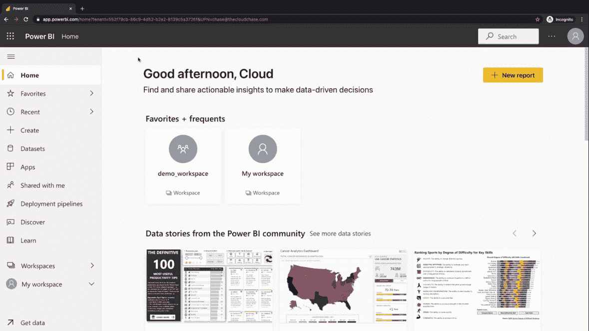
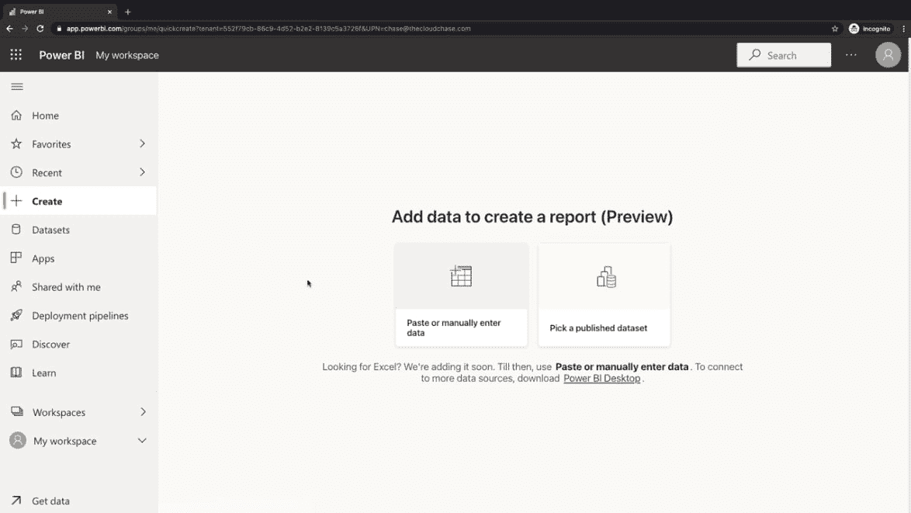
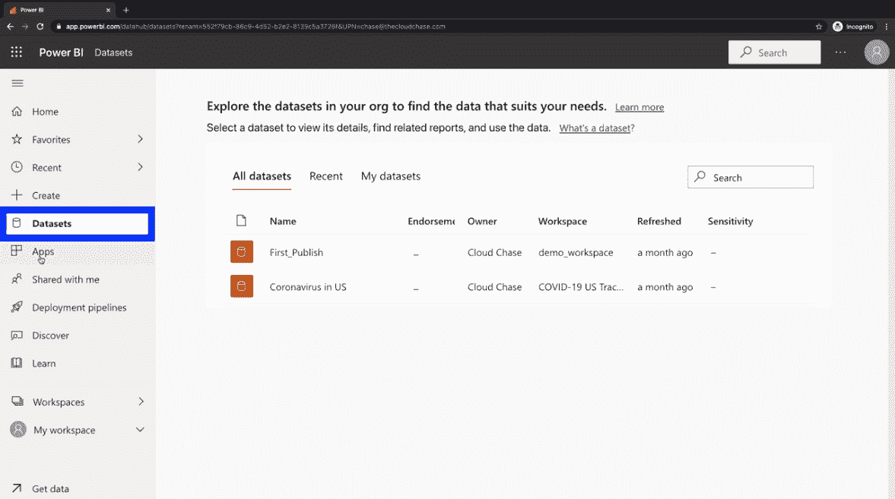
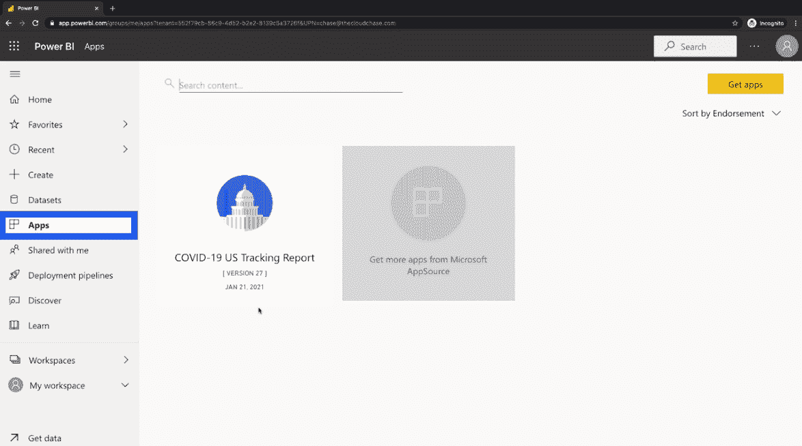
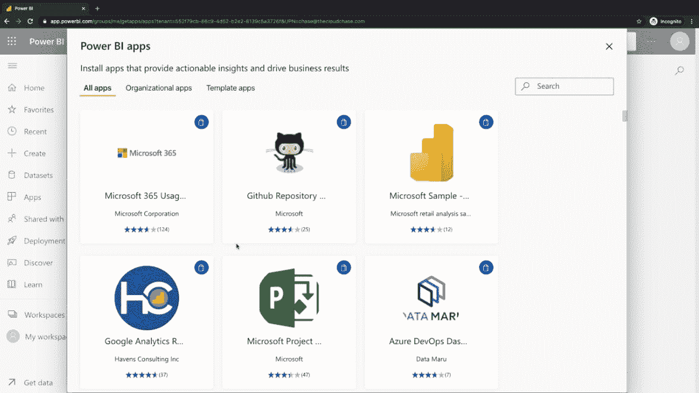
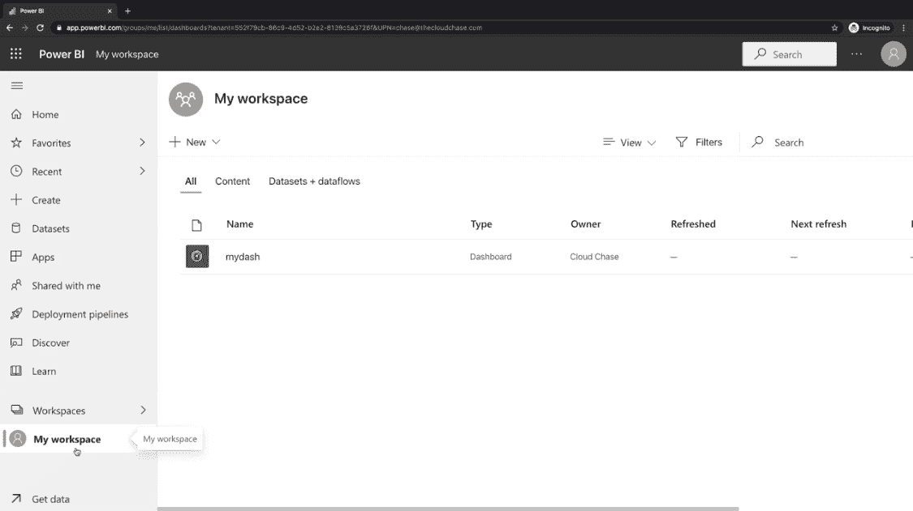
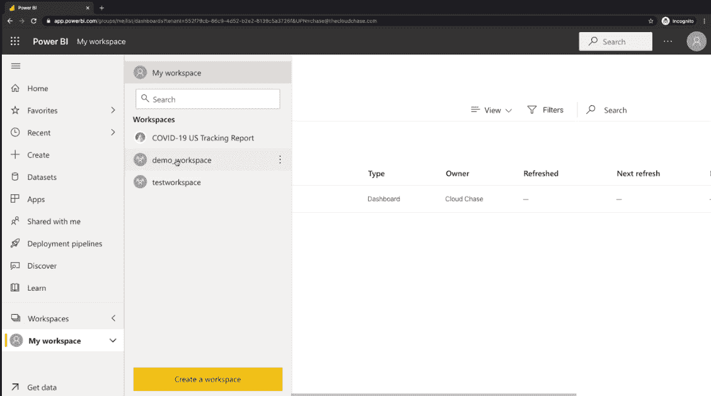
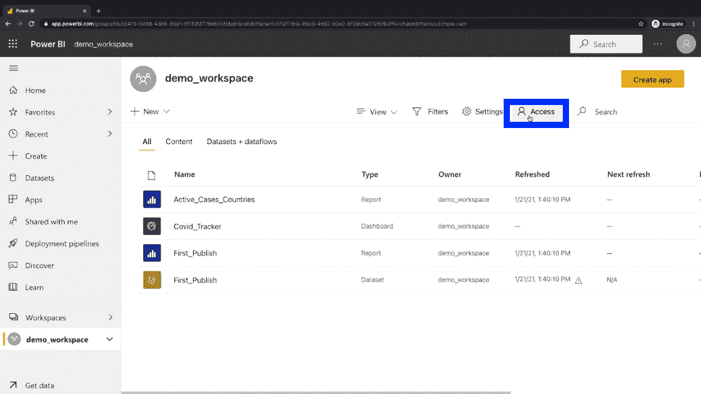
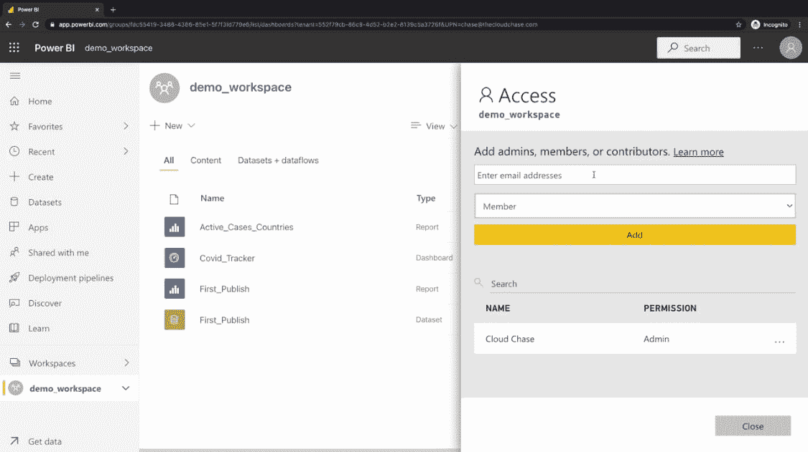

# 什么是 Power BI？微软 Power 平台入门|云专家

> 原文：<https://acloudguru.com/blog/engineering/what-is-power-bi-a-microsoft-power-platform-primer>

想了解微软 Power BI 吗？在本帖中，我们将介绍 Power BI 和微软 Power 平台的基础知识，包括 Power BI 报告和工作区。我们还将分享资源，帮助您学习 Power BI，并为 Power BI 认证和[PL-900:Microsoft Power Platform Fundamentals](https://acloudguru.com/course/pl-900-microsoft-power-platform-fundamentals)认证考试做准备。

### 内容

什么是微软 Power 平台？

## Microsoft Power Platform 是一套商业应用程序，旨在帮助个人轻松创建各种商业解决方案。

电源平台包括以下应用:

**Power Apps**–用于构建定制应用

*   **Power Automate**–用于自动化流程和工作流程
*   **Power BI** —用于可视化数据和分享见解
*   **Power Virtual Agents**–用于构建无需编码的聊天机器人
*   以上所有内容都可用于在电源平台内部制定解决方案。这些工具使用相同的底层组件:

连接器

*   人工智能生成器
*   公共数据服务
*   Power Platform 如此令人惊叹的很大一部分原因是它能够与现有的微软解决方案和其他工具集成，如 Dynamics 365、微软 365(包括微软团队)、微软 Azure 和 GitHub。

Power 平台旨在供公民开发人员用于低代码/无代码开发。也就是说，它是为任何想要在 Power 平台内部创建解决方案的人而设计的。。。即使他们没有计算机科学学位。

而且动力平台真的是为*任何人*打造的。很直观，也很好用。您可以快速学习 Power BI，并立即开始在 Power Platform 中设计解决方案。

*有兴趣升级或开始您的应用程序开发之旅吗？云专家的 Azure 开发学习路径提供适合初学者和高级专家的定制课程！*

* * *

接下来，在我们进入博客的精华部分:Power BI 之前，我们将对 Power Platform 工具箱中的每个工具进行概述。

* * *

什么是 Power Apps？

## Power Apps 用于用很少甚至没有代码来构建应用程序。您可以使用 Power Apps 构建三种类型的应用程序:

**画布应用**–使用拖放构建器，从空白的现有模板或数据源构建的应用。这些可以使用类似 Excel 的公式进一步修改。

*   **模型驱动的应用**–通用数据服务内部存储的数据应用。这些应用不需要我们写任何代码。您使用关系、表单、视图和业务规则对数据进行建模，Power Apps 将根据数据模型自动创建界面。

*   **门户应用**–提供面向公众的网站的应用，提供匿名和认证的浏览体验，允许用户通过互联网与通用数据服务中的数据进行交互。

*   什么是权力虚拟代理？

## Power Virtual Agents 是 Power 平台中的一个工具，可用于创建聊天机器人，与客户或内部员工互动，以提供某种程度的自动化人工智能和支持。

什么是电力自动化？

## Power Automate 可用于自动化工作流和流程。这是通过连接到数据源的 Power Automate 内部的流来完成的。

Power Automate 流可以使用连接器与数据交互。连接器是提供从我们的流到我们的数据源的连接的桥梁。流是基于触发器构建的，以提供某种自动化操作。这些触发器促使流运行。

什么是 Power BI？

## Power BI 是 Microsoft Power Platform 内部的一项服务，用于分析数据和创建可视化，以提供商业智能(因此是“Power BI”中的“BI”)，用于做出明智的决策。

使用 Power BI，您可以从公共数据服务、Excel 文件或云存储源中的各种数据源收集数据集。您可以将这些数据集放在一起，加载和转换它们，并为报告和仪表板创建可视化效果。

这些包含有意义数据的可视化数据可以在组织内共享，以提供协作感并为业务决策提供信息。

[**获得痛苦的云词典**](https://get.acloudguru.com/cloud-dictionary-of-pain?ajs_aid=8b2cc73f-c0e0-442b-ba6d-0eb362250ebb)
说云不一定要努力。我们分析了数以百万计的回答，以确定哪些概念会让人犯错。抓住这个[云指南](https://get.acloudguru.com/cloud-dictionary-of-pain)获取最痛苦的云术语的简洁定义。

* * *

电动 BI 工具

* * *

### **Power BI Desktop** —该工具连接和模拟数据，并创建报告和可视化。

*   **Power BI 服务** —这种基于云的门户服务用于共享。您可以在工作区中发布和共享数据集、报表和仪表板。
*   **Power BI mobile** —该工具通过移动应用程序使用数据，因此您可以随时了解最新动态。通过移动应用程序获取、分享和协作见解。
*   超级商务智能桌面与超级商务智能服务

### 让我们来看看 Power BI 桌面和 Power BI 服务有何不同(和相似)。这需要一个维恩图！

虽然我们可以将数据源引入 Power BI Desktop 和 Power BI service，但还是有一些区别。

Power BI Desktop 可以访问许多不同的数据源；Power BI 服务的局限性更大一些。(这是因为 Power BI Desktop 用于完成大部分创建工作。)

*   您可以在 Power BI Desktop 应用程序中转换数据、模型数据和使用计算列。在 Power BI 服务中，你可以共享一些功能，比如仪表盘——你的老板和你老板的老板都会喜欢的单页视图。这些有瓷砖代表不同的可视化和报告，从我们的信息获取关键绩效指标。

*   Power BI 服务还提供工作区，支持数据集、报告、可视化和仪表板的共享和协作。在 Power BI 服务中，我们可以建立数据流和网关连接。

*   在 Power BI Desktop 和 Power BI service 中，我们可以创建报告和可视化，并执行某种级别的过滤。

*   有什么比学习新的技术技能更好的呢？免费做这件事。查看[本月的免费云课程](https://acloudguru.com/blog/news/whats-free-at-acg)。

* * *

什么是 Power BI 报告？

* * *

## Power BI 的构建模块

### Power BI 由几个关键的构建模块组成。

**数据集** —数据的集合，例如来自 Excel 或 SQL 数据库的数据。

*   可视化效果 —可视化效果是，嗯。。。可视化(或漂亮的图表和图形)使数据集变得生动。
*   **报告** — Power BI 报告是已经创建的不同可视化(可以是一个或多个)的集合。每个报告仅附加到一个数据集。可以过滤报告。
*   **仪表板** —仪表板可用于在单页视图中共享报告和可视化效果，并带有平铺窗口，允许用户查看报告中的 KPI(关键绩效指标)。
*   **工作区** —可在组织内共享的仪表板、报告和数据集的协作空间。
*   Power BI 报告与仪表盘和工作区

### 报告

| 仪表板 | 工作区 | 一页或多页
图片集
允许过滤 |
| --- | --- | --- |
| ·单页视图
·图块集合
·包含报告
·KPI 概述 | 
协作空间【包含数据集、报告和仪表盘
应用暂存区 | Power BI 教程 |

## 导航电源 BI

### 下面来看看 Power BI 服务。

在 Power BI 服务中，您可以通过手动输入或粘贴数据来创建报告，或者从共享数据集列表中选择一个已发布的数据集。(这就是在 Power BI 服务内部发布共享数据集非常有用的原因:您可以使用这些数据集直接从 Power BI 服务创建报告。)

正如您在上面的截图中看到的，我们在 Power BI 服务中受到数据源的限制。这是因为桌面应用程序用于从数据集进行大多数可视化和报告创建。在那里，您将有更多的机会访问各种数据源。

通过单击数据集，您可以看到 Power BI 服务中发布的数据集。

通过点按“应用程序”，您可以查看您发布的应用程序。

此外，在应用程序下，您还可以查看 Microsoft AppSource 中可用的模板应用程序。这些模板应用是出色的预打包电源 BI 解决方案。BYO 数据和你准备好党。

在工作区中，您可以查看(您猜对了)工作区。您的默认工作空间是您独有的。

但是，您也可以创建协作工作区，通过电子邮件地址与其他用户共享对报告、仪表板和数据集的访问。

您可以通过在想要添加用户的工作区中单击访问来添加用户。

您向共享此工作区的用户提供的权限将取决于您在共享访问时选择的内容。选择管理员、成员、贡献者或查看者。

如何学习 Power BI

## 想了解更多关于 Power BI 的信息或接受一些 Power BI 培训吗？

要获得深入的 Power BI 教程并准备 Power BI 认证，请查看我们的学徒级 Azure Power BI 课程,[PL-900 Microsoft Power Platform Fundamentals。](https://acloudguru.com/course/pl-900-microsoft-power-platform-fundamentals)本 Azure Power BI 课程将让您更好地理解 Power 平台中提供的工具，包括 Power BI。您还将学习如何创建 Power 应用程序、流程、报告、仪表板和聊天机器人。

*   Azure 您在云中的成功

* * *

## 借助 Microsoft Azure、AWS、Google Cloud 等领域的课程和实际动手实验室，改变您的职业生涯。

Transform your career with courses and real hands-on labs in Microsoft Azure, AWS, Google Cloud, and beyond.