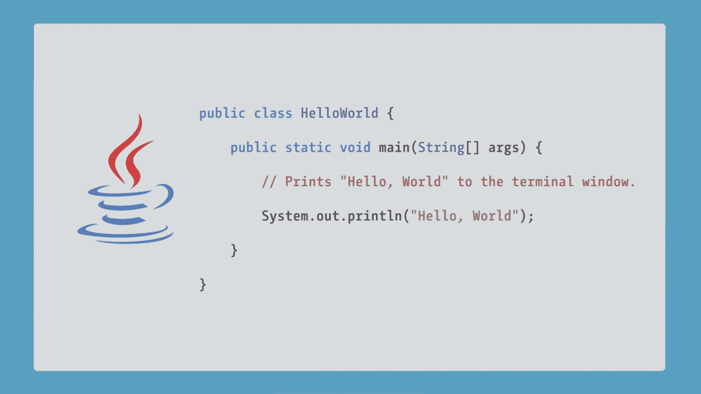

# Python 编程语言是什么？

> 原文：<https://acloudguru.com/blog/engineering/what-is-the-python-programming-language%ef%bf%bc>

在本帖中，我们将探索 Python，一种在各种项目中都很有用的多范式语言。请继续阅读，了解它为什么如此受欢迎，它可以用来做什么，以及它与 Ruby 和 Java 相比如何。在这篇文章结束时，你会知道为什么 Python 是我们云编程语言的首选之一。我们开始吧！

* * *

**通往更好职业的钥匙**

[立即开始 ACG](https://acloudguru.com/pricing) 通过 AWS、Microsoft Azure、Google Cloud 等领域的课程和实际动手实验室来改变你的职业生涯。

* * *

## Python 是什么？

Python 由荷兰程序员[吉多·范·罗苏姆](https://gvanrossum.github.io/)创造，并于 1990 年首次发布。编程语言通常被设计成完成一个特定的任务，限制了它们的使用。然而，Python 是一种多范例语言。作为一种面向对象的编程语言，它很棒，但是如果你更愿意用函数式编程风格编写程序，你也可以这样做。这种灵活性使得 Python 成为许多领域和行业的首选语言。

Python 可能不是一门新的编程语言(很难相信它已经有 30 多年的历史了！)，但其持续的采用增长表明它经受住了时间的考验。

## **Python vs Ruby**

Ruby 主要用于 web 开发。在很大程度上，它被用来创建 web 应用程序，因为它有一个很好的社区、框架和库来这样做。

另一方面，Python 可以用于很多其他东西，比如:

*   编写脚本来清理计算机上的文件
*   编写 web 应用程序
*   从事无服务器项目
*   数据科学应用
*   向孩子和大学生教授编程
*   动画项目

在你可能遇到的所有编程语言中，你不会找到一种比 Python 更常被非程序员使用的语言。

## **Python vs Java**

Python 如此受欢迎有很多原因，但人们喜欢它并坚持使用它的主要原因之一是因为它超级简单的语法。传统上，一个人用任何语言编写的第一个程序是“hello world”，它只是将文本打印到屏幕上。让我们看看用 Python 和 Java 编写“hello world”程序有多简单。

Java 需要几个函数和几行代码来执行“hello world”

Writing “Hello, World” in Java requires several functions and lines of code.

在 Python 中，您所需要的只是一行代码和一个命名良好的函数来体验您的第一次编程胜利。

Writing “Hello, World” in Python requires a single line of code and one well-named function.

语法并不代表一切，但是与其他语言相比，上述模式通常适用于您想要在 Python 中完成的大多数事情。

## **Python 为什么这么受欢迎？**

Python 的持续流行基于三个重要因素:

1.  **全面上市**
    Python 可以在当今使用的几乎任何设备和操作系统上运行。这意味着你可以在你的 Windows 机器上写一个程序，与使用 Mac 的人分享，并且仍然期望它能为他们正常运行。
2.  **现有社区**
    [Python.org](https://www.python.org/community/)是获得资源、文档和 [Python 软件基金会](https://www.python.org/psf/membership/)会员资格的绝佳起点。PSF 的任务是通过资助会议、聚会、用户组等来支持和授权 Python 用户。
3.  **帮助您实现目标的库的可用性**
    Python 包索引发布了超过 250，000 个包，可供您下载并在项目中使用。

## **该不该学 Python？**

如果你对学习 Python 犹豫不决，这里有一些信息可以说服你去学。

根据 [2021 栈溢出开发者调查](https://insights.stackoverflow.com/survey/2021#section-experience-learning-how-to-code)，Python 一直受到已经在使用它的开发者的喜爱，并且是其他开发者*希望*他们正在使用的第一语言。

根据 [Indeed 的工资计算器](https://www.indeed.com/career/python-developer/salaries)的数据，2021 年，美国 Python 开发者的平均年收入约为 11.4 万美元。

而且，Python 拥有来自所有主要云提供商(AWS、Azure 和 GCP)的第三方支持。

### 在云专家那里了解更多信息

想了解更多？一个云计算专家有很多课程可以帮助你学习 Python，从最基础的，到高级用法，再到与你选择的云提供商一起使用。