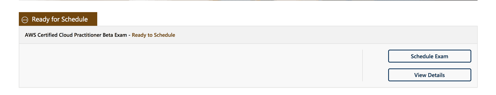

# AWS 认证云从业者考试:我们从那里学到了什么

> 原文：<https://acloudguru.com/blog/engineering/what-we-learned-sitting-aws-cloud-practitioner-exam>

*本帖最初是在 AWS 认证云从业者考试处于测试阶段时创建的，自从它成为正式的 AWS 认证后，已经更新了附加信息。*

每个旅程都有起点，对于 AWS 来说，起点是唯一的基础级认证— AWS 认证云从业者。

AWS 认证云从业者为您提供 AWS 的高级介绍。它并不深入任何特定的服务，而是关注 AWS 的一般结构和一些主要服务的工作知识。

* * *

#### 想获得 AWS 认证？

访问云专家的所有 AWS 认证课程、实验室、测验、原创系列等等！

* * *

## 谁应该参加 AWS CCP 考试？

[AWS 云从业者考试](https://acloudguru.com/course/aws-certified-cloud-practitioner)面向技术方面的绝对初学者，以及商业专业人士——项目和产品经理、财务资源和高管——他们希望熟悉 AWS，但不需要获得[助理级 AWS 认证](/blog/engineering/which-aws-certification-should-i-take)。换句话说，人们在云中工作，但不会亲自参与实际的实现和部署。

AWS 建议您至少有六个月的 AWS 工作经验，并对 IT 服务及其在 AWS 云平台中的使用有基本的了解。

这可能有点安全，所以把六个月的经验当作一个建议，而不是先决条件。尽管如果你对云完全陌生，我们还是建议你参加我们的[1 小时免费课程，AWS 简介](https://acloud.guru/learn/aws-technical-essentials)。这是快速了解基本云概念的好方法。

如果您已经获得 AWS 认证(无论是助理还是专业级别)，则没有资格参加本次考试。如果你对 AWS 很熟悉，但还没有获得认证，那么在追求助理级别的认证之前，CCP 可能是一个很好的热身。尽管如此，它主要面向新来者。

**注意:**如果您是一名企业领导、高管或非技术人员，想要了解云计算的优势并构建云战略来实现您的业务目标，我们为您准备了一门课程！我们的 AWS 商业基础课程将把你变成一名 [AWS 商业专家](https://acloudguru.com/course/aws-business-essentials)。

## AWS 认证云从业者指南和范围:

考试涵盖以下领域:

**云概念–28%**

定义 AWS 云及其价值主张—确定 AWS 云经济的各个方面—列出不同的云架构设计原则

**安全性–24%**

定义 AWS 共享责任模型—定义 AWS 云安全和合规性概念—确定 AWS 访问管理功能—确定安全支持资源

**技术-36%**

定义在 AWS 云中部署和运行的方法—定义 AWS 全球基础架构—确定核心 AWS 服务—确定技术支持资源

**计费和定价-12%**

比较 AWS 的各种定价模式—识别与 AWS 计费和定价相关的各种客户结构—确定可用于计费支持的资源。

这种分类通常与我们参加考试的经历相符，尽管账单和定价似乎占问题的 12%以上。

在我们参加的考试中，我们看到的问题包括:

*   AWS 全球基础设施(AWS 区域、可用性区域、边缘位置)
*   AWS 架构原则
*   AWS 价值主张
*   关键 AWS 服务及其常见使用案例
*   AWS 共同责任模型
*   AWS 控制台
*   身份访问管理器
*   AWS 存储服务和使用案例(S3、冰川等。)
*   EC2 使用案例、EC2 与内部部署服务器的比较、自动扩展、使用按需实例与现场实例以及保留实例)
*   AWS 关系数据库服务
*   AWS 成本控制(AWS 组织、合并计费、使用警报和资源标记)
*   TCO 和云经济(数据中心迁移等。)
*   值得信赖的顾问
*   AWS 支持层级和资源
*   安全最佳实践(IAM，S3)
*   AWS 市场

* * *

#### 什么是 AWS 市场？

AWS Marketplace 使寻找、购买和部署 AWS 云解决方案变得容易。ACG 提供了一门课程，分解了 [AWS 市场深度安全防护即服务](https://acloudguru.com/course/introduction-to-the-aws-marketplace)的更复杂的方面，以帮助在采购云解决方案时做出明智的决策。

* * *

## 如何准备:螺母和螺栓

AWS 认证云从业者考试包括 65 道选择题和多选题，需要在 90 分钟内完成。考试费用为 100 美元(或当地等值货币)，有英语、日语、韩语和简体中文版本。

要注册，请访问 AWS 培训和认证门户，然后单击“安排新考试”

##### AWS CCP 之后是什么？

一旦你通过了 AWS 认证云从业者考试，下一步是什么？

首先，请确保[将您的认证](https://acloud.guru/certifications/step0)上传到您的云个人资料。这非常简单，也是展示您不断提高的云计算能力的绝佳方式。

从 AWS 认证云从业者开始，大多数学生都可以进入 AWS 助理级认证—解决方案架构师、开发人员和系统管理员。

您也可以走上我们的一条学习之路，这条路旨在让您在自己选择的职业道路上一步步从新手变成专家。你所要做的就是选择一条符合你职业目标的道路，并沿着这条道路走下去。