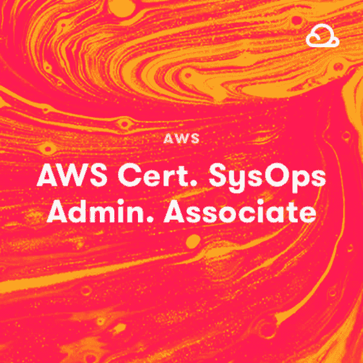
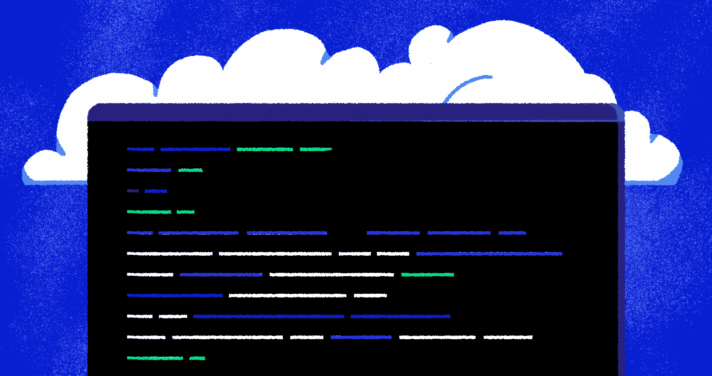

# 参加新的 AWS SysOps 管理员助理测试我们学到了什么|云专家

> 原文：<https://acloudguru.com/blog/engineering/what-we-learned-taking-the-new-aws-sysops-administrator-associate-beta-exam>

您应该如何准备包含实验部分的第一次 AWS 考试？

现在有一个新的 AWS 认证系统运行管理员助理测试，截止日期为 2021 年 3 月 26 日。

这个测试版考试令人兴奋的是，AWS 推出了一种新的考试问题，称为**考试实验室**，要求您使用 AWS 管理控制台或 CLI 完成一项实际任务。

作为一名 AWS 爱好者和 ACG 的 SysOps 助理课程讲师之一，我尽快安排并参加了新的考试！我不能透露考试问题的具体细节，但我会尽可能多地告诉你会发生什么。首先…

## 什么是 Beta 测试？

AWS p [定期更新他们的认证考试](https://acloudguru.com/blog/engineering/should-i-take-the-saa-c01-or-saa-c02)，AWS 认证系统管理员助理是最新更新的考试。

和过去一样，在正式发布之前，AWS 提供测试版考试，在真实的候选人身上测试新的考试。

测试版考试以 75 美元的折扣价提供，如果通过，您将获得 AWS 认证系统管理员助理认证！

测试结束后大约 90 天会有结果，而不是在考试后立即公布。

## 谁应该参加 SysOps 管理员助理考试？

该考试面向在 AWS 的部署、管理、网络和安全性方面至少有**一年实践经验**的云运营角色的系统管理员，它结合了三种可能的问题格式:

*   多项选择:有一个正确答案和三个错误答案(干扰物)。
*   多重回答:在五个选项中有两个正确回答。
*   考试实验:有一个场景，由一组必须在 AWS 管理控制台或 AWS CLI 中执行的任务组成。

* * *

*Faye Ellis and Ryan Kroonenburg’s* [*AWS SysOps Administrator Associate Certification prep* *course*](https://acloudguru.com/course/aws-certified-sysops-administrator-associate) *includes a practice exam and three new Hands-On Labs! Get your hands cloudy and star[t learning today](https://acloudguru.com/pricing).*

* * *

## 参加考试

考试开始时，我被通知将有 55 道选择题/多选题，然后是 3 个考试实验室。他们建议你计划 20 分钟来完成每个实验，你总共有 220 分钟来完成整个考试。我被告知，我的最终分数的 21%将由考试实验室决定。

因此，当您开始考试时，您需要回答 55 个问题，就像平常一样，您可以标记问题以便稍后复习。

一旦你完成了问题并复习了所有内容，点击提交，考试的这一部分就完成了。此时，**您将无法返回并更改您的任何答案**。

问题做完后，真正的乐趣开始了…考试实验室！

## 有趣的部分——考试实验室！

当考试实验开始时，屏幕左侧将显示 AWS 控制台。您需要完成的实验任务将出现在右侧。您需要完成每项任务，完成所有步骤并满足所有要求，然后提交作业并继续下一个实验。

在进入下一个实验室之前，您必须完成考试实验室的所有工作，因为一旦完成，您将无法返回实验室。

每个考试实验都包含许多不同的任务，您需要完成这些任务来配置一个通用场景。

我觉得给我的实验是对实践经验的公平测试，所有的实验都与官方考试指南中描述的考试领域非常相关:

*   领域 1:监控、记录和补救 20%
*   领域 2:可靠性和业务连续性 16%
*   领域 3:部署、供应和自动化 18%
*   领域 4:安全性和合规性 16%
*   领域 5:网络和内容交付 18%
*   领域 6:成本和性能优化 12%

## 我可以使用 AWS CLI 吗？

在进行考试实验时，您可以同时使用 AWS CLI 和 AWS 控制台。我只使用了控制台，但我假设他们的意思是你可以使用新的 [AWS CloudShell](https://acloudguru.com/blog/engineering/what-you-need-to-know-about-the-new-aws-cloudshell-service) 来运行 AWS CLI，我很喜欢！

* * *

*Check out [a deep dive into AWS CloudShell](https://acloudguru.com/blog/engineering/what-you-need-to-know-about-the-new-aws-cloudshell-service) on the ACG blog*.

* * *

## 考试实验室是如何评分的？

我在考试指南中注意到的一件很酷的事情是，AWS 承认可能有多种方法来执行考试实验室。在这些情况下，**如果达到场景的正确结束状态**，将获得满分。

AWS 还规定**部分完成考试实验室**将获得部分学分。这是一种非常不同的多项回答问题的方法，其中部分正确的答案没有部分积分。

如果你对问题的形式或者考试实验室中要求你完成的任务种类感到好奇，在官方考试指南中有一些[样题](https://d1.awsstatic.com/training-and-certification/docs-sysops-associate/AWS-Certified-SysOps-Administrator-Associate_Sample-Questions_C02.pdf)。

## 考试后的最终想法

总的来说，我觉得这是 AWS 认证考试的一个很好的新方向，非常注重实践和动手能力。通过记忆问题和答案或 FAQ 来通过考试将不再可能，这将真正提升 SysOps 管理员助理认证！

如果您想参加 AWS 认证系统管理员助理测试，请告诉我们，我们很想知道您的想法！

## 准备好边做边学了吗？

##### ACG 真实、安全的动手实验室帮助你在考试实验室中脱颖而出。

新的 AWS 认证系统运行管理员助理考试不仅仅是关于你知道什么，而是关于你能做什么。ACG 也是。拥有 1500 个动手实验室，加上 AWS、Azure 和 GCP 云沙箱，没有比这里更好的地方让你边做边学了。