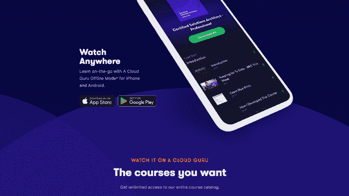
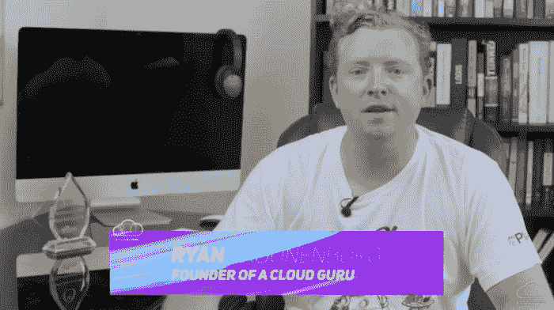

# 如何培训和准备 AWS 认证|云专家

> 原文：<https://acloudguru.com/blog/engineering/what-you-need-to-get-aws-certified>

亚马逊网络服务(AWS)认证为个人提供了市场上最有价值的认证之一。考试很难，没有绕过通过所需工作的灵丹妙药。

我们经常收到学生的提问，他们想知道"*除了观看 AWS 认证课程，还需要什么才能通过考试？*

## **最常见的 AWS 认证问题**

以下是关于准备[助理级 AWS 认证](https://acloudguru.com/aws-cloud-training)的一些常见问题的解答:

### 完成 A 云大师 AWS 培训平台需要什么？

**一个免费的 AWS 帐户** 云专家的课程提供动手实验，你需要一个 AWS 帐户来完成互动示例和练习。我们的大多数动手实验室都使用 AWS 免费层，因此几乎没有额外的帐户成本。

电脑
PC(Windows 或 Linux)或 Mac——你不能纯粹在平板电脑或移动设备上学习课程。您可以在移动设备和平板电脑上查看我们的课程，但是没有 PC 或 Mac，您无法完成练习，因为您需要能够运行 SSH 客户端。

浏览器
理想情况下，一个现代的浏览器——如 Firefox 或 Chrome——可以访问云专家[。](https://acloudguru.com/)

### AWS 认证培训需要时间？

如果您有丰富的 AWS 经验，我们已经看到学生在不到一周的时间内成功获得认证，我们的课程是考试准备的指南。

**How long does it take to study for AWS certification?**

这个要看你对 AWS 有多少经验了。如果你是 AWS 新手，但有一些 IT 经验，通常需要 40 到 80 小时的学习时间。我们的 AWS 认证助理课程长达 10 到 20 个小时，每 1 小时的视频需要大约 4 小时的学习。

## 一个云大师值得吗，他们的认证课程包括哪些？

A Cloud Guru 认证课程包括无限制访问培训内容、视频讲座、测验和练习题、示例代码、示例动手实验和主持式论坛。

您也可以在您的[苹果](https://itunes.apple.com/us/app/a-cloud-guru/id1286720016)或[安卓](https://play.google.com/store/apps/details?id=com.acloudguru)设备上访问我们的培训课程！

## A 云大师 AWS 课程包含考试报名吗？

不。AWS 使用第三方来管理考试。云专家提供的培训独立于 AWS 及其测试中心。您需要使用 [AWS 培训和认证门户](https://www.aws.training/certification)单独注册认证考试。

## 我还需要哪些 AWS 认证培训材料？

免费的 [AWS 白皮书](https://aws.amazon.com/whitepapers/)是通过认证考试所需的唯一额外学习材料。特别是，从头到尾了解 [AWS 安全白皮书](https://d0.awsstatic.com/whitepapers/Security/AWS_Security_Whitepaper.pdf)非常重要——它适用于所有认证。 [AWS 存储服务白皮书](https://d0.awsstatic.com/whitepapers/AWS%20Storage%20Services%20Whitepaper-v9.pdf)也很有用，并且 [AWS 架构良好的框架](https://d0.awsstatic.com/whitepapers/architecture/AWS_Well-Architected_Framework.pdf)值得一读。

## AWS 认证考试最好的学习方法是什么？

这因人而异，但我个人更喜欢分屏或使用双显示器同时显示视频播放器和 AWS 控制台。这使您可以与教师同时进行练习和示例，只要视频播放速度太快或您错过了什么，您就可以暂停并重播视频。

## 一般提示

要通过认证，您需要熟悉 AWS，唯一的方法是使用认证培训和考试中涵盖的所有 AWS 服务。

我的建议是完成课程，然后销毁你在课程中创造的一切——然后不遵循课程再试一次。尝试创建自己的练习来测试自己。创建一个小型个人项目来练习使用 AWS 进行构建。在学习和备考时，使用 AWS 是不可替代的。

## 期末考试准备

这就是课程中问题的重要性所在。它们将有助于评估你在知识方面的差距，以及需要进一步学习的地方。

在为考试做最后准备时，我会仔细阅读云专家的样题，并记下你哪里做得不好。然后在课程中重温这些章节，并阅读相关白皮书。之后，重复这个过程，直到你的样题得到 100 分。

你现在可以在云大师上模拟考试体验了。我们从大量的问题中随机选择，并确保领域细分满足考试蓝图中列出的要求。与真正的认证考试不同，我们会在完成后向您展示一份详细的报告。

在考试中，会有一些基于场景的问题，这些问题通常会测试你对问题的理解，就像测试你的知识一样。当您遇到基于情景的问题时，请在选择正确答案之前使用排除法。

## 我如何知道何时准备好参加 AWS 认证考试？

学生们开始训练后，许多人会想“我怎么知道我准备好参加考试了？”为了缓解考试焦虑，我们综合了数百名学生的评价、AWS 专家的见解以及我们自己无数小时的学习，编写了 [AWS 认证准备指南](https://acloudguru.com/course/aws-certification-preparation-guide)。

该考试指南对会员免费，帮助您准备所有 AWS 认证，其中包含适用于所有考试的提示、技巧和策略。

看完这本快速而全面的 AWS 认证考试指南后，你会自信地知道什么时候进入考场。

## 一旦我获得认证，如何及时了解 AWS？

亚马逊网络服务每天都会发布新的更新，很难找到时间来跟上。为了帮助你在获得认证后保持最新状态，一位云专家创建了本周[AWS](https://www.youtube.com/channel/UCp8lLM2JP_1pv6E0NQ38pq)新闻广播，每周将来自亚马逊网络服务的最新头条快速发送到你的收件箱。

*Sign up today for *AWS This Week *to get the t*op stories delivered to your inbox weekly!

## 还有其他 AWS 练习题吗？

**Slack Bot** 云专家的工程团队开发了一个有趣的问答机器人，可以与您团队的 Slack 频道集成，包括一个排行榜。

美国、英国、印度、加拿大和澳大利亚的 Alexa 上也有云专家。只需说“ *Alexa，开云大师”*即可访问数百个练习题，测试您在计算、存储、网络、安全、数据库和管理工具等各种服务方面的 AWS 知识。了解更多关于 Alexa 的数据挖掘颠覆性历史以及它如何成为我们今天都知道的 ML 服务。

我希望这回答了我们从学生那里听到的大多数问题。如果您有任何其他问题，请在云专家[上创建一个帐户，并加入我们在 160 个国家拥有超过 600，000 名学生的在线社区！](https://acloudguru.com/)

* * *

## 提升您的云计算职业生涯

无论您是云新手还是经验丰富的专家，云专家都能让您轻松(而且非常棒)地获得认证并掌握现代技术技能。查看 ACG 目前的免费课程或立即开始免费试用。

* * *

我们的[讨论论坛](https://acloud.guru/forums/home)非常活跃，到处都是工程师们互相帮助学习云计算和准备考试。那里见！

[云专家——AWS 认证课程——加入 400，000 名学生的社区，他们已经参加了我们的在线 AWS 认证准备课程，并通过了 ACG 认证！](https://acloud.guru/forums)

**查看这些帖子，帮助您为其他云认证做好准备:**

*跟上最新一期云上大师公告* [*推特*](https://twitter.com/acloudguru)***！***