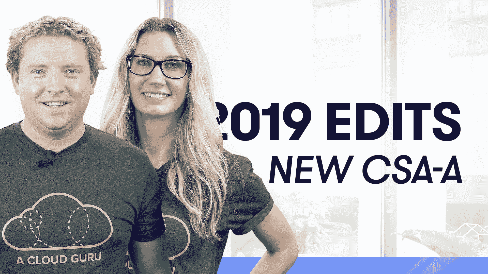
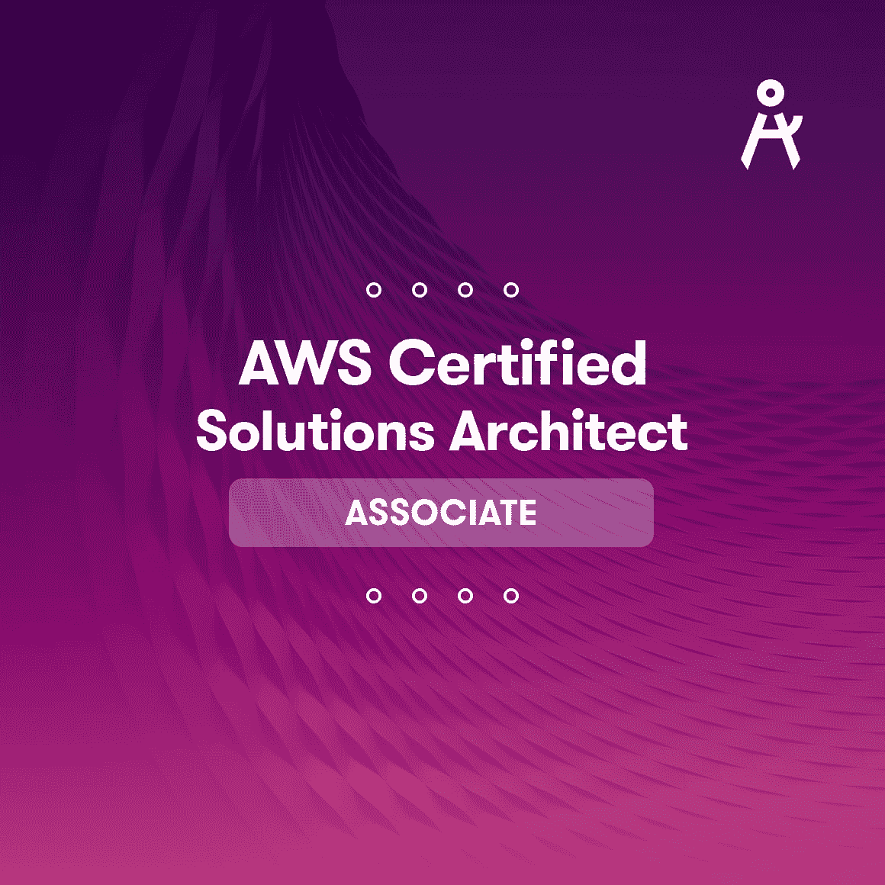
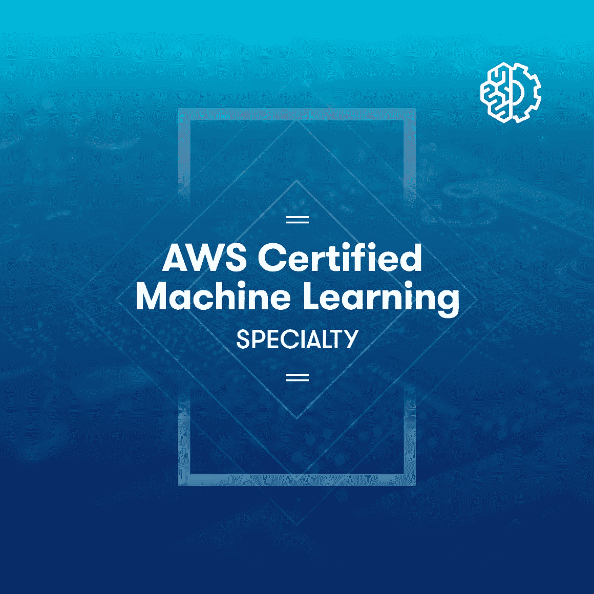
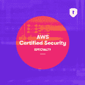
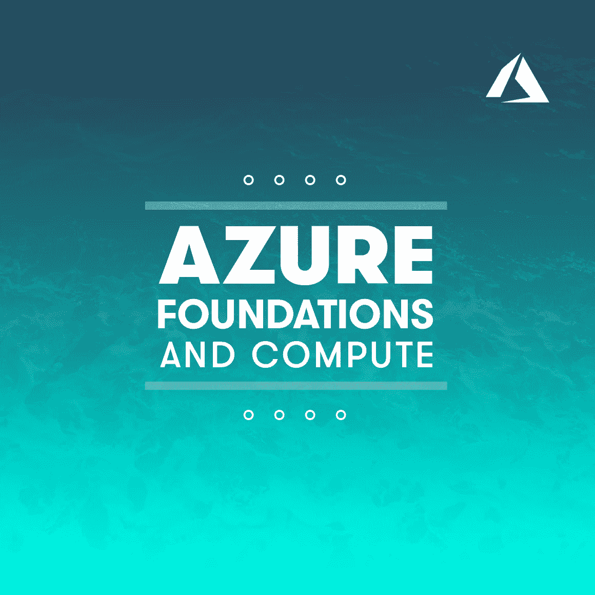
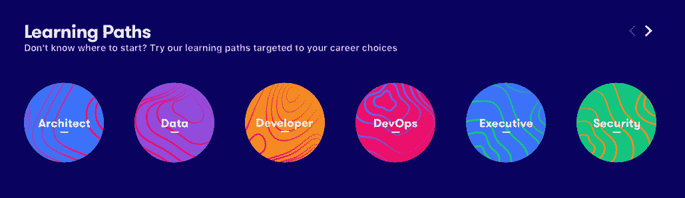

# 云专家的最新动态--四月

> 原文：<https://acloudguru.com/blog/engineering/whats-new-april-2019>

在本期内容中:更新我们的 **AWS 认证解决方案架构师助理**和 **AWS 认证安全专家**课程，我们推出了 **AWS 认证机器学习专家**预览，学习路径将带您走向大师之路。

{ % video _ player " embed _ player " overridable = False，type='scriptV4 '，hide_playlist=True，viral_sharing=False，embed_button=False，width='3840 '，height='2160 '，player_id='8618613924 '，style=" %}

 **新认证公告！**

****

**AWS 认证解决方案架构师助理(CSA-A) 2019 改造☁️ **

我们是 baa ack——对我们最热门的云课程进行了改进。我们认真致力于保持我们的课程与时俱进，同时采取简化的“少即是多”的方法。在这里，它不是关于死于 powerpoint，而是关于帮助您更快、更有效地构建云。在与学生交谈后，Ryan krooneburg(ACG 的联合创始人和 AWS 社区英雄)对我们最受欢迎的课程流程进行了改进，并深化了对高可用性和无服务器的关注。我们一直紧跟 AWS 考试趋势。

如果你不确定从云中的什么地方开始，从 CSA-A *开始(这个课程名称的奇特缩写，因为说完整的名称很拗口)*。这个基础课程将教你亚马逊网络服务的主要组成部分，并为你准备一个业界最受欢迎的认证！如果你曾经渴望进入云计算，但需要一个冒险的理由——让这次课程改革成为你的理由。但是 d 别担心，如果你已经开始学习了，你的所有进步在[2018](https://acloud.guru/learn/aws-certified-solutions-architect-associate-2018)版本上仍然可用。

希望让您的团队实现云计算？我们建议(不考虑角色)正在进行大规模 AWS 转型的企业鼓励**他们所有的工程师**参加这个课程。这样，您的全体员工对在云中工作有一个共同的理解和词汇。

**[查看课程>](https://acloud.guru/learn/aws-certified-solutions-architect-associate)**

* * *

****

**新航向！！ AWS 认证机器学习专业考试？**

{ % video _ player " embed _ player " overridable = False，type='scriptV4 '，hide_playlist=True，viral_sharing=False，embed_button=False，width='1920 '，height='1080 '，player_id='8447293739 '，style = ' margin-top:0px；'%}

？一定要看宣传片……很傻。

AWS 发布了新的认证考试，我们是第一个提供课程帮助您通过考试的地方。

大数据和机器学习可以说是目前科技领域最热门的话题，但在复杂的方程和令人费解的希腊符号之间，你可能会觉得你需要一个数学博士才能理解基本知识。我们想制作一个带有简单解释的机器学习课程，让非数学专业的人也能理解。毕竟这是云大师，不是变分贝叶斯期望最大化大师！

介绍我们最新的认证课程，旨在帮助您战胜新的 AWS 认证机器学习专业考试。ACG 的讲师 Scott Pletcher 和 Brock Tubre 用直观的方法对 AWS 最新的专业认证进行了分类。挑战自我，解决机器学习。

**[查看预习课程>](https://acloud.guru/learn/aws-certified-machine-learning-specialty)**

* * *

** 2019 改版:AWS 认证安全——专业？**

为云专家 Faye Ellis 对我们的 AWS 认证安全专业课程的 2019 年重大更新干杯。此更新包括一个全新的部分，内容是关于安全、监控、授权和身份验证以及安全网络基础架构的故障排除方案。随着安全性成为所有云计算公司的关注焦点，拥有这一专业认证将使您在竞争激烈的行业中脱颖而出。

我们知道我们的专家喜欢提问，所以 Faye 继续添加了超过 120 个新的脑筋急转弯来测试你的知识。

**[查看课程>](https://acloud.guru/learn/aws-certified-security-specialty)**

* * *

**Azure 基础和计算入门**

开始学习微软 Azure。我们希望学生在开始准备 AZ-100 考试之前，对在 Azure 云中构建有一个扎实的实际介绍。

这个 2 小时的快速课程将教你 Azure 设计和自动化的最佳实践和方法。你将很快掌握如何用 Azure 虚拟网络构建一个基本的网络结构，然后用这个网络作为主干部署 Azure 虚拟机。在课程结束时，您将拥有一个功能齐全的产品。对于刚刚涉足云世界的人来说，这是非常酷的东西。T3**T5**

[**查看课程>**](https://acloud.guru/learn/azure-foundations-and-compute)

* * *

{ % video _ player " embed _ player " overridable = False，type='scriptV4 '，hide_playlist=True，viral_sharing=False，embed_button=False，width='3840 '，height='2160 '，player_id='8447575377 '，style=" %}

科技的未来#203:太空采矿？

我写不出比看上面的视频更公正的关于这个未来科技事件的东西了…但是，我会努力的…

听听阻碍人类控制天体并收获其内在好处的地球事实。这一集只使用旧火箭部件制成的勺子背面带你去月球并返回！

**好奇？[查看插曲>](https://acloud.guru/series/future-of-tech)**

* * *

**现在，让我们真正改变现状……**

**介绍云上师的学习路径！？？**

这些是市场上唯一的学习途径，在你选择的职业中，带你一步一步从初学者到专家。当遵循学习路径时，您可以确定您和您的团队正走在快速获取专业知识的正确道路上。

无论您是云新手，不知道从哪里开始，还是刚刚达到云认证目标，开始学习都是完美的下一步。你所要做的就是选择一条最符合你职业目标的道路，并沿着这条道路从新手成长为大师。

您可以通过访问您的仪表板来访问学习路径。

**掌握我们 ACG 学习路径中的 5 个级别:**

*   **新手:**了解云计算概念和思想。
*   **学徒:**能够浏览合适的供应商 GUI，并对安全性和核心云服务有基本的了解。
*   **从业者:**具有构建云解决方案的实践经验，对安全性有实际的理解，并接触过更高级的主题，如容器和无服务器。从业者可以分析和评估不同的架构选项。
*   **专家:**对构建可扩展的基础设施和应用程序有着透彻的理解和丰富的经验。使用基础设施作为代码。能够有效地评估和推理架构和技术选项。了解各种解决方案之间的权衡。
*   **Guru:::aaaahh::**Guru 拥有安全、网络、DevOps 和基础设施方面的专业知识，并且有能力提出新的和创新的解决方案，因为 Guru 对体系结构、权衡成本以及使整个工作顺利进行的人员考虑因素有着深刻的理解。

**成为云专家的正式成员，开启 ACG 的学习之路**

成为会员:**[【ACG】](https://acloud.guru/cloud-training-for-business)**或 **[个人会员](https://acloud.guru/membership)**

* * *

**下个月到来**

下个月将会是一个重要的月份，我们将推出新的 ACG 动手实验室，这是一系列旨在帮助您工作的简短、简洁和实用的实验室。我们还将发布新的用于业务报告的 **API。？**

下个月再见，了解更多精彩课程和平台特性。

继续牛逼吧，云大师们！