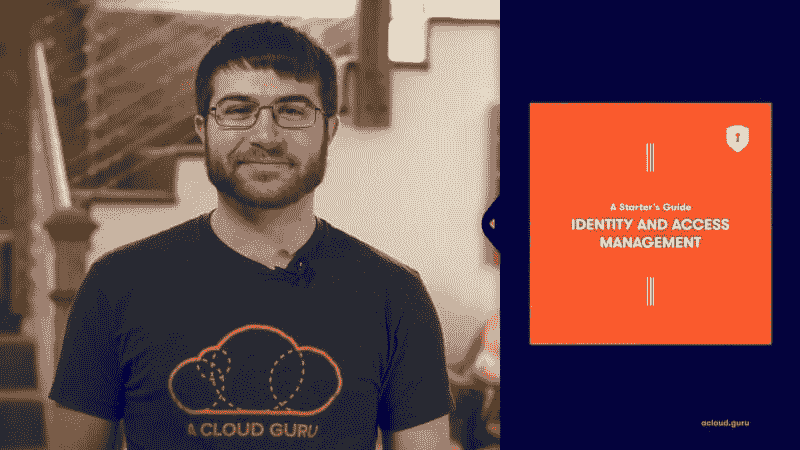
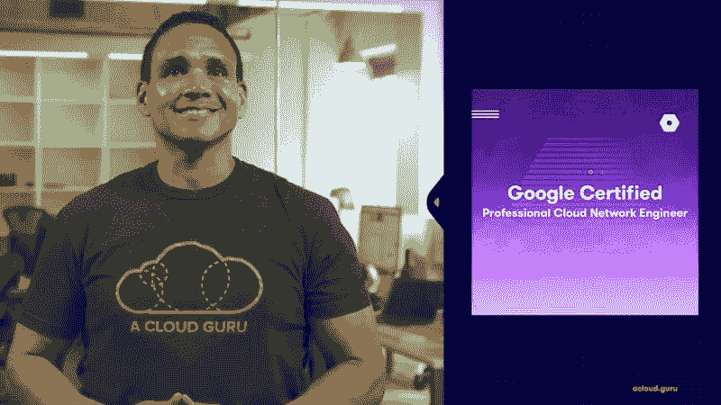

# 云专家的最新动态—2020 年 4 月|云专家

> 原文：<https://acloudguru.com/blog/news/whats-new-at-a-cloud-guru-april-2020>

你好，云大师！这个月我们发现很多人在家工作，我们已经得到了一些东西来防止幽居病——新课程，我们原来系列的新部分，以及我们考试模拟器的巨大扩展。

##### **IAM 入门指南**

随着越来越多的公司将越来越多的应用程序部署到云中，身份和访问管理的概念对于确保为您的数据提供适当的保护至关重要——防止不良行为和意外行为。

本课程为开发人员和操作员提供了 AWS 身份和访问管理服务(IAM)的实用介绍。了解“角色”、“托管策略”和“访问键”等关键术语，使用 IAM 时可能遇到的潜在陷阱，以及如何:

*   在您的 AWS 环境中控制用户授权
*   使用 IAM 跨 AWS 集成服务

不需要编码经验，所有动手实验都提供了示例代码。

##### **混合 Azure 广告设置实用指南**

Azure Active Directory (Azure AD)是组织从 Azure 开始时设置的第一批服务之一，它是保护 Azure 和 Office 365 基础架构的核心。

本课程概述了 Azure AD 以及它如何与其他 Microsoft 目录服务保持一致，然后继续通过将本地 Active Directory 与 Azure AD 连接来部署混合身份解决方案。从这里开始，该课程将引导您管理和监控 Azure AD 的运行状况和安全性。

##### **谷歌认证专业云网络工程师**

**** 众所周知，“没有网络，就没有云。”随着云技术的不断发展，网络专业人员必须了解如何在云上设计、实施和管理网络；尤其是因为它需要从传统的内部网络中转变思维模式。

本课程将为您的谷歌云网络职业生涯的下一步做准备，并帮助您获得受欢迎的谷歌认证专业云网络工程师认证。跟随 ACG 讲师 Karlos Knox，证明您在为您的公司设计、规划和实施成功、高性能且经济高效的网络解决方案方面的专业知识。

##### **AWS 认证的 Alexa 技能生成器-专业-考试模拟器**

我们的考试模拟器是我们最受欢迎的功能之一，我们很高兴地宣布，它已经扩展到涵盖凯莎威廉姆斯的 [AWS 认证的 Alexa 技能构建器-专业课程](https://acloud.guru/learn/aws-certified-alexa-skill-builder-specialty)。现在你可以在参加认证考试之前测试你的 Alexa 技能，呃，*技能*。

##### **发布审查# 303–AWS 云开发套件**

在这篇发布评论中，Travis Ralph 介绍了新的 AWS 云开发工具包(CDK ),这是一个开源软件开发框架，使用熟悉的编程语言来建模和配置云应用资源。Travis 介绍了什么是 CDK，并评估了它的可用性、实用性和堆栈实例化选项。他还研究了许多可用于构造创建、打包和模块导入的服务。然后，Travis 演示了一个快速的 CDK 基础设施，作为您的 VPC 的代码部署，并总结了这一集的优点、缺点和结论。

我们也有两个新的 [**Azure 炉边聊天**](https://acloud.guru/series/azure-chats) ，其中 Lars 与 Azure 专家 Paula Januszkiewicz 和 Damian Brady 坐下来，以及本月的[**【GCP】**](https://acloud.guru/series/gcp-this-month?_ga)和本月的[**Kubernetes**](https://acloud.guru/series/kubernetes-this-month?_ga)。

##### **下个月见，云大师们！**

这个月的课程就到此为止了，但是一定要关注新的课程和新的特性——我们即将推出一些真正令人兴奋的东西。在那之前，继续牛逼吧，云大师们！