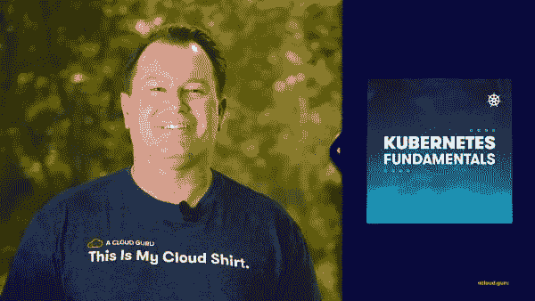
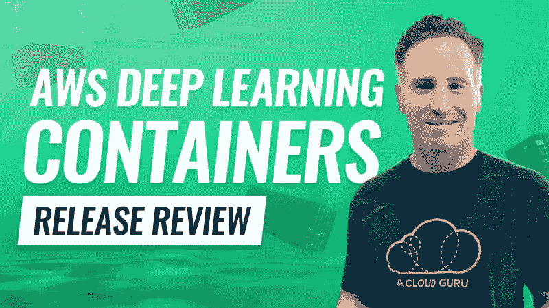
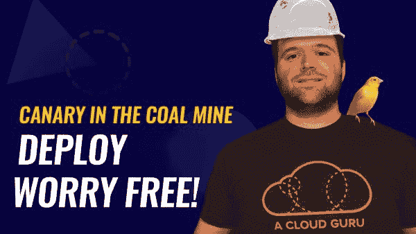
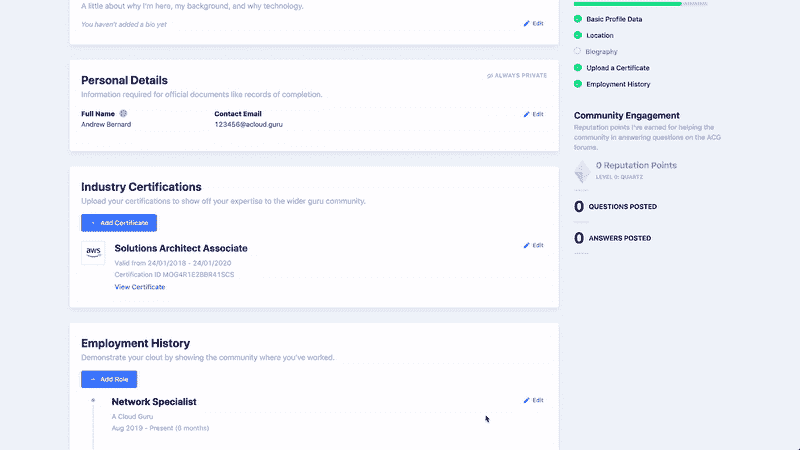

# 云专家的最新动态—2020 年 3 月

> 原文：<https://acloudguru.com/blog/news/whats-new-at-a-cloud-guru-feb-2020-0>

欢迎来到三月，大师们！这个月我们有一些很棒的新课程和实验，还有你最喜欢的原创系列的新剧集，以及一些有用的平台更新。

##### **您前往 K8s 的入口匝道**

如果你渴望登上库伯内特火车，但又不觉得你已经准备好去我们的 T2 库伯内特深潜，我们有适合你的路线。在我们新的 Kubernetes 基础课程中，你将学习 Kubernetes 的*基础课程*。它是什么，它对在云中部署和运行应用程序的未来意味着什么，它如何工作，以及如何使用它。

这是一个很好的方式来为更高级的课程热身，用容器弄湿你的脚，或者只是获得对 Kubernetes 的工作理解。

##### **GCP 专业数据工程师**

我们最新的谷歌云平台认证课程于本月正式发布。谷歌认证专业数据工程师是所有关于推进你在数据工程和机器学习的技能。课程结束时，您将能够通过 GCP 专业数据工程师考试，并能够设计和构建数据处理解决方案，操作机器学习模型，并将它们与相关的 GCP 数据处理工具和技术连接起来。

你需要有在 GCP 的工作经验才能选修这门课程吗？是啊！虽然你不需要数据工程或机器学习经验，但我们强烈建议你在学习本课程之前参加并通过谷歌认证助理云工程师考试。

##### **发布回顾 302: AWS 深度学习容器**

****

在我们最新的发布评论中，Travis Ralph 仔细研究了 AWS 深度学习容器——预装了深度学习框架的 Docker 映像，以支持更轻松地部署定制的机器学习环境。

不知道那是什么意思？让 Travis 带您了解什么是深度学习容器，它们是如何工作的，以及如何快速启动和运行。我们评估可用性、数据建模准确性、实用性，并讨论一些不同的容器训练模型部署途径。在获得 AWS 深度学习容器的实际操作后，留下来听听 Travis 的利弊，以及关于是否投资、评估或稍后重新访问的裁决。

##### ACG 项目#303:煤矿里的金丝雀

**
**

拥有一款令人敬畏的应用程序，它将彻底改变一个尚未开发的市场？当您不断推出新功能和更新时，是否渴望立即将它呈现在用户面前？使用 GCP 的应用程序引擎深入应用程序开发和轻松部署！

在 Wes Coffay 的这个新 ACG 项目中，您将了解如何设置一个稳定的数据存储后端，在 GCP 部署一个 App Engine 应用程序，更新该应用程序并使用 canary 部署来测试新版本，然后在新版本遇到错误时回滚到之前稳定的应用程序版本。

##### **两个新的 Azure 动手实验室**

这个月，我们的动手实验室图书馆增加了两个新的 Azure 风格的东西。[如何在两个虚拟网络之间创建 VNet 对等](https://learn.acloud.guru/lab/vnet-peering-between-virtual-networks)涵盖了网络对等在三种不同场景下的工作方式:同一订阅中的虚拟网络、不同订阅但在同一 Azure 租户下的虚拟网络，以及不同订阅和不同租户跨同一 Azure AD 域的虚拟网络。

[如何使用 Azure Active Directory](https://learn.acloud.guru/lab/mfa-with-azure-ad) 启用多因素身份验证是不言自明的。多因素身份认证是降低云基础设施安全风险的重要一步，本实验将带您完成使用 Azure Active Directory 打开它所需的步骤。

我们也有两个新的 [**Azure 炉边聊天**](https://acloud.guru/series/azure-chats) ，其中 Lars 与 Azure 专家 Jen staple 和 Nik Molnar 坐下来，以及本月新的[**【GCP】**](https://acloud.guru/series/gcp-this-month?_ga)和 [**Kubernetes 本月**](https://acloud.guru/series/kubernetes-this-month?_ga) 。

除了我们的新课程和系列新增内容之外，我们还将与您分享一些漂亮的新平台功能。

##### **介绍 AZ-900 认证加速器**

ACG 认证加速器为企业提供了云培训和采用的快速通道。这是一个可扩展的、基于 sprint 的程序，ACG 商业用户可以使用它来快速有效地提升每个人的知识基础。我们的认证加速器专注于最受欢迎的基础和助理级认证，如 AWS 认证解决方案架构师助理和 Google 认证助理云工程师。

现在，我们将 Azure 纳入我们新的 AZ-900 认证加速器。Azure 在过去的一年里建立了良好的势头，AZ-900 Azure 基础认证对于任何希望了解更多 Azure 并继续学习更高级认证课程的人来说都是一个很好的切入点。如果您的企业正在使用(或考虑使用)Azure，AZ-900 认证加速器是让您的一大群人跟上速度的最快选择，因此您可以在您的 Azure 环境中做出更明智的决策并更有效地工作。

##### **修改后的云配置文件&证书上传者**

这个月，我们还改进了您与世界分享云技能的方式。我们的云资料进行了一些方便的调整，让您可以更好地控制共享或不共享的内容。只要将任何部分标记为私有，它就消失了。我们还添加了一个内嵌编辑器，使配置文件的更改变得更加容易。

我们还彻底改造了我们的认证上传程序，以便与所有主要云提供商的认证保持一致。简单来说，如果能赚到，大概就可以上传了。因此，请添加这些证书，向世界展示您令人敬畏的云技能！

##### **下个月见，云大师们！**

这个月到此为止，但是请继续关注新课程和新特性——在接下来的几个月中，我们将推出一些真正令人兴奋的内容。在那之前，继续牛逼吧，云大师们！