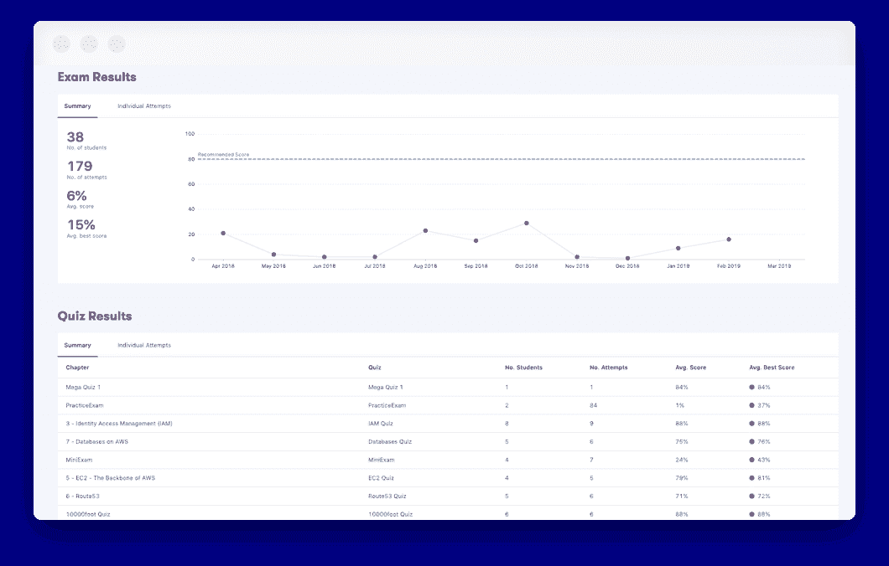
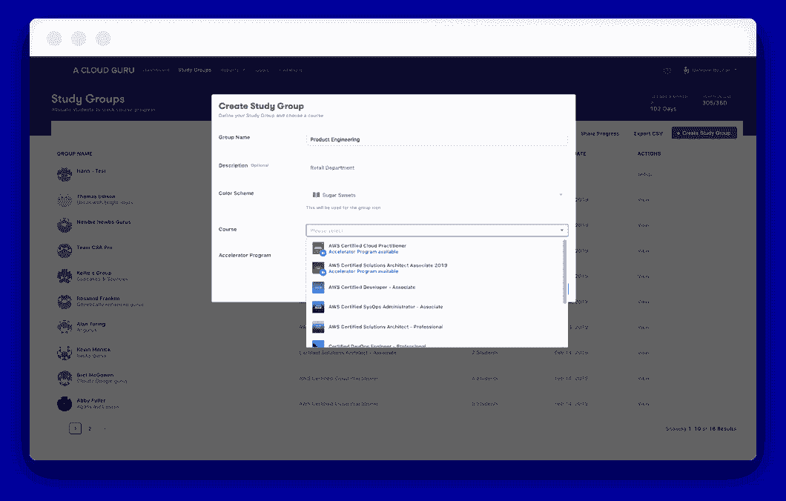
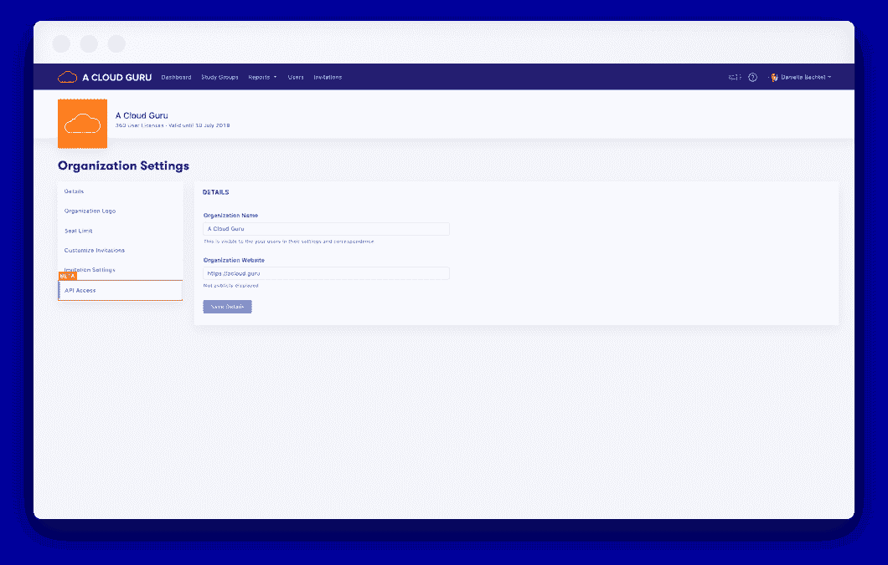
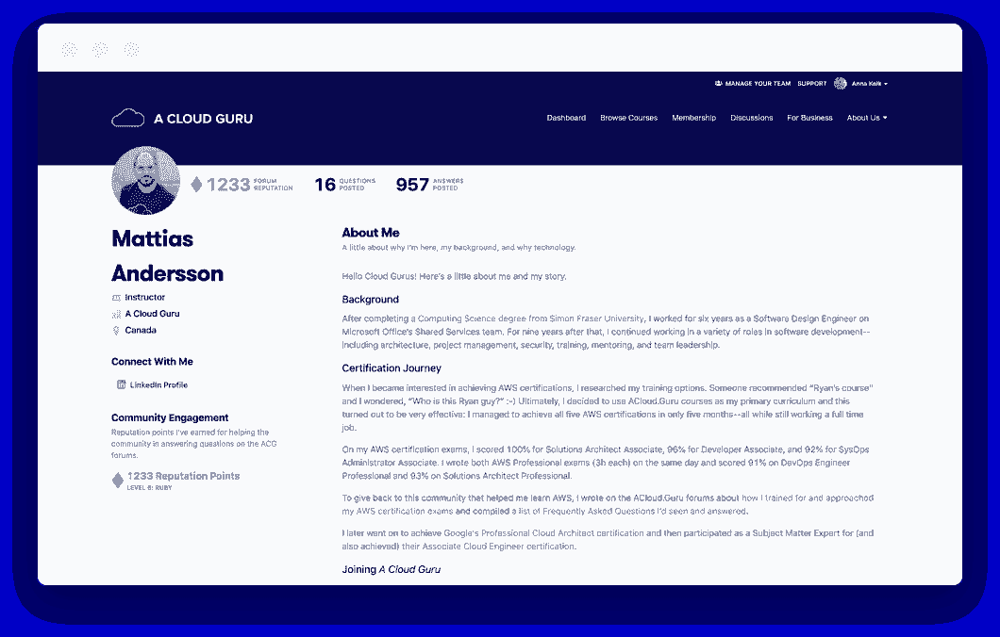

# 云专家的最新消息:2019 年 5 月|云专家

> 原文：<https://acloudguru.com/blog/engineering/whats-new-at-a-cloud-guru-may-2019>

**在此版本中:**面向 ACG Azure 和 GCP 的新 ACG 原创系列获得了增强功能，如针对所有 AWS 认证的学习小组和对 AWS 考试模拟器结果的访问，我们的报告 API 现已可用于试点。

{ % video _ player " embed _ player " overridable = False，type='scriptV4 '，hide_playlist=True，viral_sharing=False，embed_button=False，width='1920 '，height='1080 '，player_id='9297603683 '，style=" %}

五月是多云的月份

多重云将会继续存在。对于许多企业来说，出于监管和合规目的，需要一个多云环境。对于其他人来说，它提供了一个机会，可以利用不同的云提供商的独特优势，为特定的用例使用不同的云提供商。即使您是云提供商的“全包”，您也可以继续部署多云环境，我们在这里说“这太棒了，我们可以提供帮助！”我们正在将我们的 ACG 方法引入所有主要的公共云，我们的使命是让世界了解云。

* * *

 **新 CSAA 和 AWS 认证安全考试模拟器**

对于那些可能是云专家新手的人来说，我们的考试 模拟器 在外观、感觉和用户体验方面复制了现实生活中的认证考试，因此您将面临与真实交易类似的时间压力、问题格式和难度。

我们还推出了第一个

[AWS Certified Security – Specialty ](https://acloud.guru/learn/aws-certified-security-specialty "https://acloud.guru/learn/aws-certified-security-specialty")

考试模拟器！这项 1750 分钟的考试由 65 个高级问题组成，旨在验证您是否准备好有效保护您的 AWS 环境。

* * *

** Google Next Recaps**

谷歌向开发者传达了一个强烈的、充满活力的、清晰的信息——我们是开发者，我们知道你的挑战，我们在这里帮助你理解所有的噪音和术语。如果你错过了会议，看看谷歌大师马蒂亚斯·安德森的每日摘要:

 ****** GCP 本月**

{ % video _ player " embed _ player " overridable = False，type='scriptV4 '，hide_playlist=True，viral_sharing=False，embed_button=False，width='3840 '，height='2160 '，player_id='8988386191 '，style=" %}

…这还不是全部。为了帮助您跟上所有的变化，我们在本月推出了 GCP。主持人朱利安·皮塔斯将这一集分为三部分:

1.  快速咬:各种版本的快速更新
2.  GCP 宝石:ACG 从 GCP 精心挑选的发布
3.  本月大师| GCP 版:在我们的论坛上正确回答问题赢得奖品

**[本月看 GCP(免费！)>](https://acloud.guru/series/gcp-this-month)**

* * *

****** 在 GCP 应用机器学习与 big query**

谷歌云以其强大的全球影响力和丰富的数据分析服务而闻名。这门课程结合了谷歌的领先服务和世界上最受欢迎的职业领域之一。了解数据科学家和机器学习工程师如何轻松地将他们的大型数据集迁移到谷歌云平台的 BigQuery，而不必担心规模或管理。BigQuery 是一个无服务器、Pb 级的数据仓库，旨在存放结构化数据集并实现闪电般的 SQL 查询。

**[查看课程>](https://acloud.guru/learn/gcp-applied-machine-learning-bigquery)**

* * *

****

**摆脱无良用户的上传**

如果你运行任何一种允许用户上传的网站，你要么需要完全信任你的用户，要么生活在持续的恐惧中，担心他们会上传你祖母不同意的那种图片。现在，您可以让云的力量为您所用，高枕无忧。在这个 ACG 项目中，我们将创建无服务器功能来处理和过滤上传，并访问 GCP 的机器学习 API 来判断图像是否对工作不安全！

**[查看课程>](https://acloud.guru/series/acg-projects/view/203)**

* * *

****** 蔚蓝的炉边聊天**

{ % video _ player " embed _ player " overridable = False，type='scriptV4 '，hide_playlist=True，viral_sharing=False，embed_button=False，width='1920 '，height='1080 '，player_id='8988569400 '，style=" %}

更加接近知情人士，直接了解 Azure 中令人激动和惊奇的新内容。ACG 讲师/喜剧演员 Lars Klint 正在推出一个全新的系列，Azure 炉边聊天，作为一种让你了解是什么让 Azure 专家在快速增长的 Azure 社区中充满激情的方式。Lars 与 Scott Hanselman、Jeff Hollan、Troy Hunt 和 Christina Warren 等行业领袖坐下来，从日常角度分析行业趋势。

**[退房系列>](https://acloud.guru/series/azure-chats)**

* * *

****

**AZ-301 微软 Azure 架构设计**

你对微软 Azure 认证世界的变化感到困惑吗？为了跟上进度，我们强烈建议将 Azure 添加到你的周一日程中。如果你错过了，微软最近发布了 **Azure 解决方案架构师专家认证**，它要求你通过 AZ-300 和 301 考试。在我们的 AZ-301 课程中，我们将帮助您深入了解如何确定工作负载要求，以及如何针对身份、安全性、部署和迁移进行设计。本课程结束时，您将能够成功设计数据平台解决方案以及业务连续性和基础架构战略，这是您通过 AZ-301 考试所需的一切。

**[查看课程>](https://acloud.guru/learn/az-301-architect-design-2019)**

* * *

****** 警惕不可能完成的任务:数据库恢复**

在这个项目中，一些恶意的黑客破坏并删除了保持地球引力在这里工作的数据库。你必须通过恢复所有的数据库来击败黑客。这是获得更多 RDS 使用经验的一个非常棒的方式。

* * *

**所有新内容**

* * *

为新功能欢呼！！？

****

**访问 AWS 考试模拟器结果**

我们开发了 AWS 考试模拟器，因此学生可以在真实考试中面临的相同用户界面中练习。我们发现这有助于学生更加舒适、自信和有准备地参加考试。此外，如果他们需要提高分数，我们会给他们个性化的建议，告诉他们应该在哪里花时间学习。我们将考试分数数据(加上测验分数)交由管理员管理，以便您可以构建更强大的、有数据支持的转型计划。知道团队成员何时准备好参加考试，这样你就不会因为失败的尝试而损失金钱。

现在，面向企业管理员的 ACG 可以:

*   查看学生人数，尝试，平均。分数，以及认证的平均最佳分数
*   访问贵组织所有考试结果的完整列表
*   在学生的用户资料中查看单个学生的考试成绩

* * *

****

**添加到学习小组的新课程**

我们的学习小组功能正在改变人才转化的游戏规则。它们简单、直观，而且越来越好。好吧，我会停止向你推销它们…去你的 ACG 管理门户网站看看吧！本月学习小组的新情况:

*   向您的团队成员分配任何 AWS 认证课程
*   为你的团队设定一个截止日期，并使用我们的酷学习小组报告来跟踪进度
*   用欢迎邮件问候新的学习小组，或者不要——选择权在你，世界是你的
*   团队变更时添加和删除学生
*   通过带有附件格式 PDF 的自动电子邮件分享所有研究小组的进展(每月报告现在只需点击一下鼠标)

* * *

****

**新的报告 API 已为试点项目做好准备**

设置好了就算了！将用于报告和透明度的数据自动传输到您的转型中。我们的商业报告中的所有数据都包括在内。对于大型组织来说，这是一个游戏规则改变者，现在客户可以试用。如果您有兴趣加入试点计划，请联系您的客户成功经理。

* * *

##### **这个月我们真正兴奋的事……**

**？介绍您自己的云简介**

用您自己的数据支持的云简历证明您的云技能。通过展示您的技能、对社区的贡献和行业经验，向人们讲述您的云培训故事。这是你独特的一页。你可以分享给任何人来证明你的技能。与你的老板分享它来展示你的证书，把它寄给未来的雇主作为你技能的数据支持证明，或者，嘿，把它寄给你的父母来解释你是做什么工作的。但首先，请更新您的云个人资料，向全世界展示您的风采。

* * *

**下个月到来**

我们将为您带来 AZ 103、AWS 上的 IPv6、 [AWS GovCloud](https://acloudguru.com/course/aws-govcloud-beyond-the-buzzwords) ，对于我们广受欢迎的机器学习课程，我们将从预览过渡到完全可用。别担心，我们会在所有内容发布时通知您。

保持令人敬畏，云大师们…愿第四与你们同在。

{ % video _ player " embed _ player " overridable = False，type='scriptV4 '，hide_playlist=True，viral_sharing=False，embed_button=False，width='1920 '，height='1080 '，player_id='9243876443 '，style=" %}