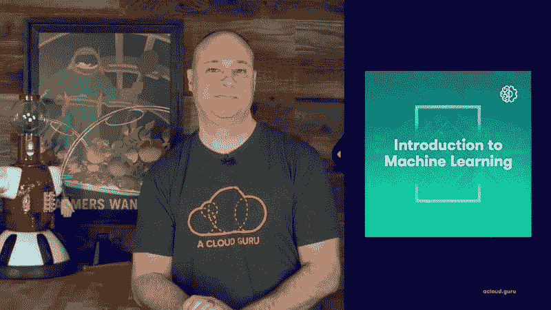
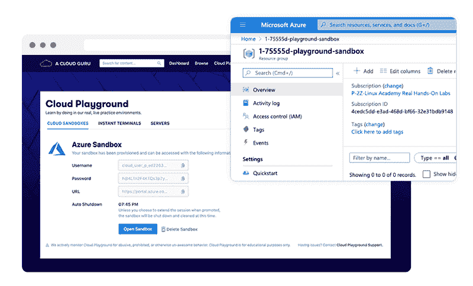

# 云专家的最新消息-2020 年 5 月|云专家

> 原文：<https://acloudguru.com/blog/news/whats-new-at-a-cloud-guru-may-2020>

你好，云大师！这个月，我们有两个关于高级网络和机器学习的令人惊叹的新课程，一个关于亚马逊工作区的及时发布评论，Lars 的未来科技系列的胜利回归，有两个新集，以及我们为商业学生和管理员提供的 ACG 的一个主要新功能。

##### **AWS 高级网络专业**

高级网络一定会成为新的潮流。继上个月发布了 Karlos Knox 的 GCP 专业云网络工程师课程后，本月我们将与 Steven Moran 和 Brock Tubre 一起深入 AWS 网络专业课程。

网络是云的核心功能，这一点从未变得更加真实，因为组织越来越需要将他们的云资源与他们已经广泛的现实世界网络相集成。世界需要高级网络专家，我们的 AWS 课程将帮助您迈出下一步。

对云本地或混合网络感兴趣？本课程专为您而设，涵盖了获得 AWS 高级网络专业认证并成为 AWS 网络专家所需了解的所有 AWS 网络和相关服务领域。

快速提醒:本课程可能不适合所有人。我们建议您在开始之前获得助理级别的认证，最好是 AWS SysOps 管理员。您还需要了解各种网络主题的基本知识，如 OSI 模型、IPv4 寻址和 CIDR、简单 IP 路由逻辑和子网划分。

##### **机器学习简介**

机器学习不是最容易涉足的技术。许多现有的培训都假定学生有一定程度的高等数学知识，这可能会让新手望而生畏。这造成了一个恶性循环，机器学习潜力的主要限制因素是缺乏熟练的从业者。

如果通过微分方程和神秘的希腊符号学习新概念不是你的事情，我们的常驻 ML 大师 Scott Pletcher 将在这里以一种有趣、不可怕、非微分方程的方式引导你进入机器学习的世界。这门入门课程是专门为没有深厚数学背景的人设计的，斯科特用明喻和隐喻来切入行话，让你具备可以立即投入工作的概念和理解。

在本课程中，您将学习区分人工智能、人工智能、数据科学和统计分析，浏览可用的工具和资源，评估和构建潜在人工智能应用的业务问题，并通过现实世界的例子了解各种类型的机器学习。我们甚至会训练一辆自动驾驶汽车！

##### **301 号技术的未来——运输**

**** 这个月我们有两部新的*科技的未来*剧集，而不是一部。首先，加入 Lars Klint，深入了解我们是如何出行的(极具娱乐性)。在这一集里，我们跳上驾驶座，探索交通运输的过去、现在和未来。我们将深入研究古埃及，我们当前的运输系统，心灵传输，当然，还有火箭的社会影响！

##### **科技的未来# 302——互联网**

****

未来我们将如何使用互联网？它还能继续发展壮大吗，或者说它是互联网的一个终结？在这一集的*科技的未来*中，Lars 回答了关于大脑植入的书呆子问题，探索了我们依赖互联网的社会和经济影响，并提出了一个个人牺牲的问题。

##### **发布评论# 304–亚马逊工作区**

在我们最新的*发布回顾*中，Nick Triantafillou 给出了亚马逊工作空间的概要——这不是一个新版本，而是一个热门话题，因为全球都在转向远程工作。Amazon Workspaces 是一个托管桌面即服务解决方案，允许组织在 AWS 中设置虚拟桌面环境，并为员工提供访问权限。Nick 概述了工作区，并展示了如何创建、配置、使用和拆除虚拟桌面。请务必关注 Nick 对是否投资、评估或重新访问这项服务的支持、反对和最终裁决。

我们还得到了两个新的 [***Azure 炉边聊天***](https://acloud.guru/series/azure-chats?_ga) ，其中 Lars 与 Azure 专家 Henk Boelman 和 Laurent Bugnion 坐在一起，以及本月新播出的[***GCP***](https://acloud.guru/series/gcp-this-month?_ga)和[***Kubernetes***](https://acloud.guru/series/kubernetes-this-month?_ga)。

和往常一样，本周你可以转向**[*AWS*](https://acloud.guru/series/aws-this-week?_ga)**和 **[*Azure 本周*](https://acloud.guru/series/azure-this-week)** 以跟上两个最大的公共云平台的所有主要开发和发布。

##### **云游乐场——边做边学**

****

这个月，我们还很高兴地为商业学生和管理员展示了我们 ACG 的一个巨大的新功能— **[云游乐场](https://acloud.guru/cloud-playground)** 。

Cloud Playground 是学习云的最佳方式——在无风险的环境中实际操作云并进行实验。Cloud Playground 取代了 ACG 沙盒环境，但它不仅仅是沙盒。这是一个完整的游乐场…因此得名！Cloud Playground 的关键组件是 AWS、Azure 和 GCP 的云沙箱，可定制的云服务器，以及我们方便的浏览器内即时终端。所有这些都旨在让团队接触云并通过实践来学习，而不会让系统管理员担心意外费用或安全风险。

如果你是一个 ACG 商业帐户，你可以通过你的仪表板查看云游乐场。

##### **下个月见，云大师们！**

这就是本月 ACG 最新消息的全部内容。下个月请关注我们更多的更新。在那之前，保持安全，继续学习，继续牛逼，云大师们！