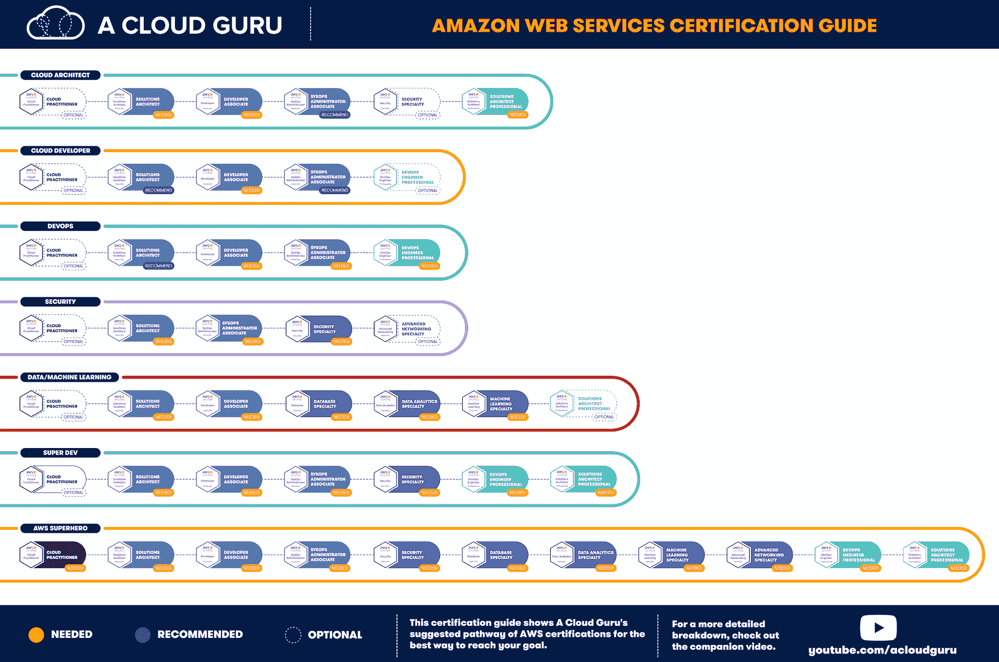

# 应该获得哪个 AWS 认证？

> 原文：<https://acloudguru.com/blog/engineering/which-aws-certification-should-i-take>

所以你正在考虑获得亚马逊网络服务(AWS)认证。太好了！

云计算技能需求巨大。63%的 IT 领导者表示，比大脚怪更难找到合格的工程师。(更大的新闻是，这意味着 37%的 IT 领导者*发现了*大脚怪？)无论你是想让自己的职业生涯更上一层楼，还是想进入一个新的领域，[开发云技能](https://acloudguru.com/solutions/individuals)并获得合适的亚马逊网络服务(AWS)认证，可以帮助你开启一些改变人生的职业道路。

* * *

**通往更好职业的钥匙**

[立即开始 ACG](https://acloudguru.com/pricing) 通过 AWS、Microsoft Azure、Google Cloud 等领域的课程和实际动手实验室来改变你的职业生涯。

* * *

但是你从哪里开始呢？[什么是 AWS](https://acloudguru.com/blog/engineering/what-is-amazon-web-services-aws) ？哪种 AWS 认证应该先做，哪种 AWS 认证学习路径适合你？什么工作需要哪些 AWS 认证？

如果你在寻找一个真正的 TL；至于你需要获得哪些亚马逊网络服务认证，从 [AWS 认证云从业者考试](https://acloudguru.com/course/aws-certified-cloud-practitioner) (CCP)开始，然后继续到 [AWS 认证解决方案架构师助理](https://acloudguru.com/course/aws-certified-solutions-architect-associate-saa-c02) (CSAA)。想要更多细节或最佳 AWS 初学者培训的链接吗？接着读下去！

### 规划您的 AWS 云认证学习路径

点击下面的链接，跳转到更多关于亚马逊网络服务认证的信息，获得认证需要什么，以及它们对你的云计算职业生涯可能意味着什么。

## 什么是 AWS 认证，为什么它们很重要？

AWS 认证是行业公认的证书。它通过验证 Amazon Web Services 云专业知识的水平来帮助学习者建立信誉，并帮助组织确定使用 AWS 领导云计划的熟练专业人员。

专业人员在通过 AWS 提供的一项或多项考试后获得 AWS 认证。AWS 认证的有效期为三年。

为了保持 AWS 认证状态，AWS 要求您通过一个称为重新认证的过程定期展示您持续的专业技能。

让我们花点时间来探讨一下什么是认证，什么是*而不是*。

*   **证书是知识的证明**-它们证明你足够精通以通过考试。

*   **认证不是经验的证明**-没有什么可以替代在云中的实际工作。然而，有很多方法可以让[在职场之外获得 AWS 云实践培训](https://acloudguru.com/aws-cloud-training)，让[以最少的经验启动你的云事业](https://acloudguru.com/blog/engineering/jump-start-your-cloud-career)。

*   认证是敲门砖——它们可以让你进入面试，或者晋升的考虑范围。

*   **认证不是金奖券**–一个常见的问题是，“AWS 认证能让我找到工作吗？”他们不能保证你会[得到一份云工作](https://acloudguru.com/blog/engineering/how-many-certifications-do-i-need-to-get-a-cloud-job)，但是他们可以让你成功。从那里赚到它取决于你。

*   **证书非常有价值**-AWS 证书持有者的平均年薪超过 10 万美元。AWS 认证是一些[顶级付费云认证](https://acloudguru.com/blog/engineering/top-paying-cloud-certifications-and-jobs)。

*   **认证不仅仅是赚钱的能力**-它们还验证你的知识，并帮助确保团队拥有共同的云“语言”——通常被称为“[云流畅度](https://acloudguru.com/blog/business/how-to-build-a-cloud-fluency-program-for-everyone)”

当考虑你的 AWS 职业道路时，将认证视为敲门砖会有所帮助。它可以帮助你达到下一个层次，但是实际的达到还是取决于你自己。

无论您选择哪条路线，获得 AWS 认证都从未如此简单。[亚马逊在网上提供所有的认证考试](https://acloudguru.com/blog/engineering/all-aws-certification-exams-now-available-online)，这意味着你可以在家里、办公室或任何你在的地方进行考试，而不需要去考试中心。

## **2022 年 AWS 认证值得吗？**

是的，AWS 认证是值得的！但是 AWS 认证的真正价值[取决于**为什么**你想获得 AWS 认证。](https://acloudguru.com/blog/engineering/the-value-of-an-aws-certification)

你希望亚马逊网络服务认证能让你获得一次面试或者找到一份云计算工作吗？你的老板告诉你你需要获得认证吗？你认为拿到一个证书就能让你拿到六位数的薪水吗？(这些问题的答案依次是:有可能，你应该听你老板的，这种情况很可能不会发生。)

**为什么**重要。认证是工具。它们不是最终目标；它们是人生道路上的里程碑。

那么，应该先做哪个 AWS 认证呢？

截至 2022 年 3 月，亚马逊网络服务提供了 11 种个人认证，分布在四个不同的级别。一开始，弄清楚从哪里开始，哪一个 AWS 证书对你和你的职业目标来说是最好的，可能看起来超级吓人。幸运的是，一旦你弄清楚什么是什么，到达那里的路径通常是非常清楚的。

Wondering what is the best path for AWS certification or which AWS course is best for freshers? Where to start: Solutions Architect vs Developer Associate? [*Download A Cloud Guru’s AWS Certification Guide PDF*](https://go.acloudguru.com/rs/194-UHP-609/images/Cert-Guide-AWS-2020.pdf) for your step-by-step visual guide to AWS certification.

* * *

## **让我们开始你的 AWS 之旅**

云专家培训课程是准备考试的最佳方式。查看 ACG 目前的[免费云课程](https://acloudguru.com/blog/news/whats-free-at-acg)或通过我们的[云技能评估](https://acloudguru.com/platform/skills-assessments)测试您的知识。

* * *

## AWS 认证有哪些不同的级别？

“什么是最适合我的 AWS 证书？”你可能会问。您的职业目标可以帮助您走上正确的认证学习道路。让我们来看看亚马逊网络服务提供的不同认证。

目前有 11 种不同的认证，分布在四个经验级别:

*   基本的
*   联想
*   专业的
*   专业

## 哪个 AWS 认证最容易？

AWS 认证云从业者(CCP)是最简单的亚马逊网络服务认证。这是一个云初学者友好的认证，涵盖了 AWS 和云的基础知识，不需要任何技术经验作为先决条件。尽管如此，除非你有 AWS 方面的经验，否则你仍然需要努力学习来掌握它。(没*那么*容易。)

## AWS 基础级认证

*   认证:
*   范围:10
*   深度:2
*   先决条件:无
*   推荐经验:6 个月的 AWS 和行业知识
*   涵盖的技能:
    *   基本 AWS 架构基础
    *   关键 AWS 服务
    *   AWS 安全性和合规性

**它很可能适合您，如果:**您需要了解基本的云概念，如什么是云、[什么是云迁移](https://acloudguru.com/blog/business/what-is-cloud-migration)，以及 AWS 如何在较高层次上工作，但不要参与实施。

每个旅程都从某处开始。对于 AWS 来说，这个起点是一个基础认证。

*想开始您的云架构师之旅吗？查看我们的 [AWS 架构师学习路径](https://acloudguru.com/learning-paths/aws-architect)！*

#### AWS 认证云从业者—基础

[AWS 云从业者考试](https://acloudguru.com/blog/engineering/what-we-learned-sitting-aws-cloud-practitioner-exam)认证给你一个关于 AWS 的高级介绍。它没有深入任何特定的服务。相反，它概述了 AWS 的结构。

我们推荐我们的 [AWS 认证云从业者课程](https://acloudguru.com/course/aws-certified-cloud-practitioner),作为任何云计算新手的最佳起点。这将有助于你建立，呃，深入研究 AWS 内部工作所需的基础。您还可以查看 Ryan 的[动手实验室的云播放列表，了解 AWS 的基本知识](https://acloudguru.com/blog/engineering/ryans-cloud-playlist-hands-on-labs-for-learning-aws-essentials)。

* * *

**[实践 AWS 应用的 10 个有趣的动手项目](https://acloudguru.com/blog/engineering/10-fun-hands-on-projects-to-learn-aws)** 学习 AWS 没有比使用所提供的服务来构建真实世界的应用更好的方法了。看看这些 [10 个好玩的 AWS 项目](https://acloudguru.com/blog/engineering/10-fun-hands-on-projects-to-learn-aws)，难度各不相同。

* * *

## AWS 助理级认证

*   认证:
*   范围:8
*   深度:4
*   推荐经历:有一年在 AWS 解决问题和实施解决方案的工作经验。
*   涵盖的技能:
    *   基于 AWS 的应用程序如何工作
    *   在 AWS 平台上构建安全的应用程序
    *   部署混合 AWS 系统
    *   动手 AWS 应用程序设计
    *   AWS 应用程序开发
    *   AWS 环境中的安全性

**它很可能适合你，如果:**如果你打算在 AWS 的任何实际应用中工作，助理级认证应该标志着你旅程的真正开始。AWS 云从业者提供了坚实的概念基础，但 AWS 助理级认证是日常实施中真正遇到困难的地方。

#### AWS 认证解决方案架构师助理

AWS 认证解决方案架构师助理认证让您对 AWS 有一个全面的了解，并为您将来学习其他内容打下了坚实的基础。想知道哪种 AWS 认证最受欢迎？**AWS 认证解决方案架构师助理多年来一直是云认证的第一名，这是有原因的。**

CSA-Associate 认证侧重于核心 AWS 服务，如身份和访问管理(IAM)、虚拟私有云(VPC)、S3 和 EC2。学习这些核心服务将让您很好地理解 AWS 如何处理安全性、网络、数据存储和计算能力。(查看我们的亚马逊 S3[动手实验室播放列表](https://acloudguru.com/blog/engineering/intro-to-amazon-s3-the-aws-hands-on-labs-playlist)，了解 S3。)

对于刚接触云计算的人，我们推荐我们的 [AWS 解决方案架构师助理课程](https://acloudguru.com/course/aws-certified-solutions-architect-associate-saa-c02)作为您获得 AWS 云从业者认证后的  下一个最佳步骤。

由于理想情况下，您不仅希望收集足够的信息以通过认证考试，还希望为未来的云职业成功做好准备，因此我们推出了[六门课程的 AWS 认证解决方案架构师助理认证课程](https://acloudguru.com/blog/engineering/aws-solutions-architect-associate-exam-blueprint-6-areas-to-master)。除了通过考试之外，建立真正的 AWS 技能不仅会帮助你通过 SAA-C02 考试并获得认证，还会确保你为解决方案架构师的职业生涯做好准备。

您的开发人员和系统管理员可能想直接获得开发人员助理或系统运行管理员助理证书，并获得更多权力，但我们仍然建议您首先通过解决方案架构师助理。

#### AWS 认证开发人员–助理

你可能会认为 AWS 认证开发者助理证书是为开发者准备的。毕竟，这里写的是“开发者”，但实际上是给任何使用 AWS 的人看的。

就关注点而言， [AWS 认证开发者](https://acloudguru.com/course/aws-certified-developer-associate)——助理认证会带你更深入地了解像迪纳摩 DB、弹性豆茎、SQS 和社交网络这样的服务——但不会太深。它还希望您能更多地了解如何使用这些服务，以及它们如何通过 API 和 SDK 向外界展示。在 Alexa SDK 中使用 DynamoDB 的[数据持久性和 CRUD 操作等话题](https://acloudguru.com/blog/engineering/alexa-node-sdk-session-persistence-and-dynamo-crud-operations-part-i)！

**这是我们推荐给大家的另一个认证。**事实上，我们建议您在完成 AWS 认证解决方案架构师助理考试后，立即参加我们的 [AWS 认证开发人员助理课程](https://acloudguru.com/course/aws-certified-developer-associate)。证书之间有很多重叠，将它们放在一起会使这个更容易快速完成。

* * *

**[AWS 开发人员必备:ACG 动手实验室播放列表](https://acloudguru.com/blog/engineering/aws-developer-essentials-the-acg-hands-on-labs-playlist)** 查看这个[动手实验室组合](https://acloudguru.com/blog/engineering/aws-developer-essentials-the-acg-hands-on-labs-playlist)以获得真实生活经验并练习建立 AWS 开发人员技能。

* * *

#### AWS 认证系统运行管理员-助理

这个认证标题也有些误导。不仅仅是系统管理员。这是给任何在 AWS 上运行东西的人的。这个考试在 CloudWatch 上进行得相当深入。通过这个认证会让你对你的 AWS 架构中实际发生的事情有更强的把握。

给聪明人一句话！**系统管理员被广泛认为是最难的 AWS 助理认证**。但是在参加更难的专业考试之前，干掉所有的同事真的很有价值。专业人士希望你对准水平考试了如指掌，所以错过一门考试——尤其是最难的一门——可能会反过来伤害你。

你准备好了吗？通过我们的 [AWS 认证系统运营管理员助理课程](https://acloudguru.com/course/aws-certified-sysops-administrator-associate)为这一具有挑战性的云证书做好准备。查看我们的 [AWS SysOps 管理员助理 SOA-C02 实践考试问题、提示和常见问题解答](https://acloudguru.com/blog/engineering/aws-sysops-administrator-associate-soa-c02-sample-exam-questions-tips-faqs)。

* * *

## **想获得 AWS 认证？**

访问云专家的所有 [AWS 认证课程](https://acloudguru.com/aws-cloud-training)、动手实验、测验、模拟考试、原创系列等等！

* * *

## AWS 专业级认证

*   证书
*   范围:10
*   深度:8
*   推荐经验:两年使用 AWS 的全面经验，具有设计、操作和故障排除解决方案的全面经验。
*   涵盖的技能:
    *   部署复杂的 AWS 迁移
    *   学习成本优化策略
    *   实施 CD 战略
    *   监控和记录 AWS 系统
    *   在 AWS 上实现可伸缩系统

**它很可能适合你，如果:**你已经有了在 AWS 工作的经验，已经掌握了 AWS 助理级认证，并准备好迈出下一步。

如果你不确定自己是否准备好获得 AWS 专业级认证，你可能还没有准备好！这些考试不是闹着玩的。它们代表了亚马逊网络服务认证的巅峰，范围广泛，重点突出。你必须知道很多很多东西！

### AWS 认证解决方案架构师-专业

**[AWS 认证解决方案架构师专业人士](https://acloudguru.com/course/aws-certified-solutions-architect-professional)是通用 AWS 专业知识的巅峰。**有了 CSA–Pro 证书，您就可以充分利用任何 AWS 功能或服务。此外，由于您对生态系统有着深入的了解，因此随着 AWS 的不断变化，保持与时俱进会容易得多。

对于 Solutions Architect–Pro 而言，整个 AWS 生态系统中的每一项服务都在发挥作用，并且在特定领域(如安全性和直连)需要相当多的深度。获得这个认证并不适合胆小的人——你必须了解 AWS 提供的所有东西。

* * *

**[我的](https://acloudguru.com/blog/engineering/my-near-disaster-aws-solutions-architect-professional-recertification-experience) [附近的](https://acloudguru.com/blog/engineering/my-near-disaster-aws-solutions-architect-professional-recertification-experience)[-灾难 AWS 解决方案架构师职业经验](https://acloudguru.com/blog/engineering/my-near-disaster-aws-solutions-architect-professional-recertification-experience)** 有本事就看！Scott Pletcher 与 AWS 认证解决方案架构师专业在线再认证和参加 AWS CSAP 考试的提示分享了他的[险些酿成灾难的经历](https://acloudguru.com/blog/engineering/my-near-disaster-aws-solutions-architect-professional-recertification-experience)。

* * *

### AWS 认证 DevOps 工程师-专业

DevOps 是关于结合开发、运营和质量的思想来管理系统。这个考试反映了这一点，并且确实需要你思考的不仅仅是部署一次的静态系统，而是会变化和发展的系统。

虽然 CSA–Pro 是一个包罗万象的认证，但 [AWS 认证 DevOps 工程师–专业人员](https://acloudguru.com/course/aws-certified-devops-engineer-professional)实际上更深入到部署和生命周期等特定领域(以及 CloudFormation 和 OpsWorks 等服务)。不过，总的来说，它的范围相当窄。

大师提示:这里的顺序有一定的回旋余地。devo PS–Pro 是助理级证书和[解决方案架构师–专业认证](https://acloudguru.com/course/aws-certified-solutions-architect-professional)之间的一块宝贵的敲门砖，所以一方面，先通过这个是个好主意(我们确实认为它会使通过 CSA–Pro 考试变得容易得多)。另一方面，devo PS–Pro 和 CSA–Pro 之间有相当多的重叠，许多人发现一起为它们学习是有价值的。

准备好做该死的 DevOps 了吗？通过我们的 [AWS 认证 DevOps 工程师专业课程](https://acloudguru.com/course/aws-certified-devops-engineer-professional)，掌握通过考试和提升职业生涯所需的技能。

* * *

## **AWS 专业认证**

*   证书
*   范围:3
*   深度:10
*   推荐经验:在特定专业领域有两到五年的实践经验和先进的 AWS 知识。
*   涵盖的技能:
    *   设计和维护大数据
    *   使用 AWS 自动化数据分析
    *   自动化网络部署的 AWS 系统
    *   Kinesis，雅典娜，快速之光和重识
    *   ML 解决方案的 AWS
    *   设计安全的 ML 解决方案

**它很可能适合你，如果:**你已经在 AWS 的某个特定领域拥有丰富的经验，并准备好验证这种经验，并在你的职业生涯中迈出下一步。

AWS 专业认证在狭窄的重点领域深度挖掘，特别是网络、数据分析、数据库、安全和机器学习。像专业水平证书一样，他们不能轻易接近，强烈建议所有人在每个专业领域都有多年的实际专业经验。

### AWS 认证高级网络–专业

[AWS 认证高级网络-专业](https://acloudguru.com/course/aws-certified-advanced-networking-specialty-2020)认证深入混合网络和仅 AWS 网络，包括多区域设置和成本优化等方面。它不是一个包罗万象的证书——有些服务你不需要知道任何东西——但它关注的地方非常深入。你需要完全了解某些服务的一切，比如直接连接、边界网关协议(BGP)和路由。

专家提示:如果你在参加[解决方案架构师-专业人员](#csap)之前先学习高级网络-专业，这将使 CSA-Pro 考试的某些方面对你来说容易得多。

准备好获得认证了吗？通过我们的 [AWS 认证高级网络-专业课程](https://acloudguru.com/course/aws-certified-advanced-networking-specialty-2020)，让 AWS 网络工作变得轻松。

### AWS 认证数据分析–专业

[AWS 认证数据分析专业认证](https://acloudguru.com/course/aws-certified-Data-Analytics-specialty)之前是 AWS 认证大数据专业认证，已于 2020 年退役。有一些延续的话题，但其他领域是全新的，更深入的。它侧重于所有的数据服务，尤其是 S3，红移，Kinesis 和弹性 MapReduce。数据安全也包括在内。获得此证书表明您已经掌握了可以在 AWS 中用来构建数据分析应用程序的服务和工具，以及构建和管理收集、存储、处理和可视化数据的生命周期。

准备好获得认证了吗？参加我们的 [AWS 认证数据分析专业课程，准备考试。](https://acloudguru.com/course/aws-certified-Data-Analytics-specialty)

### AWS 认证安全–专业

在专业认证中，AWS 认证安全专业是最广泛的。这很有意义——安全性跨越了许多其他领域，所以这个证书不太关注特定的服务。不过，它确实深入研究了许多特定于安全的服务，如[身份和访问管理(IAM)](https://acloudguru.com/blog/engineering/fixing-5-common-aws-iam-errors) 、虚拟专用云(VPC)、密钥管理服务(KMS)、CloudTrail、 [AWS 配置](https://acloudguru.com/hands-on-labs/auditing-resource-compliance-with-aws-config)和 Web 应用防火墙(WAF)。本考试中一些最常见的问题会让你弄清楚不同的安全设置是如何相互作用或冲突的。

准备好获得认证了吗？通过我们的 [AWS 认证安全专业课程](https://acloudguru.com/course/aws-certified-security-specialty-2020)为您的考试做准备。查看我们的[动手实验室播放列表，了解 AWS 安全基础知识](https://acloudguru.com/blog/engineering/hands-on-labs-for-learning-aws-security-essentials)。s

* * *

**[勒索软件和 AWS: 6 种降低爆炸半径的方法](https://acloudguru.com/blog/engineering/ransomware-and-aws-6-ways-to-reduce-your-blast-radius)** 了解更多关于勒索软件如何工作以及如何[在云中构建时使用 AWS 降低勒索软件风险](https://acloudguru.com/blog/engineering/ransomware-and-aws-6-ways-to-reduce-your-blast-radius)。

* * *

### AWS 认证机器学习-专业

AWS 认证的机器学习-专业证书是较新的认证之一，重点是[机器学习](https://acloudguru.com/blog/engineering/what-is-machine-learning-as-a-service-mlaas)。想象一下！你需要展示对机器学习基本概念的理解，如数据收集和分析、建模和机器学习算法，以及对用于流数据收集的 Kinesis 和用于构建、培训、调整和部署机器学习模型的 [SageMaker](https://acloudguru.com/blog/engineering/sagemaker-studio-lab-how-to-experiment-with-ml-for-free) 的熟练程度。

### AWS 认证数据库–专业

作为最新的亚马逊网络服务认证之一，该认证表明您有能力为组织的独特 [AWS 数据库服务](https://acloudguru.com/course/choosing-the-right-database-service-on-aws)需求推荐、设计和维护 AWS 数据库解决方案。你应该理解数据库的部署、迁移、管理、监控和故障排除；特定工作负载的数据库设计；和数据库安全。理想情况下，你需要 5 年的通用数据库技术经验，几年的 AWS 实践经验，以及使用本地和 AWS 基于云的关系数据库和 [NoSQL 数据库](https://acloudguru.com/blog/engineering/comparing-cloud-nosql-databases-dynamodb-vs-cosmos-db-vs-cloud-datastore-and-bigtable)的专业知识。

* * *

## 哪个 AWS 认证适合你？

好吧！因此，我们总共获得了 11 个 AWS 认证(目前)，分布在多个级别和学科领域。如果你是那种需要收集所有信息的人，那就给你更多的力量。但是，如果你正在遵循一个更专注的轨道，或者考虑进入云计算的职业生涯呢？你应该追求什么样的 AWS 认证？

看情况。

* * *

[**获得痛苦的云词典**](https://get.acloudguru.com/cloud-dictionary-of-pain)
说云不一定要努力。我们分析了数以百万计的回复，找出了最容易让人犯错的概念。抓住这个[云指南](https://get.acloudguru.com/cloud-dictionary-of-pain)获取一些最痛苦的云术语的简洁定义。

* * *

### 从你心中的目标开始

作家拿破仑·希尔写道:“知识只是潜在的力量。”同样，证书只是潜在的职业提升。他们可以向你敞开大门，但能否把握好 AWS 职业生涯的机遇取决于你。为此，重要的是将认证视为达到目的的一种手段。最终决定哪些认证适合你的是你的目标。

那么…你想做什么？

要深入探究动机和抱负的每一种可能的组合是不可能的，所以让我们把它分成几大类:

1.  **我想学习足够多的知识来跟上**——如果你将在云中的*工作，而不是专门在*云中的*工作，比如说担任行政或营销职位，你应该考虑 AWS 云从业者认证。获得该认证后，您将能够与您的 IT 团队保持同步，并充分理解云概念，从而思考如何将它们应用于您的公司或[行业的云创新](https://acloudguru.com/blog/business/how-is-the-education-industry-using-cloud-technologies)。*

*   **我想从事云计算的职业** —如果你想让[成为云计算的职业](https://acloudguru.com/blog/engineering/how-to-begin-your-cloud-career)，你绝对应该追求 AWS 认证解决方案架构师助理认证。CSA-Associate 是所有其他 AWS 认证的起点，不仅是最受欢迎的认证，也是 ACG 最受欢迎的课程。CSA-Associate 认证被广泛认为是所有认证中[最有价值的认证之一](https://acloudguru.com/blog/engineering/top-paying-cloud-certifications-and-jobs)，不仅可以帮助您开始云计算职业生涯，还可以为您提供获得更多 AWS 认证的起点。

*   **我已经每天都在云中工作，并且想进入下一个级别** —好吧，那么你已经在云中工作了。也许您已经获得了 AWS 认证解决方案架构师助理认证(如果没有，您应该参加该考试)。你已经准备好更上一层楼，拓宽视野，获得晋升。一个很好的起点是剩下的助理级认证:AWS 认证开发人员和 AWS 认证系统管理员。从那里，你可以追求两个专业水平的认证或考虑获得一些专业认证。

*   **我已经以专业的角色每天在云中工作，并希望成为我的领域的主人** —如果你在云的特定领域工作，如安全或网络，AWS 专业认证是一条自然的道路。在获得专业证书之前，你必须至少有一个助理级证书(或 AWS 认证云从业者)，但是一旦你满足了先决条件，你就可以提升你在特定专业领域的知识水平。

### 掩护你的基地

甚至一个证书都有可能改变一生。它可以打开新机会的大门。但能否抓住这些机会并与它们一起奔跑，取决于你自己。而在这个越来越 DevOps 的世界里，你不可能真的指望会有别人在那里照顾所有你不懂的细节。专业化可能很重要，团队合作可能很关键，但是您仍然需要能够自己处理运行的系统。

鉴于此，参加三个 AWS 助理认证是一个好主意，可以为日常有效地使用 AWS 打下坚实的基础。通过这些，您将了解如何设计、构建、配置、监控和维护基于 AWS 的系统。

### Go pro

获得三个助理认证后，下一个合乎逻辑的途径是获得两个专业认证，特别是 [AWS 认证解决方案架构师-专业人员](https://acloudguru.com/course/aws-certified-solutions-architect-professional)。CSA–Pro 是 AWS 知识的绝对巅峰，获得这个认证相当于 AWS 打败了一个视频游戏的最终 boss。

### 获得“核心 5”认证的建议顺序

获得“core 5”AWS 认证的途径有很多，但是我们发现按照这个顺序进行认证可以为您提供一些很好的垫脚石。如果您在此之前从可选的认证云从业者开始，随着您对关键 AWS 服务的熟悉，您可以享受更轻松的学习曲线。

1.  认证解决方案架构师–助理
2.  认证开发人员–助理
3.  认证系统运行管理员–助理
4.  认证开发人员–专业人员
5.  认证解决方案架构师-专业

## TL；博士？

那么，哪个 AWS 认证适合你呢？如果您刚刚开始使用云计算，AWS 认证云计算从业者和认证解决方案架构师助理考试绝对是您想要开始的地方。从那里，可以传递信息并提出一些一般性的建议，但确定正确的认证(或认证集合)和 AWS 学习路径最终取决于您的环境和职业目标。

*   请记住，认证就像一块垫脚石。他们可以帮助你达到下一个水平，但是否迈出这一步仍然取决于你自己。
*   刚刚入门还是需要了解基础知识？从 AWS 认证云从业者开始。
*   如果您想在云计算领域走得更远，那么选择 AWS 认证解决方案架构师助理是绝对不会错的。
*   除此之外， [AWS 认证解决方案架构师-专业人员](https://acloudguru.com/course/aws-certified-solutions-architect-professional)基本上是 AWS 专业知识的巅峰。
*   AWS 云认证包括几个专业级别的认证，包括安全性、数据分析和高级网络。

* * *

## **让我们开始你的 AWS 之旅**

云专家课程是准备考试和[开始云职业生涯](https://acloudguru.com/blog/engineering/how-to-begin-your-cloud-career)的最佳方式。立即开始免费试用，或者浏览我们所有的[亚马逊网络服务课程](https://acloudguru.com/browse-training)！