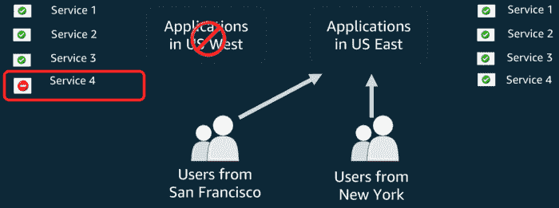
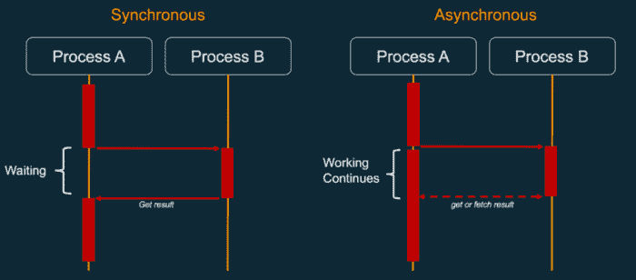
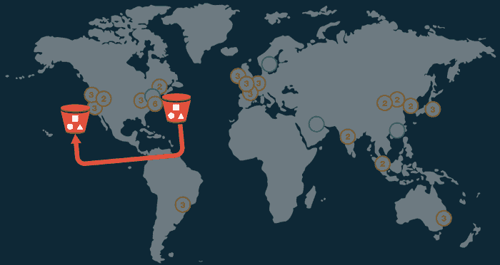
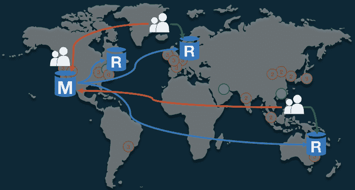
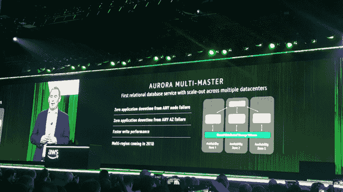
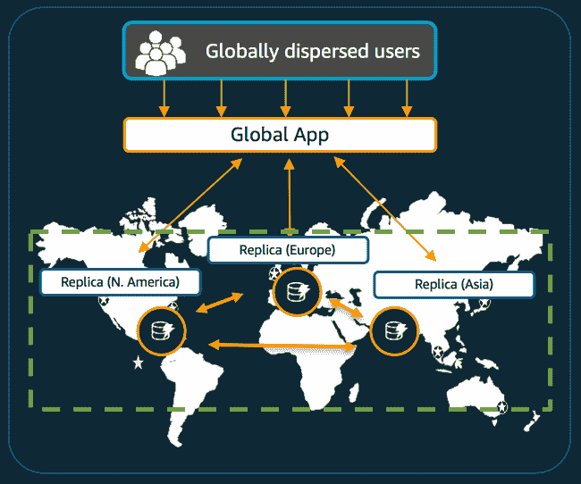

# 如何在 AWS 上构建多区域主动-主动架构

> 原文：<https://acloudguru.com/blog/engineering/why-and-how-do-we-build-a-multi-region-active-active-architecture>

## 任何事情都有失败的时候—构建弹性

> 任何足够先进的技术都和魔法没什么区别。
> 
> Arthur C. Clarke

这是我们构建多区域、主动-主动架构系列的第二部分。在上一篇文章中，我们谈到了对可用性 的 **[追求，因为它是这种设计的核心。在本帖中，我们将讨论设计多区域主动-主动架构的**为什么**和**如何**。](https://read.acloud.guru/the-quest-for-availability-771fa8a94a7c)**

请记住，构建和成功运行多区域主动-主动架构是很困难的，所以这篇文章不会假装涵盖所有相关的内容。相反，它应该被视为这种艺术的介绍。

## 为什么要为多区域架构烦恼呢？

好问题，很高兴你问了！基本上有三个原因可以解释为什么你想要一个多区域架构。

1.  **改善最终用户的延迟**
2.  **灾难恢复**
3.  **业务需求**

### **1。改善最终用户的延迟**

这个想法非常简单，与光速有关，但还没有人能够破解。你的后台离终端用户越近，体验就越好。

像[亚马逊 CloudFront](https://aws.amazon.com/cloudfront/) 这样的内容交付网络(CDN)用于加速内容的交付，尤其是静态内容(例如图像、视频、JavaScript 库等。)提供给全球的最终用户。使用全球分布的缓存服务器网络，静态内容就像在本地一样被提供给消费者，从而改进了静态内容的交付。

然而，即使 CloudFront 为您的大部分内容解决了问题，一些更动态的调用仍然需要在后端完成，而且它可能离您很远，这给请求增加了宝贵的毫秒数。

例如，如果您的用户在欧洲，但您的后端在美国或澳大利亚，则增加的延迟分别约为 140 毫秒和 300 毫秒。对于许多流行的游戏、银行业务需求或交互式应用来说，这些延迟是不可接受的。

事实上，延迟在客户对高质量体验的感知中扮演着重要角色，并被证明在一定程度上影响着用户的行为，[延迟越低，用户参与度越大](https://dl.acm.org/citation.cfm?id=2609627)。

大公司也多次证实了这一观察结果:

*   **亚马逊** : 100 毫秒的额外加载时间导致销售额下降 1%(格雷格林登，消息来源[此处](http://stanforddatamining.2006-11-29.ppt/))。
*   **谷歌** : 500 毫秒的额外加载时间导致搜索减少了 20%(玛丽莎·梅耶尔，来源[此处](https://books.google.fi/books?id=UPY7Tt_nlBAC&lpg=PA105&ots=_w_03082nU&dq=Google%20500%20ms%20of%20extra%20load%20time%2020%25%20fewer%20searches%20Marrissa%20Mayer&pg=PA105#v=onepage&q=Google%20500%20ms%20of%20extra%20load%20time%2020%25%20fewer%20searches%20Marrissa%20Mayer&f=false))。
*   雅虎！ : 400 毫秒的额外加载时间导致页面加载前点击“返回”的人数增加了 5-9%(妮可·沙利文，消息来源[此处](https://books.google.fi/books?id=UPY7Tt_nlBAC&lpg=PA105&ots=_w_03082sS&dq=400%20ms%20of%20extra%20load%20time%20caused%20a%205%E2%80%939%25%20increase%20in%20the%20number%20of%20people%20who%20clicked%20%E2%80%9Cback%E2%80%9D&pg=PA105#v=onepage&q=400%20ms%20of%20extra%20load%20time%20caused%20a%205%E2%80%939%25%20increase%20in%20the%20number%20of%20people%20who%20clicked%20%E2%80%9Cback%E2%80%9D&f=false))。

随着技术的进步，特别是随着 AR、VR 和 MR 的出现，需要更身临其境和逼真的体验，开发人员需要生产具有严格延迟要求的软件系统。因此，拥有本地可用的应用程序和内容变得越来越重要。

### **2。灾难恢复**

在 2012 年平安夜上，[网飞流媒体服务经历了由 AWS](https://medium.com/netflix-techblog/a-closer-look-at-the-christmas-eve-outage-d7b409a529ee) [ELB 控制平面](https://aws.amazon.com/message/680587/)引起的中断。ELB 的失败超出了网飞的纠正能力。

接下来是任何 AWS 客户的一些重要和鼓舞人心的工程工作——实现**区域弹性**。

Regional Resiliency at work.

> 正如[网飞在其博客上解释](https://netflixtechblog.com/a-closer-look-at-the-christmas-eve-outage-d7b409a529ee)的那样，“网飞旨在处理一个区域中单个可用性区域的全部或部分故障，因为我们跨三个区域运行，并且两个区域的功能没有损失。我们正在研究如何**扩展我们的弹性，以处理部分或全部地区中断**

事实上，如果您的应用程序由多个不同的服务组成，并且其中一个对您的应用程序至关重要的服务遇到了问题，您可能希望将流量转移到一个健康的区域，以防止客户生气。

网飞并不是唯一一个从 ELB 的失败中吸取教训的人——AWS 也从那次失败中吸取了教训，并且已经采取措施减小潜在失败的爆炸半径。如今，控制平面的实现更加健壮。

失败总是会发生，当失败发生时，重要的是既要努力减少问题的发生，又要努力减轻问题影响的严重性。

### **3。业务需求**

最后，一些客户可能有在相距数百公里的不同区域存储数据的业务需求。因此，这些客户必须在多个区域存储数据。这变得越来越普遍，因为 AWS 现在在全球有 18 个地区，分布在美洲、亚太、欧洲、中东和非洲。

## 如何在 AWS 中构建多区域主动-主动架构

简而言之，多区域主动-主动架构获得跨多个 AWS 区域部署的客户机请求路径上的所有服务。为此，必须满足几个要求。

1.  地区间的数据复制一定要**快******可靠**。**
2.  **你需要一个**全球** **网络基础设施**来连接你的不同地区。**
3.  **服务不应该有本地状态——它们必须是**无状态的**，并且状态应该在区域之间共享。**
4.  **应尽可能避免跨地区的同步呼叫。应用程序应该**使用区域资源**。**
5.  ****DNS 路由**应该用于允许不同的场景。**

**让我们仔细看看这些要求。**

### **1.可靠的数据复制**

**先简单说一下 [CAP 定理](https://en.wikipedia.org/wiki/CAP_theorem)。CAP 定理指出，分布式系统不可能同时提供以下三种保证中的两种以上:****[可用性](https://en.wikipedia.org/wiki/Availability)** 和 [**分区容差**](https://en.wikipedia.org/wiki/Network_partitioning) **。但是特别是在存在网络分区的情况下，人们必须在一致性和可用性之间做出选择。******

****这意味着我们有两个选择:放弃一致性将允许系统保持高可用性，优先考虑一致性意味着系统可能不总是可用的。****

****因为我们正在构建一个多区域架构，并且正在优化可用性，所以我们必须放弃一致性——从设计上来说，这也意味着我们需要**采用异步系统和复制**。****

****

Synchronous vs asynchronous pattern**** 

****对于分布式数据存储，异步复制以引入复制滞后或延迟为代价，将主节点与其副本分离。****

****这意味着在主节点上执行的更改不会立即反映在其副本上——这种滞后的结果产生了通常被称为[最终一致性](https://en.wikipedia.org/wiki/Eventual_consistency)的情况。当一个系统达到最终的一致性时，我们说它已经收敛，或者达到了副本收敛。****

****为了实现副本收敛，系统必须协调分布式数据的多个副本之间的差异。它可以通过执行以下协调来实现这一点:****

*   ****比较数据的版本****
*   ****数据本身的“智能”比较****
*   ****选择任意的最终状态****

****最常见的协调方法，也是大多数系统中使用的方法，包括 DynamoDB 全局表，被称为*“最后一个写入者获胜”*。****

****在设计应用程序时，必须考虑到**异步复制**的影响，因为除了对架构产生影响之外，它还会对客户端用户界面设计和体验产生一些影响。****

****这意味着接口应该是完全无阻塞的。用户交互和操作应该立即解决，而不需要等待任何后端响应——所有事情都应该在后台异步解决，并且对用户透明。****

****没有加载消息或微调永远停留在屏幕上。对服务器的请求应该与用户界面完全分离。这种“技巧”还会让用户相信应用程序很快，即使实际上并不是这样——隐藏网络延迟甚至全面服务失败。****

****这通常被称为**优雅降级**，它也被网飞用来减轻某些故障。****

### ****2.全球网络基础设施****

****几年前，在部署多区域体系结构时，标准做法是在区域之间建立安全的 VPN 连接，以便异步复制数据。****

****虽然部署和管理这些连接变得更加容易，但主要问题是它们通过互联网传输，因此容易受到路由突然变化的影响，尤其是延迟，这使得很难保持一致的良好复制。****

****

James Hamilton — AWS re:Invent 2016**** 

****为了克服这个问题，AWS 副总裁兼杰出工程师詹姆斯·汉密尔顿[宣布](https://www.youtube.com/watch?v=uj7Ting6Ckk)AWS 将提供高带宽的全球网络基础设施，由环绕全球的冗余 100GbE 链路供电。****

****这意味着 AWS 区域连接到一个专用的全球网络主干，与公共互联网相比，它提供了更低的成本和更一致的跨区域网络延迟，其优势显而易见:****

1.  ****改进延迟、数据包丢失和整体质量****
2.  ****避免网络互连容量冲突****
3.  ****更强的运营控制****

### ****3.无状态应用程序****

****我之前写过[本地状态是云反模式](https://hackernoon.com/10-lessons-from-10-years-of-aws-part-1-258b56703fcf)。对于多区域架构来说更是如此。当客户端与应用程序交互时，它们通过一系列称为会话的交互来完成。****

****在无状态架构中，服务器必须独立于之前的请求或会话来处理所有客户端请求，并且不应该在本地存储任何会话信息。因此，给定相同的输入，无状态应用程序应该向任何最终用户提供相同的响应。****

****无状态应用程序可以水平扩展，因为任何请求都可以由任何可用的计算资源(例如，实例、容器或函数)来处理。****

****

Stateful Applications**** 

****通过使用像 [Memcached](http://memcached.org/) 、 [Redis](https://redis.io/) 、 [EVCache](https://github.com/netflix/evcache/wiki) 这样的内存对象缓存系统，或者像 [Cassandra](http://cassandra.apache.org/) 或 [DynamoDB](https://aws.amazon.com/dynamodb/) 这样的分布式数据库，可以与任何实例、容器或函数共享状态，这取决于您的对象的结构和您在性能方面的需求。****

****2013 年，网飞[讲述了](https://www.youtube.com/watch?v=hAyA86QGRnI)和[写下了](https://medium.com/netflix-techblog/active-active-for-multi-regional-resiliency-c47719f6685b)关于在多区域设置中测试 Cassandra 的著名故事，在多区域集群的一个区域中写入 100 万条记录，然后在 500 毫秒后在另一个区域中读取，同时保持集群上的生产负载水平——所有这些都没有任何数据丢失。****

### ****4.使用本地资源，避免跨区域通话****

****如前所述，防止延迟增加对应用程序至关重要。因此，重要的是避免同步跨区域调用，并始终确保本地资源可供应用程序使用，从而优化延迟。****

****例如，存储在亚马逊 S3 存储桶中的对象应该在多个地区复制，以允许从任何地区进行本地访问。幸运的是，亚马逊为亚马逊 S3 实现了功能[跨区域复制](https://docs.aws.amazon.com/AmazonS3/latest/dev/crr.html)。跨区域复制是一种存储桶级别的配置，支持跨不同 AWS 区域中的存储桶自动、异步复制对象。****

****

S3 Cross Region replication**** 

****这种资源的本地访问也适用于数据库。为了支持这种情况，AWS 推出了针对 MySQL 的亚马逊 RDS 的[跨区域读取副本，随后是 MariaDB、PostgreSQL](https://docs.aws.amazon.com/AmazonRDS/latest/UserGuide/USER_ReadRepl.html) 和[亚马逊 Aurora](https://docs.aws.amazon.com/AmazonRDS/latest/UserGuide/AuroraMySQL.Replication.CrossRegion.html) 。****

****

Cross-Region Read Replicas for Amazon RDS MySQL, MariaDB, PostgreSQL and Amazon Aurora.**** 

****将跨多个区域的写入和读取操作分开将提高您的灾难恢复能力，但这也将使您能够将读取操作扩展到离您的用户更近的区域，并使从一个区域迁移到另一个区域变得更容易。****

****这种模式的主要限制是，所有关键的写入流量都必须传输到一个位于源区域的主设备。****

****

Reads (green) and Writes (red) patterns.**** 

****请记住，为了使用跨区域读取副本，您必须接受如上所述的最终一致性，因为数据复制是异步的。****

*****注意:使用 RDS，您可以通过使用*[*Amazon cloud watch*](http://aws.amazon.com/cloudwatch/)*来监控这种复制延迟，如果它达到您的应用程序无法接受的高水平，就发出警报。*****

****为了防止对数据库进行跨区域写入，您可以使用 [Amazon Aurora 多主集群](https://docs.aws.amazon.com/AmazonRDS/latest/AuroraUserGuide/aurora-multi-master.html)。****

****

Andy Jassy, CEO of AWS, announcing Aurora Multi-Master at re:Invent 2017.**** 

****多主集群提高了 Aurora 已经很高的可用性。如果您的一个主实例出现故障，集群中的其他实例将立即接管，在实例故障甚至整个 AZ 故障期间保持读写可用性，应用程序不会停机。****

****[Amazon DynamoDB 全局表](https://aws.amazon.com/dynamodb/global-tables/)还允许您构建全球分布式应用程序。****

****

Global applications powered by DynamoDB Global Tables.**** 

****DynamoDB 全局表由多个副本表组成，每个区域一个副本表，DynamoDB 将其视为一个单元。每个副本都有相同的表名和相同的主键模式。****

****应用程序可以将数据写入任何副本表。DynamoDB 自动将写操作传播到其他 AWS 区域中的其他副本表。****

****DynamoDB 是在[黄金时段](https://aws.amazon.com/blogs/aws/prime-day-2017-powered-by-aws/)在**Amazon.com**使用的同一个数据库。例如，2017 年，来自 Alexa、Amazon.com 网站和亚马逊履行中心的[亚马逊 DynamoDB](https://aws.amazon.com/dynamodb/) 请求总计 3.34 万亿次，峰值为每秒 1290 万次。****

### ****5.DNS 路由****

****为了在地区之间路由流量，我们需要使用支持可配置路由策略的域名系统(DNS)。****

****[Amazon Route 53](https://aws.amazon.com/route53/) 提供高度可用和可扩展的域名系统(DNS)、域名注册和健康检查 web 服务。但对我们的用例来说，最重要的是，它通过各种[路由策略](https://docs.aws.amazon.com/Route53/latest/DeveloperGuide/routing-policy.html)支持[流量](https://docs.aws.amazon.com/Route53/latest/DeveloperGuide/traffic-flow.html)，所有这些都可以与 DNS 故障转移相结合。****

1.  ******地理位置路由策略**:当您希望根据用户的位置路由流量时使用。****
2.  ******地理邻接路由策略**:当您希望根据资源的位置路由流量时使用，并且可以选择将流量从一个位置的资源转移到另一个位置的资源。****
3.  ******延迟路由策略**:当您在多个位置拥有资源，并且希望将流量路由到提供最佳延迟的资源时使用。****
4.  ******多值应答路由策略**:当您希望 Route 53 使用随机选择的多达八个健康记录来响应 DNS 查询时使用。****
5.  ******加权路由策略**:用于按照您指定的比例将流量路由到多个资源。****

****Route53 的路由策略(地理邻近和延迟)。****

## ****破败不堪****

****在这篇文章中，我们了解到，为了构建多区域主动-主动架构，客户端请求路径上的所有服务必须跨多个 AWS 区域部署，我们必须采用**异步** **设计和架构**，并且我们必须构建完全****无状态**的应用程序。******

****当然，我们应该利用像亚马逊 S3 或 DynamoDB 这样的高可用性服务，并从亚马逊在全球建立的全球网络中获益，以获得可靠的数据复制。最后，我们还讨论了如何使用流量来支持 AWS 区域之间的不同路由策略。****

****这部分就讲到这里了。我希望你喜欢它。我要感谢[阿德里安·科克罗夫特](https://medium.com/u/eed29d74b3fb?source=post_page-----6d81acb7d208--------------------------------)和[朱利安·西蒙](https://medium.com/u/4ffe14103b7a?source=post_page-----6d81acb7d208--------------------------------)提供的宝贵反馈！****

****请不要犹豫给出反馈，分享你自己的观点或只是拍手。在下一部分中，我将继续构建一个多区域、主动-主动后端——但将采用无服务器的方式🙂敬请期待！****