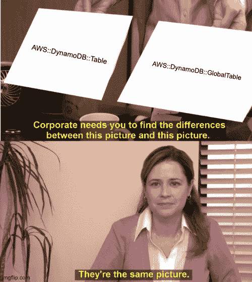
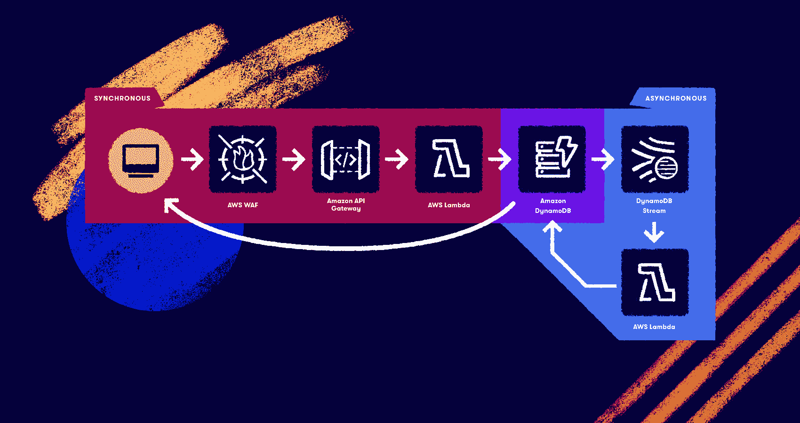

# 你现在应该一直使用 DynamoDB 全局表

> 原文：<https://acloudguru.com/blog/engineering/you-should-always-use-dynamodb-global-tables-now>

这是 NoSQL 世界听到的推文:

我等待这一天已经很久了(我们这些知道的人知道这是一段很长的时间)。

新的`AWS::DynamoDB::GlobalTable` CloudFormation 资源最终提供了 DynamoDB 的全局表功能，作为一种可配置的 IaC 资源，而不使用 Lambda 函数支持的定制资源来实现自动化。在我工作的地方，我选择不投资定制资源，而是将全局副本的配置留给使用这种模式的服务的手动步骤。

我是说，这不是你经常会碰到的事情。站立时创建副本，扩张时创建副本。手动步骤并不那么痛苦，而且投资一个定制的资源来做这件事也不会有很大的投资回报。

但是现在我们已经完全支持 CloudFormation 来创建和配置我们的全局表，我有一些想法。

* * *

*云 NoSQL 面对面:我们[比较了 DynamoDB、Azure Cosmos DB 和 GCP 的云数据存储和 Bigtable](https://acloudguru.com/blog/engineering/comparing-cloud-nosql-databases-dynamodb-vs-cosmos-db-vs-cloud-datastore-and-bigtable) 的价格、功能等。*

* * *

## CloudFormation 如何支持 DynamoDB 全局表

首先，我想说的是，这是一个全新的资源，而不是现有资源的扩展，这让我非常失望。

让我们看一下这两种资源的基本单表表示:

```
MyTable:
  Type: AWS::DynamoDB::Table
  Properties:
    BillingMode: PAY_PER_REQUEST
    AttributeDefinitions:
      - AttributeName: pk
        AttributeType: S
      - AttributeName: sk
        AttributeType: S
      - AttributeName: gsi1pk
        AttributeType: S
      - AttributeName: gsi1sk
        AttributeType: S
    KeySchema:
      - AttributeName: pk
        KeyType: HASH
      - AttributeName: sk
        KeyType: RANGE
    GlobalSecondaryIndexes:
      - IndexName: GSI1
        KeySchema:
          - AttributeName: gsi1pk
            KeyType: HASH
          - AttributeName: gsi1sk
            KeyType: RANGE
        Projection:
          ProjectionType: ALL
```

```
MyGlobalTable:
  Type: AWS::DynamoDB::GlobalTable
  Properties:
    BillingMode: PAY_PER_REQUEST
    AttributeDefinitions:
      - AttributeName: pk
        AttributeType: S
      - AttributeName: sk
        AttributeType: S
      - AttributeName: gsi1pk
        AttributeType: S
      - AttributeName: gsi1sk
        AttributeType: S
    KeySchema:
      - AttributeName: pk
        KeyType: HASH
      - AttributeName: sk
        KeyType: RANGE
    GlobalSecondaryIndexes:
      - IndexName: GSI1
        KeySchema:
          - AttributeName: gsi1pk
            KeyType: HASH
          - AttributeName: gsi1sk
            KeyType: RANGE
        Projection:
          ProjectionType: ALL
    Replicas:
      - Region: !Ref AWS::Region
```

发现区别了吗？新的`Replicas`属性有一个有趣的规则:*“列表必须包含至少一个元素，即定义全局表的堆栈部署的区域。”*所以，无论如何，我们需要填充它，在我上面的模板片段中，我选择使用 AWS region 伪参数。

事实上，围绕新的全局表资源有很多规则(请记住，我是从 CloudFormation 文档中复制和粘贴的):

*   您不能通过在模板中更改类型来将类型为`AWS::DynamoDB::Table`的资源转换为类型为`AWS::DynamoDB::GlobalTable`的资源。**这样做可能会导致 DynamoDB 表被删除。**

这是一个耻辱…在最后补上这个。

*   使用调配计费模式时，CloudFormation 将在您的每个复制副本上创建自动扩展策略，以控制其写入容量。您必须使用`WriteProvisionedThroughputSettings`属性配置此策略。CloudFormation 将确保所有复制副本具有相同的写容量自动扩展属性。您不能直接为全局表的写容量指定值。
*   如果您的表使用调配的容量，您必须直接在`AWS::DynamoDB::GlobalTable`资源中配置自动扩展。您不应该在任何表副本或全局二级索引上配置额外的自动伸缩策略，无论是通过 API 还是通过`AWS::ApplicationAutoScaling::ScalableTarget`或`AWS::ApplicationAutoScaling::ScalingPolicy`。这样做可能会导致意外行为，并且不受支持。

*TL；DR* 这里是 CloudFormation 将管理您的复制副本的所有容量配置。这不应该是意料之外的，也是受欢迎的。

*   在 AWS CloudFormation 中，每个全局表由单个区域中的单个堆栈控制，而不管副本的数量。当您部署模板时，CloudFormation 将在单个堆栈操作中创建/更新所有副本。不应在多个区域部署相同的 AWS::DynamoDB::GlobalTable 资源。这样做会导致错误，并且不受支持。如果在多个区域中部署应用程序模板，可以使用条件仅在单个区域中创建资源。或者，您可以选择在独立于应用程序堆栈的堆栈中定义 AWS::DynamoDB::GlobalTable 资源，并确保它只部署到一个区域。

最后一部分，*“…在与应用程序分开的堆栈中定义您的资源……”*如果您一直在使用最新版本的全局表构建多区域 DynamoDB 支持的应用程序，我认为这是最佳实践。

假设有人在遵循这种做法，我觉得 AWS 可以允许将`AWS::DynamoDB::Table`资源转换为`AWS::DynamoDB::GlobalTable`的路径，并采用它发现的所有副本。那会是一条快乐的领养之路。相反，我们只能通过数据库迁移来实现这一目标。

* * *

*深挖 DynamoDB？云专家的 [DynamoDB 深潜课程](https://acloudguru.com/course/amazon-dynamodb-deep-dive)永远免费。*

* * *

## 在多个 AWS 区域中使用表格

现在，让我们深入了解一下围绕该`Replicas`属性的一些行为。

*   该列表必须包含至少一个元素，即定义全局表的堆栈部署的区域。例如，如果您在部署到 us-east-1 的堆栈中定义您的表，那么您必须在`Replicas`中有一个区域为 us-east-1 的条目。
*   您可以创建一个最多包含两个副本的新全局表。创建表后，可以添加或移除副本，但每次更新时只能添加或移除一个副本。

嗯…如果我们在开始定义一个包含两个以上区域的表，会是什么样子？我们得到这个错误:

提供的请求无效:创建全局表时，最多只能声明 2 个副本

哦。如果我们在更新时一次添加多个区域会怎么样？

提供的请求无效:在每次更新操作中，您只能添加或删除一个副本

双 oof！！这是 GSI 的更新了一遍！至少在那里，我们可以在创建时定义它们，直到达到总限制。

这使得从一开始就推出针对 3 个以上地区的全球服务变得困难。您需要首先在两个区域中部署带有副本的表的模板，然后执行增量更新，添加每个额外的区域，直到您达到目标。这意味着最终结果模板 ***不能作为一个新的栈单独部署。*** 你必须回到起点，或者引入一堆条件语句来控制你要扩张到的区域(不要@我 CDK 用户——我听到了)。

添加或删除复制副本还附带一条注释:

*   对于空表，添加副本可能需要几分钟，对于大表，可能需要几个小时。如果您想要添加或删除一个副本，我们建议提交一个仅包含该更改的`UpdateStack`操作。

这更倾向于在自己的栈中定义 DynamoDB 表的最佳实践。在扩展应用程序之前，首先*扩展到数据层的新区域！*

## 何时在 CloudFormation 中使用 DynamoDB 全局表

我花了整篇文章来梳理所有这些警告，以及我对 AWS 为什么不只是扩展原始资源的感叹，您可能会想:为什么这篇文章的标题说您应该总是使用新的？



在功能上，当您部署 CloudFormation 堆栈时，这两种类型的资源以完全相同的方式运行。如果你正在构建一个只会出现在一个区域的应用，好吧，我承认你可能没有理由总是默认使用`AWS::DynamoDB::GlobalTable`。但是，如果你正在开发一个计划扩展到多个地区的应用程序，或者想留有余地这样做，你应该只是使用它，并在以后减轻多地区扩展的负担。关键是，即使你从来没有打开它，选项也是存在的！

当然，如果您正在构建一个由 DynamoDB 支持的多区域应用程序，这是显而易见的。

感谢 CloudFormation 团队最终以代码形式向我们提供了全球表格！

* * *

准备好享受 DynamoDB 带来的更多乐趣了吗？[通过 Forrest brace al](https://acloudguru.com/blog/engineering/building-aggregations-with-dynamodb-streams)演示如何使用 DynamoDB 流构建可扩展的聚合。

[](https://acloudguru.com/blog/engineering/building-aggregations-with-dynamodb-streams)