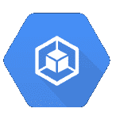
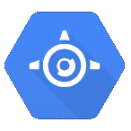
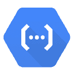
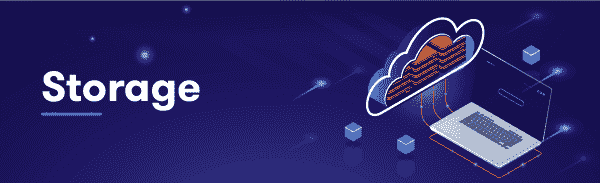
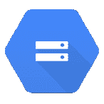
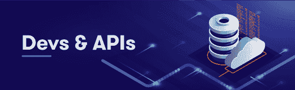
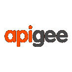

# 你方便的谷歌云平台(GCP)备忘单

> 原文：<https://acloudguru.com/blog/engineering/your-handy-gcp-cheat-sheet>

谷歌云平台(GCP)是一个庞大的、不断扩张的平台，找到自己的路可能有点困难，尤其是如果你是第一次涉水进入。当然，把“云”放在任何东西的前面会让它看起来更酷，但是把“云”放在所有东西的前面会让它有点混乱。

无论您是第一次来到 GCP，还是仅仅需要快速复习，我们都整理了这份方便的“g 重复表”来帮助您了解一些主要的平台服务:

## 

### ** **   **谷歌计算引擎:谷歌全球基础设施触手可及。**

GCE 是 Google 的基础设施即服务(IaaS)产品，它允许您在 Google 的物理硬件上运行工作负载，并访问 Google 用来运行其核心服务的相同全球基础设施。

###   ** Google Kubernetes 引擎:自动化、可扩展的容器部署。**

Kubernetes Engine 是 Google 的生产就绪环境，用于大规模运行 Kubernetes 集群和部署容器化应用程序以及其他工作负载。

### **谷歌应用引擎:在网络的任何地方运行任何东西。**

就像听起来一样，GAE 是谷歌的网络应用开发和托管平台。使用灵活模式运行容器，并利用 GAE 的自动伸缩来处理任何需求的增加。

### **谷歌云功能:专为微服务打造，随处适用。**

GCF 通常与微服务一起使用，为事件响应提供大规模可扩展的解决方案。它是一个“无服务器”解决方案，运行 node.js 或 Python，并为事件触发的每个“功能”生成 HTTP 端点，例如，关闭不在使用的支持基础设施。

* * *

##### **准备好深入了吗？**

通过我们的**谷歌云平台介绍**课程，迈出学习 GCP 的下一步。这个两个小时的免费课程涵盖了 GCP 的设计、结构和大量的服务，这是申请云工程师助理认证的良好基础。

* * *

## 

###   **谷歌云存储:维系 GCP 服务的“胶水”。**

GCS 是整个谷歌云上最重要的服务之一。它通常充当用其他工具包(如 GCE 和 GAE)构建的服务的“粘合剂”,提供无限可伸缩、完全可管理、版本化和高度持久的对象存储。

### **云扳手:SQL 数据库类固醇。大量类固醇。**

这个 GCP 数据库服务可以像普通的 SQL 数据库一样使用。但是，Cloud Spanner 突破性的水平可伸缩性和一致性意味着，即使是巨大的关系数据库，你也不会牺牲掉保证。

### ** BigQuery:比快速获得答案更快。**

BQ 提供了一个可大规模扩展的、无服务器的列存储数据仓库，用于使用 SQL 进行分析，无需预先配置。含义:数据库查询可以在几秒钟内扫描万亿字节的数据，在几分钟内扫描千兆字节的数据。

## 

### **虚拟私有云:公共广场内的隐私。**

谷歌的 VPC 允许你在 GCP 公共云网络内创建一个私有云网络，这为做许多有趣的事情打开了大门，而这些事情在私有基础设施上是无法合理完成的。

## 

### ** Apigee API 平台:从头到尾的 API 管理。**

Apigee 是一个功能全面的企业级 API 管理平台，可帮助企业在 GCP、多云和混合云环境中设计、保护和扩展其 API。

谈到谷歌云平台服务，这个列表显然只是冰山一角。如果你想要一个更全面的纲要，看看谷歌开发者关系团队编写的[谷歌云开发者备忘单](https://github.com/gregsramblings/google-cloud-4-words/blob/master/README.md)。它不仅列出了每一个谷歌云产品，而且实现了用不到四个词描述每一个产品的惊人壮举！如果你非常熟悉 GCP，这是一个无价的资源，如果你只是在附近找路，这是一个很棒的兔子洞。

* * *

##### **准备好深入了吗？**

通过我们的**谷歌云平台介绍**课程，迈出学习 GCP 的下一步。这个两个小时的免费课程涵盖了 GCP 的设计、结构和大量的服务，这是申请云工程师助理认证的良好基础。